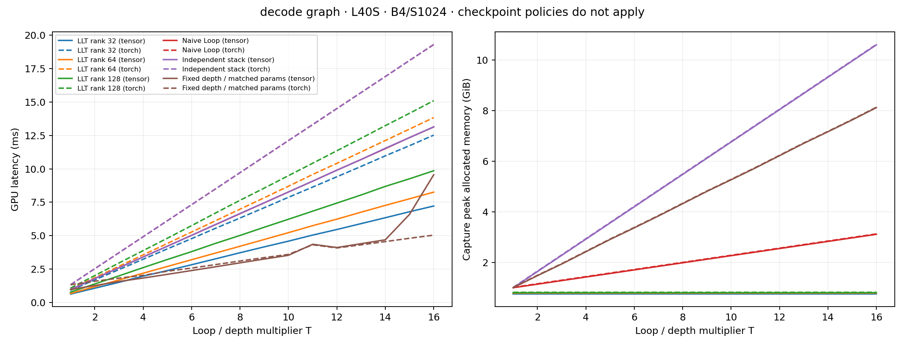
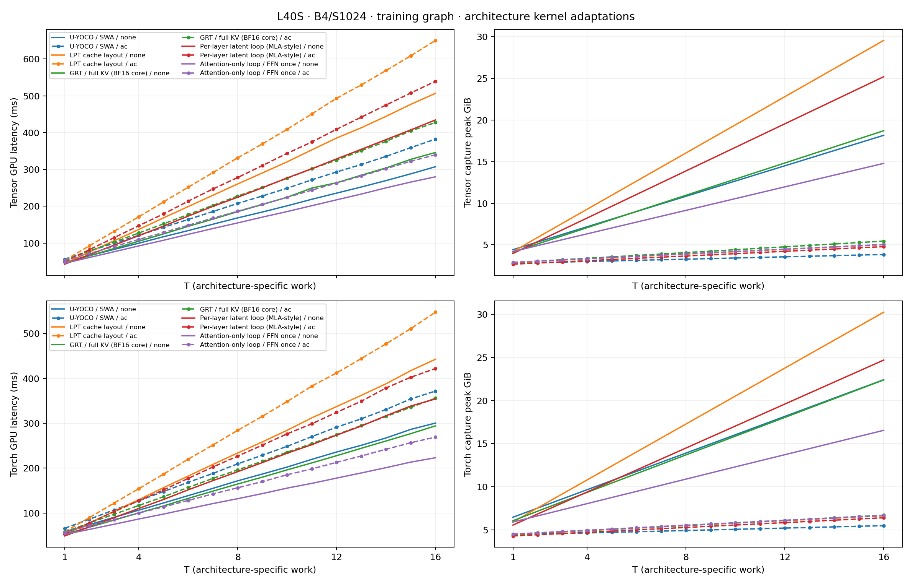
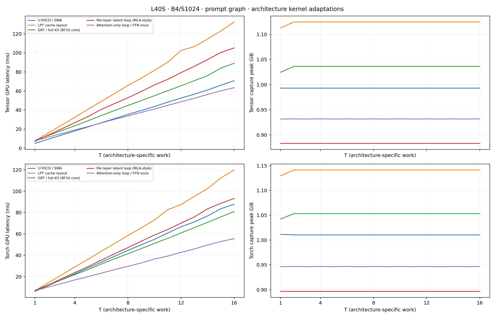
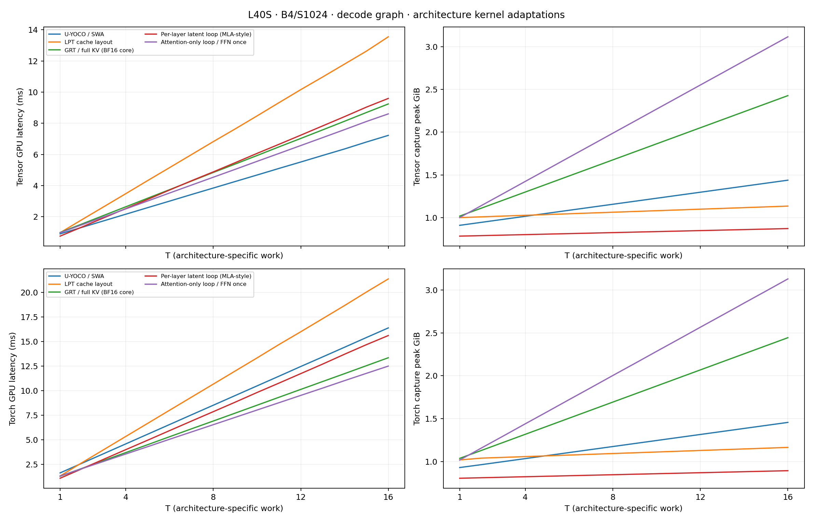

> Historical report: globally shared embedding-derived latent implementation. Its measurements are preserved; see the [current experiment](../../experiments/l40s/LOOP_SWEEP.md).

# L40S loop, rank, and checkpoint sweep

This is the project's **main measured experiment**: loop counts T=1..16,
batch 4, sequence length 1024, and LLT KV ranks 32, 64, and 128 on one NVIDIA L40S.
It compares [Tensor](https://github.com/kreasof-ai/tensor) numerical kernels with
matched PyTorch controls using Flash SDPA and fused AdamW. Inputs are synthetic;
this study measures execution cost and numerical consistency, without a trained
language-model quality evaluation.

The current **LAC is an exploratory, exact attention-region checkpoint policy**.
It is narrower than block AC and is not a completed strategy for checkpointing
an entire loop through its latent state. See [checkpoint boundaries](../../docs/CHECKPOINTING.md)
and the [architecture](../../docs/ARCHITECTURE.md).

The [additional architecture-family study](#additional-architecture-families-kernel-profiles)
adds U-YOCO, LPT, GRT, a per-layer latent control, and an attention-only loop control.
The joined study contains **1152 performance records**; its [T=16 comparison](#all-architectures-at-t16)
puts every architecture in one table.

## Model and measurement protocol

The original LLT/four-control study uses residual width 768, 12 heads (head dimension 64), independent
input embedding/output weights, vocabulary 50,304, learned absolute positions
with capacity 1025, exact GELU, and unweighted RMSNorm with epsilon 1e-5.
Master weights, embeddings, residuals, AdamW states, and loss reductions are FP32;
projection and attention arithmetic is BF16. Serving prepares BF16 linear-weight
copies while retaining FP32 masters; these copies count toward peak memory.

| Architecture | Unique blocks | Applied blocks | MLP hidden width |
|---|---:|---:|---:|
| LLT, ranks 32/64/128 | 12 | 12T | 3072 |
| Naive Loop | 12 | 12T | 3072 |
| Independent stack | 12T | 12T | 3072 |
| Fixed depth, matched parameters | 12 | 12 | 768(6T−2) |

The fixed-depth control matches the stack's parameter count exactly at each T
using active MLP weights. Residual width, heads, vocabulary, and embeddings stay
fixed. This changes its attention-to-MLP compute balance; parameter matching does
not match attention work or activation memory. At T=1 the three conventional
controls have equivalent architectures and are measured independently.

Training measures forward, full-token output projection/cross entropy, backward,
global gradient clipping (norm 1), and AdamW updates (learning rate 0.0006,
betas 0.9/0.95, weight decay 0.1). Input and target CUDA token IDs use seed 9505.
A step processes 4096 tokens. AC checkpoints full Transformer blocks with
non-reentrant recomputation. LAC checkpoints only LLT's latent attention and
folded output projection, with Q_r, C, and the folded output weight as explicit
inputs. LAC uses the existing model rank and adds no compression codec or parameters.
Query formation, full-width residuals, and MLP activations remain outside LAC.
Conventional controls have no matching native latent boundary, so LAC is N/A.

Inference has no backward checkpoints and reports three operations:

- **Prompt:** causal 1024-token forward and last-position logits, without persistent KV allocation.
- **Serving startup:** prompt plus KV allocation/copy and LLT fold rebuild.
- **Cached decode:** one supplied token after a 1024-token history, using 1025 cache slots.

Latency is per batch of four. Cached decode computes four supplied tokens; it
includes no token sampling or beam search. Historical cache copies and prepared
weights are outside cached-token timing and included in live memory.

Cases run sequentially in fresh processes. Compilation and warmup are excluded.
There are three warmups and nine timing samples per operation. Eager results
retain CUDA-event latency and synchronized wall time. Each graph sample times
three replays and divides by three. Decode rewinds the logical cache before
replay, keeping the same history. Successful training cases validate finite loss
and every parameter gradient, and check all 42 actual optimizer updates.

Eager memory is peak allocated memory during a call. Graph memory is peak
allocated memory during **capture**, including temporaries and the graph pool.
Both include weights and live model state; allocated memory excludes allocator
reservations and driver/context memory. Replay peaks and reservations remain in
raw records. OOM is recorded at the failed operation with unchanged geometry;
operations skipped after an earlier OOM have no latency. Supplementary retries
that release eager gradients before capture remain separate from primary cases.

## Results

**672 performance records: 664 passed and 8 recorded OOM.** The combined study reuses all 256 original records and adds 416 rank/checkpoint cases. Every new performance case passed.

### T=16 training endpoint

Cells are **CUDA graph ms / capture peak allocated GiB**, per batch of four.

**Tensor**

| Architecture | None | AC | LAC (exploratory) |
|---|---:|---:|---:|
| LLT rank 32 | 359.60 / 22.85 | 448.67 / 4.78 | 377.38 / 21.12 |
| LLT rank 64 | 411.77 / 25.11 | 518.51 / 4.79 | 432.84 / 21.70 |
| LLT rank 128 | 555.65 / 29.65 | 683.96 / 4.83 | 594.31 / 22.87 |
| Naive Loop | 492.07 / 27.45 | 617.41 / 4.88 | N/A |
| Independent stack | OOM | 663.75 / 21.56 | N/A |
| Fixed depth / matched params | 513.00 / 31.32 | 676.68 / 22.95 | N/A |

**Torch**

| Architecture | None | AC | LAC (exploratory) |
|---|---:|---:|---:|
| LLT rank 32 | 308.60 / 21.76 | 367.12 / 6.40 | 316.28 / 20.60 |
| LLT rank 64 | 350.49 / 23.47 | 411.93 / 6.42 | 354.35 / 21.19 |
| LLT rank 128 | 424.60 / 26.89 | 515.76 / 6.47 | 439.27 / 22.36 |
| Naive Loop | 400.78 / 28.14 | 492.85 / 6.50 | N/A |
| Independent stack | — (eager OOM) | 584.96 / 23.06 | N/A |
| Fixed depth / matched params | OOM | 422.95 / 22.98 | N/A |

At rank 64 and T=16, Tensor AC uses 4.79 GiB versus 21.70 GiB for
LAC and 25.11 GiB without checkpoints. These policies recompute different regions:
AC discards full-block intermediates; LAC retains the residual/query/MLP paths.
This result motivates further checkpoint design rather than a claim that the
current LAC achieves constant total training memory.

## Numerical qualification

The audit verifies 12 small and 12 full-size T=16 checkpoint qualifications, plus eight original backend correctness cases. It verifies 954 unique hashed sm89 CUDA artifacts and zero implicit Tensor numerical fallback.

Small checks cover every variant at T=4 and T=16, width 128, two
base blocks, batch 2, and sequence 32. Full-size checks use the measured geometry
at T=16 with unchanged initial weights, no optimizer between policies, and
reference gradients streamed to CPU. AC and applicable LAC gradients are compared
with uncheckpointed gradients; full checks first repeat uncheckpointed backward.
Within-backend parameter relative L2 must be below 1e-5 and forward losses must
agree exactly. Cached decode is compared with full-forward supplied-token logits
(maximum error <0.05; relative L2 <0.03). These checks establish numerical behavior
for this implementation, without evaluating trained quality.

Default Torch BF16 backward is not a bitwise full-size reference. Two unchanged
uncheckpointed rank-32 runs differed by about 0.6% in the worst parameter, with
comparable AC/LAC variation. Disabling the autocast cache did not remove it.
Torch correctness checks therefore use deterministic algorithms and
CUBLAS_WORKSPACE_CONFIG=:4096:8; repeated uncheckpointed backward, AC, and LAC then
agree exactly. Tensor qualification retains the original kernels. These controls
are limited to correctness checks; primary performance settings are unchanged.
The [diagnostics](../../experiments/l40s/results/loop-sweep/diagnostics/) preserve the original strict
failure and repeat/control results.

Observed worst within-backend checkpoint gradient relative L2: **1.44652e-09**. See the [gradient checks CSV](../../experiments/l40s/results/loop-sweep/views/exact-gradient-checks.csv).

## Records and reproduction

- [Combined CSV](../../experiments/l40s/results/loop-sweep/views/combined.csv): all eager/graph metrics, parameters, caches, origins, and raw-record paths.
- [Combined audit](../../experiments/l40s/results/loop-sweep/views/audit.json) and [view manifest](../../experiments/l40s/results/loop-sweep/views/run-manifest.json).
- Immutable measurement manifests: [baseline](../../experiments/l40s/results/loop-baseline/run-manifest.json) and [extension](../../experiments/l40s/results/loop-sweep/run-manifest.json).
- [Result layout and relocation map](../../experiments/l40s/results/README.md); [reproduction guide](../../docs/REPRODUCIBILITY.md).
- [Supplementary capture retries](../../experiments/l40s/results/loop-baseline/views/capture-recovery.csv), separate from primary OOMs.

The plots also have PDF exports. Eager training, prompt, and serving-startup plots
are beside the plotted graph results. Original payloads and source snapshots
remain byte-preserved; regenerated views describe the current file locations.
Earlier exploratory studies are indexed in the [archive](../../archive/README.md).

## Combined tables for every loop count

Cells are **CUDA graph ms / capture peak allocated GiB**, per batch of four. S=1024. All checkpoint policies are exact. LAC is N/A without an existing latent boundary. AC checkpoints full blocks; LAC checkpoints the latent attention/output region.

### Tensor — all loop counts

| T | Architecture | Train: none | Train: AC | Train: LAC | Prompt inference | Cached decode |
|---:|---|---:|---:|---:|---:|---:|
| 1 | LLT rank 32 | 37.94 / 3.79 | 43.36 / 2.67 | 38.98 / 3.70 | 6.08 / 0.85 | 0.63 / 0.75 |
| 1 | LLT rank 64 | 41.16 / 3.97 | 47.61 / 2.69 | 42.75 / 3.75 | 6.86 / 0.87 | 0.68 / 0.78 |
| 1 | LLT rank 128 | 50.57 / 4.30 | 58.53 / 2.73 | 53.12 / 3.88 | 8.84 / 0.91 | 0.78 / 0.81 |
| 1 | Naive Loop | 45.03 / 4.19 | 52.91 / 2.77 | N/A | 7.81 / 0.97 | 0.98 / 1.00 |
| 1 | Independent stack | 45.07 / 4.19 | 52.92 / 2.77 | N/A | 7.81 / 0.97 | 0.98 / 1.00 |
| 1 | Fixed depth / matched params | 45.06 / 4.19 | 52.92 / 2.77 | N/A | 7.82 / 0.97 | 0.98 / 1.00 |
| 2 | LLT rank 32 | 59.55 / 5.08 | 70.60 / 2.81 | 61.59 / 4.87 | 11.63 / 0.85 | 1.07 / 0.75 |
| 2 | LLT rank 64 | 65.80 / 5.39 | 78.80 / 2.83 | 69.12 / 4.96 | 13.10 / 0.87 | 1.18 / 0.78 |
| 2 | LLT rank 128 | 84.67 / 5.99 | 100.68 / 2.86 | 89.74 / 5.14 | 17.01 / 0.91 | 1.39 / 0.81 |
| 2 | Naive Loop | 74.94 / 5.76 | 90.72 / 2.91 | N/A | 15.38 / 0.97 | 1.79 / 1.14 |
| 2 | Independent stack | 77.90 / 6.72 | 93.56 / 3.86 | N/A | 15.35 / 1.47 | 1.79 / 1.64 |
| 2 | Fixed depth / matched params | 66.17 / 5.97 | 80.48 / 3.82 | N/A | 13.55 / 1.52 | 1.27 / 1.48 |
| 3 | LLT rank 32 | 80.86 / 6.36 | 97.52 / 2.95 | 84.04 / 6.03 | 17.14 / 0.85 | 1.51 / 0.75 |
| 3 | LLT rank 64 | 90.27 / 6.80 | 109.86 / 2.97 | 95.06 / 6.16 | 19.39 / 0.87 | 1.69 / 0.78 |
| 3 | LLT rank 128 | 118.59 / 7.68 | 142.57 / 3.01 | 125.83 / 6.41 | 25.24 / 0.91 | 1.99 / 0.81 |
| 3 | Naive Loop | 104.86 / 7.31 | 128.79 / 3.05 | N/A | 22.92 / 0.97 | 2.60 / 1.28 |
| 3 | Independent stack | 110.78 / 9.24 | 134.37 / 5.01 | N/A | 22.99 / 1.97 | 2.60 / 2.28 |
| 3 | Fixed depth / matched params | 89.24 / 7.77 | 110.91 / 5.18 | N/A | 19.71 / 2.05 | 1.57 / 1.94 |
| 4 | LLT rank 32 | 102.68 / 7.63 | 124.98 / 3.09 | 107.05 / 7.19 | 22.81 / 0.85 | 1.97 / 0.75 |
| 4 | LLT rank 64 | 114.77 / 8.21 | 140.97 / 3.11 | 121.28 / 7.36 | 25.65 / 0.87 | 2.19 / 0.78 |
| 4 | LLT rank 128 | 152.55 / 9.37 | 184.86 / 3.15 | 162.18 / 7.68 | 33.64 / 0.91 | 2.61 / 0.81 |
| 4 | Naive Loop | 134.68 / 8.86 | 166.50 / 3.19 | N/A | 30.56 / 0.97 | 3.41 / 1.42 |
| 4 | Independent stack | 143.82 / 11.76 | 174.85 / 6.28 | N/A | 30.51 / 2.47 | 3.41 / 2.92 |
| 4 | Fixed depth / matched params | 111.85 / 9.58 | 138.69 / 6.58 | N/A | 23.86 / 2.60 | 1.83 / 2.42 |
| 5 | LLT rank 32 | 124.32 / 8.89 | 152.13 / 3.23 | 129.68 / 8.35 | 28.26 / 0.85 | 2.39 / 0.75 |
| 5 | LLT rank 64 | 139.42 / 9.62 | 172.63 / 3.25 | 148.00 / 8.55 | 31.94 / 0.87 | 2.70 / 0.78 |
| 5 | LLT rank 128 | 186.87 / 11.06 | 227.17 / 3.29 | 199.03 / 8.94 | 42.81 / 0.91 | 3.22 / 0.81 |
| 5 | Naive Loop | 164.41 / 10.41 | 203.15 / 3.33 | N/A | 38.05 / 0.97 | 4.21 / 1.57 |
| 5 | Independent stack | 176.76 / 14.28 | 214.61 / 7.55 | N/A | 38.00 / 2.97 | 4.21 / 3.56 |
| 5 | Fixed depth / matched params | 137.14 / 11.40 | 169.43 / 7.98 | N/A | 29.20 / 3.16 | 2.11 / 2.91 |
| 6 | LLT rank 32 | 145.83 / 10.16 | 179.15 / 3.37 | 152.06 / 9.52 | 33.89 / 0.85 | 2.83 / 0.75 |
| 6 | LLT rank 64 | 163.83 / 11.03 | 202.56 / 3.39 | 174.19 / 9.75 | 38.24 / 0.87 | 3.20 / 0.78 |
| 6 | LLT rank 128 | 219.41 / 12.75 | 266.96 / 3.43 | 233.34 / 10.21 | 49.33 / 0.91 | 3.81 / 0.81 |
| 6 | Naive Loop | 194.41 / 11.96 | 240.94 / 3.47 | N/A | 45.64 / 0.97 | 5.03 / 1.71 |
| 6 | Independent stack | 209.80 / 16.80 | 256.14 / 8.83 | N/A | 45.59 / 3.47 | 5.03 / 4.20 |
| 6 | Fixed depth / matched params | 163.44 / 13.14 | 204.32 / 9.27 | N/A | 34.41 / 3.69 | 2.39 / 3.37 |
| 7 | LLT rank 32 | 167.72 / 11.43 | 206.02 / 3.51 | 174.45 / 10.68 | 39.56 / 0.85 | 3.27 / 0.75 |
| 7 | LLT rank 64 | 188.31 / 12.44 | 233.83 / 3.53 | 199.23 / 10.94 | 44.49 / 0.87 | 3.70 / 0.78 |
| 7 | LLT rank 128 | 253.69 / 14.44 | 309.48 / 3.57 | 270.17 / 11.47 | 58.37 / 0.91 | 4.43 / 0.81 |
| 7 | Naive Loop | 224.25 / 13.51 | 279.32 / 3.61 | N/A | 53.22 / 0.97 | 5.84 / 1.85 |
| 7 | Independent stack | 242.72 / 19.33 | 297.99 / 10.10 | N/A | 53.16 / 3.97 | 5.85 / 4.84 |
| 7 | Fixed depth / matched params | 187.68 / 14.94 | 236.79 / 10.64 | N/A | 40.01 / 4.23 | 2.68 / 3.84 |
| 8 | LLT rank 32 | 191.40 / 12.70 | 232.47 / 3.65 | 196.24 / 11.84 | 46.30 / 0.85 | 3.72 / 0.75 |
| 8 | LLT rank 64 | 212.72 / 13.84 | 262.87 / 3.67 | 224.18 / 12.14 | 50.70 / 0.87 | 4.21 / 0.78 |
| 8 | LLT rank 128 | 286.51 / 16.13 | 351.02 / 3.71 | 306.16 / 12.74 | 65.52 / 0.91 | 5.02 / 0.81 |
| 8 | Naive Loop | 254.00 / 15.06 | 316.13 / 3.75 | N/A | 60.83 / 0.97 | 6.65 / 1.99 |
| 8 | Independent stack | 275.84 / 21.85 | 337.02 / 11.38 | N/A | 60.72 / 4.47 | 6.66 / 5.48 |
| 8 | Fixed depth / matched params | 211.50 / 16.76 | 265.42 / 12.04 | N/A | 45.49 / 4.79 | 2.97 / 4.32 |
| 9 | LLT rank 32 | 211.46 / 13.97 | 262.54 / 3.79 | 220.04 / 13.00 | 52.04 / 0.85 | 4.16 / 0.75 |
| 9 | LLT rank 64 | 237.66 / 15.25 | 295.44 / 3.81 | 251.70 / 13.33 | 57.05 / 0.87 | 4.71 / 0.78 |
| 9 | LLT rank 128 | 322.92 / 17.82 | 393.38 / 3.85 | 342.20 / 14.01 | 75.38 / 0.91 | 5.63 / 0.81 |
| 9 | Naive Loop | 283.90 / 16.61 | 355.99 / 3.89 | N/A | 68.38 / 0.97 | 7.45 / 2.13 |
| 9 | Independent stack | 309.73 / 24.37 | 382.59 / 12.65 | N/A | 69.14 / 4.97 | 7.46 / 6.12 |
| 9 | Fixed depth / matched params | 235.45 / 18.57 | 290.50 / 13.43 | N/A | 51.05 / 5.34 | 3.25 / 4.81 |
| 10 | LLT rank 32 | 231.05 / 15.24 | 286.08 / 3.93 | 241.27 / 14.16 | 56.01 / 0.85 | 4.59 / 0.75 |
| 10 | LLT rank 64 | 262.70 / 16.66 | 326.03 / 3.95 | 277.91 / 14.53 | 63.71 / 0.87 | 5.23 / 0.78 |
| 10 | LLT rank 128 | 354.77 / 19.51 | 434.48 / 3.99 | 378.08 / 15.27 | 83.36 / 0.91 | 6.23 / 0.81 |
| 10 | Naive Loop | 314.86 / 18.15 | 394.01 / 4.03 | N/A | 76.43 / 0.97 | 8.27 / 2.27 |
| 10 | Independent stack | 343.26 / 26.89 | 418.68 / 13.92 | N/A | 76.39 / 5.46 | 8.27 / 6.76 |
| 10 | Fixed depth / matched params | 260.87 / 20.31 | 322.95 / 14.73 | N/A | 60.07 / 5.87 | 3.53 / 5.27 |
| 11 | LLT rank 32 | 254.94 / 16.51 | 315.79 / 4.07 | 267.50 / 15.32 | 63.35 / 0.85 | 5.04 / 0.75 |
| 11 | LLT rank 64 | 288.14 / 18.07 | 355.47 / 4.09 | 302.28 / 15.73 | 71.83 / 0.87 | 5.75 / 0.78 |
| 11 | LLT rank 128 | 387.64 / 21.20 | 476.10 / 4.13 | 414.57 / 16.54 | 89.81 / 0.91 | 6.83 / 0.81 |
| 11 | Naive Loop | 344.72 / 19.70 | 428.43 / 4.17 | N/A | 83.68 / 0.97 | 9.08 / 2.41 |
| 11 | Independent stack | 375.32 / 29.41 | 457.62 / 15.19 | N/A | 84.02 / 5.96 | 9.08 / 7.40 |
| 11 | Fixed depth / matched params | 300.16 / 22.10 | 371.03 / 16.09 | N/A | 67.52 / 6.41 | 4.36 / 5.74 |
| 12 | LLT rank 32 | 273.58 / 17.78 | 339.85 / 4.21 | 285.99 / 16.48 | 66.94 / 0.85 | 5.46 / 0.75 |
| 12 | LLT rank 64 | 314.02 / 19.48 | 387.70 / 4.23 | 328.93 / 16.92 | 78.09 / 0.87 | 6.24 / 0.78 |
| 12 | LLT rank 128 | 421.75 / 22.89 | 518.07 / 4.27 | 449.74 / 17.80 | 98.82 / 0.91 | 7.44 / 0.81 |
| 12 | Naive Loop | 375.32 / 21.25 | 466.69 / 4.31 | N/A | 93.12 / 0.97 | 9.90 / 2.55 |
| 12 | Independent stack | 408.77 / 31.94 | 497.81 / 16.47 | N/A | 92.48 / 6.46 | 9.90 / 8.04 |
| 12 | Fixed depth / matched params | 313.54 / 23.93 | 386.62 / 17.49 | N/A | 74.00 / 6.96 | 4.11 / 6.22 |
| 13 | LLT rank 32 | 295.70 / 19.04 | 367.14 / 4.35 | 308.88 / 17.64 | 72.80 / 0.85 | 5.90 / 0.75 |
| 13 | LLT rank 64 | 337.51 / 20.89 | 418.33 / 4.37 | 355.55 / 18.12 | 85.07 / 0.87 | 6.76 / 0.78 |
| 13 | LLT rank 128 | 455.68 / 24.58 | 559.60 / 4.41 | 485.61 / 19.07 | 107.82 / 0.91 | 8.04 / 0.81 |
| 13 | Naive Loop | 404.44 / 22.80 | 504.99 / 4.46 | N/A | 99.10 / 0.97 | 10.70 / 2.69 |
| 13 | Independent stack | 443.08 / 34.46 | 538.69 / 17.74 | N/A | 98.93 / 6.96 | 10.70 / 8.68 |
| 13 | Fixed depth / matched params | 354.42 / 25.80 | 447.80 / 18.89 | N/A | 86.85 / 7.52 | 4.40 / 6.71 |
| 14 | LLT rank 32 | 316.93 / 20.31 | 395.36 / 4.49 | 331.98 / 18.80 | 78.24 / 0.85 | 6.34 / 0.75 |
| 14 | LLT rank 64 | 362.51 / 22.30 | 451.34 / 4.51 | 381.51 / 19.31 | 92.62 / 0.87 | 7.26 / 0.78 |
| 14 | LLT rank 128 | 490.08 / 26.27 | 604.33 / 4.55 | 523.94 / 20.34 | 118.50 / 0.91 | 8.69 / 0.81 |
| 14 | Naive Loop | 432.17 / 24.35 | 544.28 / 4.60 | N/A | 105.60 / 0.97 | 11.51 / 2.83 |
| 14 | Independent stack | OOM | 581.74 / 19.02 | N/A | 105.43 / 7.46 | 11.54 / 9.32 |
| 14 | Fixed depth / matched params | 429.22 / 27.60 | 560.55 / 20.19 | N/A | 123.55 / 8.05 | 4.69 / 7.17 |
| 15 | LLT rank 32 | 339.56 / 21.58 | 422.13 / 4.63 | 355.24 / 19.96 | 84.03 / 0.85 | 6.79 / 0.75 |
| 15 | LLT rank 64 | 390.41 / 23.71 | 481.64 / 4.65 | 409.16 / 20.51 | 96.29 / 0.87 | 7.76 / 0.78 |
| 15 | LLT rank 128 | 524.58 / 27.96 | 643.22 / 4.69 | 557.90 / 21.60 | 123.69 / 0.91 | 9.25 / 0.81 |
| 15 | Naive Loop | 464.64 / 25.90 | 582.35 / 4.74 | N/A | 115.41 / 0.97 | 12.34 / 2.97 |
| 15 | Independent stack | OOM | 620.28 / 20.29 | N/A | 116.51 / 7.96 | 12.33 / 9.96 |
| 15 | Fixed depth / matched params | 478.17 / 29.45 | 628.15 / 21.55 | N/A | 142.42 / 8.59 | 6.59 / 7.64 |
| 16 | LLT rank 32 | 359.60 / 22.85 | 448.67 / 4.78 | 377.38 / 21.12 | 89.33 / 0.85 | 7.22 / 0.75 |
| 16 | LLT rank 64 | 411.77 / 25.11 | 518.51 / 4.79 | 432.84 / 21.70 | 101.80 / 0.87 | 8.26 / 0.78 |
| 16 | LLT rank 128 | 555.65 / 29.65 | 683.96 / 4.83 | 594.31 / 22.87 | 130.19 / 0.91 | 9.86 / 0.81 |
| 16 | Naive Loop | 492.07 / 27.45 | 617.41 / 4.88 | N/A | 122.17 / 0.97 | 13.13 / 3.11 |
| 16 | Independent stack | OOM | 663.75 / 21.56 | N/A | 122.48 / 8.46 | 13.14 / 10.60 |
| 16 | Fixed depth / matched params | 513.00 / 31.32 | 676.68 / 22.95 | N/A | 154.36 / 9.14 | 9.56 / 8.12 |

### Torch — all loop counts

| T | Architecture | Train: none | Train: AC | Train: LAC | Prompt inference | Cached decode |
|---:|---|---:|---:|---:|---:|---:|
| 1 | LLT rank 32 | 45.83 / 5.36 | 49.56 / 4.29 | 46.24 / 5.27 | 5.42 / 0.86 | 0.92 / 0.77 |
| 1 | LLT rank 64 | 48.20 / 5.50 | 52.68 / 4.32 | 48.80 / 5.33 | 6.14 / 0.88 | 1.00 / 0.80 |
| 1 | LLT rank 128 | 53.19 / 5.75 | 58.48 / 4.36 | 54.11 / 5.47 | 7.69 / 0.93 | 1.08 / 0.82 |
| 1 | Naive Loop | 51.82 / 5.93 | 57.75 / 4.39 | N/A | 6.87 / 0.99 | 1.33 / 1.02 |
| 1 | Independent stack | 51.82 / 5.93 | 57.73 / 4.39 | N/A | 6.91 / 0.99 | 1.33 / 1.02 |
| 1 | Fixed depth / matched params | 51.81 / 5.93 | 57.67 / 4.39 | N/A | 6.89 / 0.99 | 1.33 / 1.02 |
| 2 | LLT rank 32 | 63.25 / 6.47 | 70.49 / 4.43 | 64.10 / 6.31 | 10.33 / 0.86 | 1.69 / 0.77 |
| 2 | LLT rank 64 | 67.77 / 6.70 | 76.96 / 4.45 | 69.39 / 6.41 | 11.79 / 0.88 | 1.86 / 0.80 |
| 2 | LLT rank 128 | 78.39 / 7.17 | 89.25 / 4.49 | 79.90 / 6.61 | 14.87 / 0.93 | 2.02 / 0.82 |
| 2 | Naive Loop | 74.59 / 7.43 | 86.22 / 4.54 | N/A | 13.55 / 0.99 | 2.53 / 1.16 |
| 2 | Independent stack | 81.06 / 8.55 | 92.64 / 5.48 | N/A | 13.64 / 1.49 | 2.53 / 1.66 |
| 2 | Fixed depth / matched params | 72.35 / 7.90 | 82.34 / 5.34 | N/A | 11.50 / 1.53 | 1.59 / 1.50 |
| 3 | LLT rank 32 | 80.73 / 7.56 | 91.60 / 4.57 | 82.05 / 7.34 | 15.26 / 0.86 | 2.46 / 0.77 |
| 3 | LLT rank 64 | 87.80 / 7.90 | 101.26 / 4.59 | 90.23 / 7.47 | 17.44 / 0.88 | 2.71 / 0.80 |
| 3 | LLT rank 128 | 103.17 / 8.58 | 119.83 / 4.64 | 105.85 / 7.73 | 21.96 / 0.93 | 2.96 / 0.82 |
| 3 | Naive Loop | 97.66 / 8.92 | 115.39 / 4.68 | N/A | 20.29 / 0.99 | 3.72 / 1.30 |
| 3 | Independent stack | 110.52 / 11.17 | 128.02 / 6.70 | N/A | 20.22 / 1.99 | 3.72 / 2.30 |
| 3 | Fixed depth / matched params | 93.32 / 9.83 | 108.81 / 6.39 | N/A | 16.70 / 2.06 | 1.83 / 1.95 |
| 4 | LLT rank 32 | 98.52 / 8.65 | 113.13 / 4.71 | 100.15 / 8.36 | 20.36 / 0.86 | 3.24 / 0.77 |
| 4 | LLT rank 64 | 107.80 / 9.10 | 125.76 / 4.73 | 111.02 / 8.53 | 23.11 / 0.88 | 3.57 / 0.80 |
| 4 | LLT rank 128 | 127.99 / 9.99 | 150.32 / 4.78 | 131.69 / 8.85 | 29.10 / 0.93 | 3.88 / 0.82 |
| 4 | Naive Loop | 120.87 / 10.39 | 144.60 / 4.82 | N/A | 26.98 / 0.99 | 4.92 / 1.44 |
| 4 | Independent stack | 140.02 / 13.79 | 163.04 / 7.96 | N/A | 27.12 / 2.49 | 4.92 / 2.94 |
| 4 | Fixed depth / matched params | 110.61 / 11.79 | 130.16 / 7.52 | N/A | 21.44 / 2.62 | 2.03 / 2.44 |
| 5 | LLT rank 32 | 116.19 / 9.75 | 134.33 / 4.85 | 118.38 / 9.38 | 25.36 / 0.86 | 4.01 / 0.77 |
| 5 | LLT rank 64 | 127.86 / 10.30 | 150.58 / 4.87 | 132.21 / 9.58 | 28.72 / 0.88 | 4.42 / 0.80 |
| 5 | LLT rank 128 | 152.95 / 11.39 | 180.27 / 4.92 | 156.60 / 9.98 | 36.15 / 0.93 | 4.81 / 0.82 |
| 5 | Naive Loop | 143.86 / 11.87 | 172.21 / 4.96 | N/A | 33.67 / 0.99 | 6.12 / 1.58 |
| 5 | Independent stack | 169.41 / 16.41 | 197.62 / 9.22 | N/A | 33.69 / 2.99 | 6.12 / 3.58 |
| 5 | Fixed depth / matched params | 131.27 / 13.76 | 154.60 / 8.65 | N/A | 26.14 / 3.18 | 2.34 / 2.93 |
| 6 | LLT rank 32 | 133.66 / 10.84 | 155.23 / 4.99 | 136.23 / 10.40 | 30.27 / 0.86 | 4.78 / 0.77 |
| 6 | LLT rank 64 | 147.15 / 11.49 | 173.76 / 5.01 | 151.59 / 10.64 | 34.40 / 0.88 | 5.27 / 0.80 |
| 6 | LLT rank 128 | 176.28 / 12.80 | 209.12 / 5.06 | 181.61 / 11.11 | 43.02 / 0.93 | 5.75 / 0.82 |
| 6 | Naive Loop | 167.14 / 13.35 | 202.18 / 5.10 | N/A | 40.55 / 0.99 | 7.32 / 1.72 |
| 6 | Independent stack | 199.10 / 19.04 | 233.82 / 10.47 | N/A | 40.30 / 3.48 | 7.32 / 4.22 |
| 6 | Fixed depth / matched params | 152.11 / 15.69 | 183.29 / 9.72 | N/A | 30.98 / 3.71 | 2.58 / 3.39 |
| 7 | LLT rank 32 | 150.97 / 11.93 | 177.00 / 5.13 | 154.15 / 11.42 | 35.38 / 0.86 | 5.56 / 0.77 |
| 7 | LLT rank 64 | 167.60 / 12.69 | 197.99 / 5.15 | 172.18 / 11.69 | 40.12 / 0.88 | 6.13 / 0.80 |
| 7 | LLT rank 128 | 201.99 / 14.21 | 240.87 / 5.20 | 208.22 / 12.23 | 50.45 / 0.93 | 6.71 / 0.82 |
| 7 | Naive Loop | 190.43 / 14.83 | 231.56 / 5.24 | N/A | 47.17 / 0.99 | 8.51 / 1.86 |
| 7 | Independent stack | 228.62 / 21.66 | 270.12 / 11.73 | N/A | 47.06 / 3.98 | 8.51 / 4.86 |
| 7 | Fixed depth / matched params | 170.28 / 17.66 | 207.71 / 10.82 | N/A | 35.46 / 4.25 | 2.84 / 3.86 |
| 8 | LLT rank 32 | 167.31 / 13.02 | 196.20 / 5.27 | 170.73 / 12.44 | 39.87 / 0.86 | 6.32 / 0.77 |
| 8 | LLT rank 64 | 187.15 / 13.89 | 220.36 / 5.30 | 191.77 / 12.75 | 45.68 / 0.88 | 6.98 / 0.80 |
| 8 | LLT rank 128 | 226.64 / 15.62 | 270.76 / 5.34 | 232.83 / 13.36 | 58.10 / 0.93 | 7.65 / 0.82 |
| 8 | Naive Loop | 213.55 / 16.31 | 259.99 / 5.38 | N/A | 53.89 / 0.99 | 9.71 / 2.00 |
| 8 | Independent stack | 257.97 / 24.28 | 304.31 / 12.99 | N/A | 53.91 / 4.48 | 9.72 / 5.50 |
| 8 | Fixed depth / matched params | 187.94 / 19.60 | 228.71 / 12.07 | N/A | 40.49 / 4.80 | 3.10 / 4.34 |
| 9 | LLT rank 32 | 186.19 / 14.12 | 218.23 / 5.41 | 189.43 / 13.46 | 45.18 / 0.86 | 7.09 / 0.77 |
| 9 | LLT rank 64 | 207.27 / 15.09 | 245.76 / 5.44 | 214.29 / 13.80 | 51.47 / 0.88 | 7.84 / 0.80 |
| 9 | LLT rank 128 | 251.34 / 17.03 | 301.39 / 5.48 | 261.17 / 14.48 | 64.74 / 0.93 | 8.56 / 0.82 |
| 9 | Naive Loop | 236.68 / 17.79 | 291.03 / 5.52 | N/A | 60.66 / 0.99 | 10.91 / 2.15 |
| 9 | Independent stack | 289.10 / 26.90 | 341.52 / 14.25 | N/A | 61.36 / 4.98 | 10.92 / 6.14 |
| 9 | Fixed depth / matched params | 207.45 / 21.57 | 244.91 / 13.46 | N/A | 45.55 / 5.36 | 3.36 / 4.83 |
| 10 | LLT rank 32 | 202.68 / 15.21 | 239.65 / 5.55 | 207.63 / 14.48 | 50.23 / 0.86 | 7.87 / 0.77 |
| 10 | LLT rank 64 | 228.11 / 16.29 | 270.75 / 5.58 | 235.04 / 14.86 | 58.06 / 0.88 | 8.70 / 0.80 |
| 10 | LLT rank 128 | 275.80 / 18.44 | 331.92 / 5.62 | 288.40 / 15.61 | 71.75 / 0.93 | 9.49 / 0.82 |
| 10 | Naive Loop | 260.92 / 19.27 | 321.59 / 5.66 | N/A | 68.25 / 0.99 | 12.12 / 2.29 |
| 10 | Independent stack | 319.11 / 29.52 | 374.56 / 15.51 | N/A | 68.85 / 5.48 | 12.11 / 6.78 |
| 10 | Fixed depth / matched params | 233.74 / 23.50 | 278.87 / 14.76 | N/A | 52.48 / 5.89 | 3.60 / 5.29 |
| 11 | LLT rank 32 | 221.06 / 16.30 | 259.71 / 5.69 | 224.04 / 15.50 | 54.99 / 0.86 | 8.63 / 0.77 |
| 11 | LLT rank 64 | 249.20 / 17.48 | 291.73 / 5.72 | 252.60 / 15.91 | 64.72 / 0.88 | 9.58 / 0.80 |
| 11 | LLT rank 128 | 301.17 / 19.85 | 359.79 / 5.76 | 308.73 / 16.73 | 78.60 / 0.93 | 10.42 / 0.82 |
| 11 | Naive Loop | 283.27 / 20.75 | 346.13 / 5.80 | N/A | 74.24 / 0.99 | 13.30 / 2.43 |
| 11 | Independent stack | 347.36 / 32.15 | 408.83 / 16.77 | N/A | 74.76 / 5.98 | 13.32 / 7.42 |
| 11 | Fixed depth / matched params | 254.34 / 25.44 | 298.38 / 16.13 | N/A | 58.60 / 6.42 | 4.32 / 5.75 |
| 12 | LLT rank 32 | 236.87 / 17.39 | 280.86 / 5.83 | 242.75 / 16.52 | 59.73 / 0.86 | 9.41 / 0.77 |
| 12 | LLT rank 64 | 269.48 / 18.68 | 317.04 / 5.86 | 273.72 / 16.97 | 69.23 / 0.88 | 10.41 / 0.80 |
| 12 | LLT rank 128 | 324.45 / 21.26 | 390.56 / 5.90 | 335.89 / 17.86 | 85.68 / 0.93 | 11.35 / 0.82 |
| 12 | Naive Loop | 307.68 / 22.23 | 375.04 / 5.94 | N/A | 81.40 / 0.99 | 14.51 / 2.57 |
| 12 | Independent stack | 377.72 / 34.77 | 443.43 / 18.03 | N/A | 81.32 / 6.48 | 14.50 / 8.06 |
| 12 | Fixed depth / matched params | 275.21 / 27.40 | 317.51 / 17.52 | N/A | 63.18 / 6.98 | 4.08 / 6.24 |
| 13 | LLT rank 32 | 254.80 / 18.48 | 302.07 / 5.97 | 260.11 / 17.54 | 64.83 / 0.86 | 10.18 / 0.77 |
| 13 | LLT rank 64 | 287.95 / 19.88 | 341.11 / 6.00 | 294.15 / 18.02 | 74.85 / 0.88 | 11.26 / 0.80 |
| 13 | LLT rank 128 | 349.17 / 22.66 | 421.10 / 6.04 | 361.99 / 18.98 | 92.82 / 0.93 | 12.28 / 0.82 |
| 13 | Naive Loop | 330.28 / 23.71 | 405.74 / 6.08 | N/A | 88.12 / 0.99 | 15.71 / 2.71 |
| 13 | Independent stack | OOM | 478.96 / 19.28 | N/A | 87.71 / 6.98 | 15.70 / 8.70 |
| 13 | Fixed depth / matched params | 291.40 / 29.39 | 343.22 / 18.92 | N/A | 68.00 / 7.54 | 4.31 / 6.72 |
| 14 | LLT rank 32 | 273.76 / 19.58 | 324.60 / 6.11 | 279.95 / 18.56 | 70.17 / 0.86 | 10.97 / 0.77 |
| 14 | LLT rank 64 | 309.59 / 21.08 | 366.11 / 6.14 | 315.97 / 19.08 | 80.44 / 0.88 | 12.12 / 0.80 |
| 14 | LLT rank 128 | 376.69 / 24.07 | 454.80 / 6.19 | 389.60 / 20.11 | 101.07 / 0.93 | 13.23 / 0.82 |
| 14 | Naive Loop | 353.41 / 25.19 | 435.01 / 6.22 | N/A | 94.94 / 0.99 | 16.90 / 2.85 |
| 14 | Independent stack | OOM | 516.84 / 20.54 | N/A | 95.24 / 7.48 | 16.90 / 9.34 |
| 14 | Fixed depth / matched params | 313.71 / 31.30 | 369.50 / 20.22 | N/A | 75.26 / 8.07 | 4.56 / 7.18 |
| 15 | LLT rank 32 | 290.89 / 20.67 | 345.56 / 6.26 | 297.56 / 19.58 | 75.29 / 0.86 | 11.73 / 0.77 |
| 15 | LLT rank 64 | 329.49 / 22.28 | 393.90 / 6.28 | 338.46 / 20.13 | 86.21 / 0.88 | 12.97 / 0.80 |
| 15 | LLT rank 128 | 398.62 / 25.48 | 481.63 / 6.33 | 412.94 / 21.23 | 107.16 / 0.93 | 14.15 / 0.82 |
| 15 | Naive Loop | 378.01 / 26.67 | 463.48 / 6.36 | N/A | 101.93 / 0.99 | 18.11 / 2.99 |
| 15 | Independent stack | — (earlier OOM) | 549.08 / 21.80 | N/A | 101.84 / 7.98 | 18.11 / 9.98 |
| 15 | Fixed depth / matched params | 338.26 / 33.26 | 390.85 / 21.59 | N/A | 81.62 / 8.61 | 4.80 / 7.65 |
| 16 | LLT rank 32 | 308.60 / 21.76 | 367.12 / 6.40 | 316.28 / 20.60 | 80.29 / 0.86 | 12.52 / 0.77 |
| 16 | LLT rank 64 | 350.49 / 23.47 | 411.93 / 6.42 | 354.35 / 21.19 | 92.74 / 0.88 | 13.83 / 0.80 |
| 16 | LLT rank 128 | 424.60 / 26.89 | 515.76 / 6.47 | 439.27 / 22.36 | 114.91 / 0.93 | 15.10 / 0.82 |
| 16 | Naive Loop | 400.78 / 28.14 | 492.85 / 6.50 | N/A | 109.90 / 0.99 | 19.29 / 3.13 |
| 16 | Independent stack | — (earlier OOM) | 584.96 / 23.06 | N/A | 110.70 / 8.48 | 19.31 / 10.62 |
| 16 | Fixed depth / matched params | OOM | 422.95 / 22.98 | N/A | 83.56 / 9.16 | 5.04 / 8.14 |

## Additional architecture families: kernel profiles

The extension adds **480 performance records: 480 passed and
0 recorded OOM**, bringing the joined study to **1152 records**.
The original 672 measurements are retained. These are random-weight kernel
adaptations, without trained-quality evaluation. The [architecture contract](../../docs/RESEARCH_BASELINES.md)
describes primary sources and every material adaptation.

B4/S1024, width 768, 12 heads, vocabulary 50,304, BF16 projections, FP32 masters,
optimizer, timing and memory protocols match the original study. Training measures
none and exact AC; inference measures prompt, serving startup and supplied-token
decode. These families have no additional LAC policy. U-YOCO uses RoPE,
weighted RMSNorm and SwiGLU; GRT uses learned LayerNorm and recurrent gates.
Other added controls retain the original normalization, positions and GELU.
Residuals are FP32 except inside GRT's projected core, which uses BF16; its
prelude, coda and retention blend use FP32. The CSV records this precision detail.
The inherited generic serving-description string in raw GRT records describes
FP32 residuals; this statement applies outside its recurrent core.

| Profile | Applied attention blocks | FFN applications | Cache boundary |
|---|---:|---:|---|
| U-YOCO / SWA | 6T + 6 | 6T + 6 | Looped self-decoder windows; one global bank shared by the cross-decoder |
| LPT cache layout | 12T | 12T | First-loop per-layer full KV plus later-loop local KV, with one joint softmax |
| GRT / full KV (BF16 core) | 8T + 4 | 8T + 4 | Full KV for prelude, every recurrent application, and coda |
| Per-layer latent loop (MLA-style) | 12T | 12T | Rank-64 latent refreshed and stored per application |
| Attention-only loop / FFN once | 12T | 12 | Full KV for every attention application |

GRT additionally executes its gate MLP and recurrence projection T times; those
costs are included and their application counts are in the joined CSV.

**T does not match compute across these architectures.** The existing stack and
matched-parameter controls remain in the original tables. Parameter counts,
attention/FFN application counts, prepared weights and cache storage accompany
latency and peak memory in the joined CSV.

U-YOCO is a 12-KV-head adaptation. LPT preserves the shared/local cache topology
rather than the paper's complete Ouro block. GRT includes training state/gate noise,
but inference and correctness checks disable it; averaged-loop KV is not substituted.
The per-layer latent control omits DeepSeek's query compression, rotary-key stream
and MoE. The attention-only control uses softmax attention rather than MixerLoop's
DeltaNet mixer. These names must not be read as published checkpoint reproductions.

Torch window/union attention uses compiled FlexAttention; Tensor uses native masked
tiles and a two-bank decode kernel. Torch LPT decode concatenates its banks for
Flash SDPA, and that copy is included in timing. U-YOCO prompt/startup computes
only the last cross-decoder query, which is valid because its shared memory is fixed.
The preserved LLT prompt path computes all query positions. Its fixed latent also
permits last-query-only execution, which those measurements do not yet use. Prompt
latency reflects these serving implementation choices as well as architecture.
Local-window cache storage still grows with T. GRT recurrence projections/gates sit
outside block AC; attention-only AC checkpoints each attention update and FFN separately.

### All architectures at T=16

Cells are **CUDA graph ms / capture peak allocated GiB**, per batch of four.

**Tensor**

| Architecture | Parameters (M) | None | AC | Prompt | Startup | Cached decode | Cache (MiB) |
|---|---:|---:|---:|---:|---:|---:|---:|
| LLT rank 32 | 149.45 | 359.60 / 22.85 | 448.67 / 4.78 | 89.33 / 0.85 | 89.59 / 0.85 | 7.22 / 0.75 | 0.25 |
| LLT rank 64 | 150.06 | 411.77 / 25.11 | 518.51 / 4.79 | 101.80 / 0.87 | 102.05 / 0.87 | 8.26 / 0.78 | 0.50 |
| LLT rank 128 | 151.29 | 555.65 / 29.65 | 683.96 / 4.83 | 130.19 / 0.91 | 130.69 / 0.91 | 9.86 / 0.81 | 1.00 |
| Naive Loop | 162.99 | 492.07 / 27.45 | 617.41 / 4.88 | 122.17 / 0.97 | 129.25 / 5.36 | 13.13 / 3.11 | 2306.26 |
| Independent stack | 1437.01 | OOM | 663.75 / 21.56 | 122.48 / 8.46 | 130.07 / 12.85 | 13.14 / 10.60 | 2306.26 |
| Fixed depth / matched params | 1437.01 | 513.00 / 31.32 | 676.68 / 22.95 | 154.36 / 9.14 | 154.78 / 9.27 | 9.56 / 8.12 | 144.14 |
| U-YOCO / SWA | 163.40 | 307.38 / 18.16 | 382.28 / 3.85 | 70.71 / 0.99 | 73.04 / 2.58 | 7.22 / 1.44 | 588.01 |
| LPT cache layout | 162.99 | 506.68 / 29.56 | 650.32 / 5.02 | 132.39 / 1.12 | 135.75 / 3.39 | 13.55 / 1.14 | 281.26 |
| GRT / full KV (BF16 core) | 165.96 | 346.02 / 18.71 | 427.44 / 5.45 | 89.07 / 1.04 | 94.15 / 3.97 | 9.24 / 2.43 | 1585.55 |
| Per-layer latent loop (MLA-style) | 150.60 | 434.40 / 25.20 | 539.49 / 4.79 | 105.17 / 0.88 | 106.26 / 0.98 | 9.59 / 0.87 | 96.10 |
| Attention-only loop / FFN once | 162.99 | 280.02 / 14.79 | 339.74 / 5.05 | 63.47 / 0.93 | 71.08 / 5.36 | 8.60 / 3.11 | 2306.26 |

**Torch**

| Architecture | Parameters (M) | None | AC | Prompt | Startup | Cached decode | Cache (MiB) |
|---|---:|---:|---:|---:|---:|---:|---:|
| LLT rank 32 | 149.45 | 308.60 / 21.76 | 367.12 / 6.40 | 80.29 / 0.86 | 80.65 / 0.86 | 12.52 / 0.77 | 0.25 |
| LLT rank 64 | 150.06 | 350.49 / 23.47 | 411.93 / 6.42 | 92.74 / 0.88 | 93.08 / 0.88 | 13.83 / 0.80 | 0.50 |
| LLT rank 128 | 151.29 | 424.60 / 26.89 | 515.76 / 6.47 | 114.91 / 0.93 | 115.24 / 0.93 | 15.10 / 0.82 | 1.00 |
| Naive Loop | 162.99 | 400.78 / 28.14 | 492.85 / 6.50 | 109.90 / 0.99 | 115.02 / 5.38 | 19.29 / 3.13 | 2306.25 |
| Independent stack | 1437.01 | — (earlier OOM) | 584.96 / 23.06 | 110.70 / 8.48 | 117.63 / 12.87 | 19.31 / 10.62 | 2306.25 |
| Fixed depth / matched params | 1437.01 | OOM | 422.95 / 22.98 | 83.56 / 9.16 | 84.06 / 9.29 | 5.04 / 8.14 | 144.14 |
| U-YOCO / SWA | 163.40 | 300.37 / 22.41 | 371.83 / 5.50 | 87.79 / 1.01 | 87.33 / 2.59 | 16.38 / 1.46 | 588.01 |
| LPT cache layout | 162.99 | 442.75 / 30.24 | 547.75 / 6.65 | 119.81 / 1.14 | 124.05 / 3.40 | 21.36 / 1.17 | 281.25 |
| GRT / full KV (BF16 core) | 165.96 | 294.20 / 22.39 | 355.86 / 6.71 | 80.89 / 1.05 | 85.84 / 3.99 | 13.35 / 2.44 | 1585.55 |
| Per-layer latent loop (MLA-style) | 150.60 | 354.25 / 24.69 | 422.06 / 6.42 | 93.14 / 0.90 | 93.70 / 0.99 | 15.60 / 0.89 | 96.09 |
| Attention-only loop / FFN once | 162.99 | 223.09 / 16.55 | 269.10 / 6.68 | 55.54 / 0.95 | 63.12 / 5.38 | 12.50 / 3.13 | 2306.25 |

### Timing continuity check

At T=1, LPT has the same full causal attention and FFN equations as Naive Loop.
Its independently measured training serves as a continuity check for the preserved
original timings. The native runtime binaries have the same SHA256 as the original study.

| Backend | Original Naive T=1 (ms / GiB) | New LPT T=1 (ms / GiB) | Latency change |
|---|---:|---:|---:|
| Tensor | 45.03 / 4.19 | 45.12 / 4.19 | +0.20% |
| Torch | 51.82 / 5.93 | 52.21 / 5.92 | +0.74% |

This checks the first-loop regime; it does not replace a contemporaneous rerun of every original case.

### Qualification and records

The added-family audit verifies 10 small qualifications
(T=4/16), 10 full B4/S1024 T=16 qualifications,
381 hashed CUDA artifacts and zero implicit Tensor
numerical fallback. Small tests compare every parameter gradient across backends;
within-backend none/AC gradients have relative L2 below 1e-5. Full-size tests first
repeat uncheckpointed backward under deterministic correctness controls. Cached
logits must have relative L2 below 0.03 and maximum error below 0.05 against full
forward. Correctness controls do not alter primary performance settings.

- [Joined CSV: all 1152 performance records](../../experiments/l40s/results/research-baselines/views/all-architectures.csv).
- [Added-family audit](../../experiments/l40s/results/research-baselines/views/audit.json) and [manifest](../../experiments/l40s/results/research-baselines/views/run-manifest.json).
- [Added-family CSV](../../experiments/l40s/results/research-baselines/views/summary.csv), including eager/wall timings and cache bytes.
- [Model implementation](../../model/research_baselines.py) and [sweep harness](../../experiments/l40s/research_sweep.py).

### Added families at every loop count

Cells are **CUDA graph ms / capture peak allocated GiB**, per batch of four.

### Tensor — additional families, all loop counts

| T | Architecture | Train: none | Train: AC | Prompt | Startup | Cached decode |
|---:|---|---:|---:|---:|---:|---:|
| 1 | U-YOCO / SWA | 48.62 / 4.42 | 56.59 / 2.79 | 5.04 / 0.99 | 5.22 / 1.05 | 0.90 / 0.91 |
| 1 | LPT cache layout | 45.12 / 4.19 | 53.05 / 2.76 | 7.83 / 1.11 | 8.26 / 1.14 | 0.98 / 1.00 |
| 1 | GRT / full KV (BF16 core) | 45.47 / 4.15 | 53.02 / 2.87 | 8.01 / 1.02 | 8.46 / 1.16 | 0.99 / 1.02 |
| 1 | Per-layer latent loop (MLA-style) | 42.74 / 3.97 | 49.32 / 2.68 | 7.12 / 0.88 | 7.17 / 0.89 | 0.76 / 0.79 |
| 1 | Attention-only loop / FFN once | 45.13 / 4.19 | 52.53 / 2.90 | 7.84 / 0.93 | 8.23 / 1.14 | 0.97 / 1.00 |
| 2 | U-YOCO / SWA | 65.83 / 5.35 | 78.27 / 2.86 | 9.37 / 0.99 | 9.71 / 1.12 | 1.32 / 0.95 |
| 2 | LPT cache layout | 75.75 / 5.90 | 92.73 / 3.05 | 16.02 / 1.12 | 16.68 / 1.29 | 1.81 / 1.01 |
| 2 | GRT / full KV (BF16 core) | 65.64 / 5.12 | 78.21 / 3.04 | 13.27 / 1.04 | 14.04 / 1.35 | 1.54 / 1.11 |
| 2 | Per-layer latent loop (MLA-style) | 68.75 / 5.40 | 82.27 / 2.82 | 13.73 / 0.88 | 13.80 / 0.89 | 1.34 / 0.79 |
| 2 | Attention-only loop / FFN once | 61.00 / 4.92 | 71.64 / 3.04 | 11.61 / 0.93 | 12.40 / 1.42 | 1.48 / 1.14 |
| 3 | U-YOCO / SWA | 82.91 / 6.26 | 99.80 / 2.93 | 13.71 / 0.99 | 14.20 / 1.20 | 1.74 / 0.98 |
| 3 | LPT cache layout | 106.40 / 7.59 | 132.08 / 3.19 | 24.25 / 1.12 | 25.08 / 1.44 | 2.65 / 1.02 |
| 3 | GRT / full KV (BF16 core) | 85.33 / 6.09 | 102.82 / 3.22 | 18.46 / 1.04 | 19.59 / 1.54 | 2.09 / 1.21 |
| 3 | Per-layer latent loop (MLA-style) | 94.49 / 6.81 | 114.83 / 2.96 | 20.22 / 0.88 | 20.44 / 0.90 | 1.93 / 0.80 |
| 3 | Attention-only loop / FFN once | 76.58 / 5.62 | 90.77 / 3.18 | 15.32 / 0.93 | 16.64 / 1.71 | 1.99 / 1.28 |
| 4 | U-YOCO / SWA | 99.81 / 7.18 | 121.11 / 3.00 | 18.00 / 0.99 | 18.63 / 1.31 | 2.16 / 1.02 |
| 4 | LPT cache layout | 137.09 / 9.28 | 171.63 / 3.33 | 32.50 / 1.12 | 33.58 / 1.59 | 3.48 / 1.03 |
| 4 | GRT / full KV (BF16 core) | 105.18 / 7.07 | 127.50 / 3.39 | 23.53 / 1.04 | 24.98 / 1.72 | 2.64 / 1.30 |
| 4 | Per-layer latent loop (MLA-style) | 120.46 / 8.23 | 147.31 / 3.10 | 26.74 / 0.88 | 27.02 / 0.91 | 2.52 / 0.80 |
| 4 | Attention-only loop / FFN once | 92.35 / 6.33 | 109.89 / 3.33 | 19.09 / 0.93 | 20.88 / 1.99 | 2.50 / 1.43 |
| 5 | U-YOCO / SWA | 117.31 / 8.09 | 142.88 / 3.07 | 22.32 / 0.99 | 23.11 / 1.42 | 2.58 / 1.05 |
| 5 | LPT cache layout | 168.69 / 10.97 | 211.99 / 3.47 | 40.94 / 1.12 | 42.21 / 1.74 | 4.32 / 1.04 |
| 5 | GRT / full KV (BF16 core) | 124.98 / 8.05 | 152.23 / 3.56 | 28.84 / 1.04 | 30.63 / 1.91 | 3.19 / 1.40 |
| 5 | Per-layer latent loop (MLA-style) | 146.17 / 9.64 | 179.33 / 3.24 | 33.19 / 0.88 | 33.51 / 0.91 | 3.11 / 0.81 |
| 5 | Attention-only loop / FFN once | 107.73 / 7.03 | 128.79 / 3.47 | 22.68 / 0.93 | 25.04 / 2.27 | 3.01 / 1.57 |
| 6 | U-YOCO / SWA | 134.00 / 9.01 | 164.32 / 3.14 | 26.71 / 0.99 | 27.63 / 1.52 | 3.00 / 1.09 |
| 6 | LPT cache layout | 199.28 / 12.66 | 252.02 / 3.61 | 49.16 / 1.12 | 50.70 / 1.89 | 5.15 / 1.05 |
| 6 | GRT / full KV (BF16 core) | 145.59 / 9.02 | 177.84 / 3.73 | 34.28 / 1.04 | 36.41 / 2.10 | 3.74 / 1.49 |
| 6 | Per-layer latent loop (MLA-style) | 173.43 / 11.06 | 213.99 / 3.38 | 40.69 / 0.88 | 41.03 / 0.92 | 3.71 / 0.82 |
| 6 | Attention-only loop / FFN once | 123.84 / 7.74 | 148.50 / 3.62 | 26.50 / 0.93 | 29.35 / 2.55 | 3.52 / 1.71 |
| 7 | U-YOCO / SWA | 151.40 / 9.92 | 185.79 / 3.22 | 31.00 / 0.99 | 31.94 / 1.63 | 3.42 / 1.12 |
| 7 | LPT cache layout | 229.99 / 14.35 | 291.63 / 3.76 | 57.49 / 1.12 | 59.26 / 2.04 | 5.99 / 1.06 |
| 7 | GRT / full KV (BF16 core) | 165.16 / 9.99 | 202.50 / 3.90 | 39.53 / 1.04 | 42.01 / 2.29 | 4.29 / 1.58 |
| 7 | Per-layer latent loop (MLA-style) | 199.86 / 12.47 | 247.12 / 3.52 | 46.82 / 0.88 | 47.39 / 0.92 | 4.31 / 0.82 |
| 7 | Attention-only loop / FFN once | 139.64 / 8.44 | 167.89 / 3.77 | 30.29 / 0.93 | 33.65 / 2.83 | 4.03 / 1.85 |
| 8 | U-YOCO / SWA | 168.48 / 10.84 | 207.74 / 3.29 | 35.44 / 0.99 | 36.70 / 1.73 | 3.84 / 1.16 |
| 8 | LPT cache layout | 260.70 / 16.04 | 331.68 / 3.90 | 65.87 / 1.12 | 67.77 / 2.19 | 6.82 / 1.07 |
| 8 | GRT / full KV (BF16 core) | 185.48 / 10.96 | 227.81 / 4.08 | 44.85 / 1.04 | 47.59 / 2.47 | 4.84 / 1.68 |
| 8 | Per-layer latent loop (MLA-style) | 224.67 / 13.89 | 278.15 / 3.66 | 52.91 / 0.88 | 53.53 / 0.93 | 4.88 / 0.83 |
| 8 | Attention-only loop / FFN once | 154.86 / 9.15 | 186.53 / 3.92 | 33.84 / 0.93 | 37.61 / 3.11 | 4.54 / 1.99 |
| 9 | U-YOCO / SWA | 184.44 / 11.76 | 227.98 / 3.36 | 39.46 / 0.99 | 40.88 / 1.84 | 4.26 / 1.19 |
| 9 | LPT cache layout | 290.60 / 17.73 | 369.33 / 4.04 | 73.35 / 1.12 | 75.47 / 2.34 | 7.64 / 1.07 |
| 9 | GRT / full KV (BF16 core) | 204.81 / 11.93 | 251.49 / 4.25 | 49.82 / 1.04 | 52.97 / 2.66 | 5.38 / 1.77 |
| 9 | Per-layer latent loop (MLA-style) | 250.28 / 15.30 | 310.62 / 3.81 | 59.43 / 0.88 | 60.06 / 0.94 | 5.47 / 0.83 |
| 9 | Attention-only loop / FFN once | 170.57 / 9.85 | 205.50 / 4.07 | 37.49 / 0.93 | 41.76 / 3.39 | 5.04 / 2.13 |
| 10 | U-YOCO / SWA | 201.32 / 12.67 | 249.12 / 3.43 | 43.70 / 0.99 | 45.25 / 1.94 | 4.68 / 1.23 |
| 10 | LPT cache layout | 320.74 / 19.42 | 409.16 / 4.18 | 81.64 / 1.12 | 83.93 / 2.49 | 8.47 / 1.08 |
| 10 | GRT / full KV (BF16 core) | 224.50 / 12.90 | 275.96 / 4.42 | 55.08 / 1.04 | 58.51 / 2.85 | 5.93 / 1.86 |
| 10 | Per-layer latent loop (MLA-style) | 276.98 / 16.71 | 343.78 / 3.95 | 66.31 / 0.88 | 66.89 / 0.94 | 6.07 / 0.84 |
| 10 | Attention-only loop / FFN once | 185.63 / 10.56 | 224.23 / 4.21 | 41.11 / 0.93 | 46.19 / 3.68 | 5.55 / 2.27 |
| 11 | U-YOCO / SWA | 219.06 / 13.59 | 271.81 / 3.50 | 48.25 / 0.99 | 49.93 / 2.05 | 5.10 / 1.26 |
| 11 | LPT cache layout | 353.23 / 21.11 | 450.83 / 4.32 | 90.16 / 1.12 | 93.02 / 2.64 | 9.32 / 1.09 |
| 11 | GRT / full KV (BF16 core) | 249.51 / 13.87 | 301.98 / 4.59 | 60.28 / 1.04 | 64.09 / 3.04 | 6.48 / 1.96 |
| 11 | Per-layer latent loop (MLA-style) | 301.89 / 18.13 | 374.65 / 4.09 | 72.24 / 0.88 | 73.00 / 0.95 | 6.65 / 0.84 |
| 11 | Attention-only loop / FFN once | 201.63 / 11.26 | 243.81 / 4.35 | 44.92 / 0.93 | 50.12 / 3.96 | 6.06 / 2.41 |
| 12 | U-YOCO / SWA | 235.75 / 14.50 | 293.29 / 3.57 | 52.61 / 0.99 | 54.48 / 2.15 | 5.51 / 1.30 |
| 12 | LPT cache layout | 385.34 / 22.80 | 493.30 / 4.46 | 102.50 / 1.12 | 104.08 / 2.79 | 10.16 / 1.10 |
| 12 | GRT / full KV (BF16 core) | 263.81 / 14.84 | 325.33 / 4.77 | 65.45 / 1.04 | 69.61 / 3.22 | 7.03 / 2.05 |
| 12 | Per-layer latent loop (MLA-style) | 328.73 / 19.54 | 409.19 / 4.23 | 79.27 / 0.88 | 80.01 / 0.95 | 7.24 / 0.85 |
| 12 | Attention-only loop / FFN once | 217.51 / 11.97 | 263.00 / 4.49 | 48.66 / 0.93 | 54.41 / 4.24 | 6.57 / 2.55 |
| 13 | U-YOCO / SWA | 252.33 / 15.42 | 313.47 / 3.64 | 56.63 / 0.99 | 58.75 / 2.26 | 5.93 / 1.33 |
| 13 | LPT cache layout | 413.25 / 24.49 | 529.61 / 4.60 | 106.56 / 1.12 | 109.40 / 2.94 | 10.97 / 1.11 |
| 13 | GRT / full KV (BF16 core) | 284.37 / 15.81 | 350.86 / 4.94 | 70.77 / 1.04 | 75.30 / 3.41 | 7.58 / 2.15 |
| 13 | Per-layer latent loop (MLA-style) | 354.66 / 20.96 | 441.98 / 4.37 | 85.83 / 0.88 | 86.79 / 0.96 | 7.83 / 0.86 |
| 13 | Attention-only loop / FFN once | 233.19 / 12.68 | 282.26 / 4.63 | 52.37 / 0.93 | 58.64 / 4.52 | 7.08 / 2.69 |
| 14 | U-YOCO / SWA | 269.77 / 16.33 | 335.47 / 3.71 | 61.00 / 0.99 | 63.34 / 2.36 | 6.35 / 1.37 |
| 14 | LPT cache layout | 444.26 / 26.18 | 568.60 / 4.74 | 114.58 / 1.12 | 117.55 / 3.09 | 11.80 / 1.12 |
| 14 | GRT / full KV (BF16 core) | 304.02 / 16.78 | 376.23 / 5.11 | 76.06 / 1.04 | 80.95 / 3.60 | 8.13 / 2.24 |
| 14 | Per-layer latent loop (MLA-style) | 381.10 / 22.37 | 474.96 / 4.51 | 92.96 / 0.88 | 93.75 / 0.96 | 8.43 / 0.86 |
| 14 | Attention-only loop / FFN once | 250.05 / 13.38 | 302.10 / 4.77 | 56.28 / 0.93 | 63.18 / 4.80 | 7.59 / 2.83 |
| 15 | U-YOCO / SWA | 288.08 / 17.25 | 359.29 / 3.78 | 65.99 / 0.99 | 68.49 / 2.47 | 6.80 / 1.40 |
| 15 | LPT cache layout | 476.74 / 27.87 | 608.66 / 4.88 | 122.99 / 1.12 | 125.72 / 3.24 | 12.63 / 1.13 |
| 15 | GRT / full KV (BF16 core) | 327.43 / 17.74 | 404.72 / 5.28 | 83.97 / 1.04 | 87.84 / 3.79 | 8.69 / 2.33 |
| 15 | Per-layer latent loop (MLA-style) | 407.33 / 23.79 | 507.59 / 4.65 | 100.43 / 0.88 | 102.48 / 0.97 | 9.04 / 0.87 |
| 15 | Attention-only loop / FFN once | 265.74 / 14.09 | 322.22 / 4.91 | 60.16 / 0.93 | 67.71 / 5.08 | 8.11 / 2.97 |
| 16 | U-YOCO / SWA | 307.38 / 18.16 | 382.28 / 3.85 | 70.71 / 0.99 | 73.04 / 2.58 | 7.22 / 1.44 |
| 16 | LPT cache layout | 506.68 / 29.56 | 650.32 / 5.02 | 132.39 / 1.12 | 135.75 / 3.39 | 13.55 / 1.14 |
| 16 | GRT / full KV (BF16 core) | 346.02 / 18.71 | 427.44 / 5.45 | 89.07 / 1.04 | 94.15 / 3.97 | 9.24 / 2.43 |
| 16 | Per-layer latent loop (MLA-style) | 434.40 / 25.20 | 539.49 / 4.79 | 105.17 / 0.88 | 106.26 / 0.98 | 9.59 / 0.87 |
| 16 | Attention-only loop / FFN once | 280.02 / 14.79 | 339.74 / 5.05 | 63.47 / 0.93 | 71.08 / 5.36 | 8.60 / 3.11 |

### Torch — additional families, all loop counts

| T | Architecture | Train: none | Train: AC | Prompt | Startup | Cached decode |
|---:|---|---:|---:|---:|---:|---:|
| 1 | U-YOCO / SWA | 57.93 / 6.48 | 65.82 / 4.45 | 6.28 / 1.01 | 6.33 / 1.07 | 1.64 / 0.93 |
| 1 | LPT cache layout | 52.21 / 5.92 | 58.03 / 4.39 | 6.98 / 1.13 | 7.44 / 1.16 | 1.33 / 1.02 |
| 1 | GRT / full KV (BF16 core) | 52.09 / 6.07 | 57.51 / 4.49 | 7.26 / 1.04 | 7.67 / 1.18 | 1.30 / 1.04 |
| 1 | Per-layer latent loop (MLA-style) | 48.70 / 5.57 | 53.01 / 4.31 | 6.35 / 0.90 | 6.39 / 0.90 | 1.10 / 0.81 |
| 1 | Attention-only loop / FFN once | 52.23 / 5.92 | 57.27 / 4.53 | 7.00 / 0.95 | 7.44 / 1.16 | 1.33 / 1.02 |
| 2 | U-YOCO / SWA | 73.91 / 7.54 | 85.96 / 4.52 | 11.72 / 1.01 | 11.76 / 1.14 | 2.63 / 0.96 |
| 2 | LPT cache layout | 77.54 / 7.56 | 89.59 / 4.68 | 14.36 / 1.14 | 15.05 / 1.31 | 2.68 / 1.04 |
| 2 | GRT / full KV (BF16 core) | 68.24 / 7.18 | 77.60 / 4.63 | 12.27 / 1.05 | 12.93 / 1.36 | 2.10 / 1.13 |
| 2 | Per-layer latent loop (MLA-style) | 69.02 / 6.86 | 77.74 / 4.45 | 12.20 / 0.90 | 12.25 / 0.91 | 2.06 / 0.81 |
| 2 | Attention-only loop / FFN once | 63.26 / 6.63 | 71.12 / 4.67 | 10.28 / 0.95 | 11.01 / 1.44 | 2.08 / 1.16 |
| 3 | U-YOCO / SWA | 90.31 / 8.60 | 106.78 / 4.59 | 17.21 / 1.01 | 17.19 / 1.22 | 3.61 / 1.00 |
| 3 | LPT cache layout | 103.76 / 9.18 | 122.06 / 4.82 | 21.68 / 1.14 | 22.63 / 1.46 | 4.01 / 1.05 |
| 3 | GRT / full KV (BF16 core) | 84.10 / 8.27 | 97.13 / 4.78 | 17.05 / 1.05 | 18.00 / 1.55 | 2.90 / 1.22 |
| 3 | Per-layer latent loop (MLA-style) | 89.59 / 8.13 | 102.81 / 4.59 | 18.14 / 0.90 | 18.24 / 0.91 | 3.04 / 0.82 |
| 3 | Attention-only loop / FFN once | 74.83 / 7.35 | 85.34 / 4.82 | 13.59 / 0.95 | 14.87 / 1.72 | 2.82 / 1.30 |
| 4 | U-YOCO / SWA | 106.23 / 9.67 | 127.11 / 4.66 | 22.61 / 1.01 | 22.59 / 1.33 | 4.59 / 1.03 |
| 4 | LPT cache layout | 129.65 / 10.80 | 154.23 / 4.96 | 29.10 / 1.14 | 30.25 / 1.61 | 5.35 / 1.06 |
| 4 | GRT / full KV (BF16 core) | 100.06 / 9.36 | 116.66 / 4.93 | 21.92 / 1.05 | 23.17 / 1.74 | 3.71 / 1.32 |
| 4 | Per-layer latent loop (MLA-style) | 110.04 / 9.40 | 127.44 / 4.73 | 23.88 / 0.90 | 24.00 / 0.92 | 4.00 / 0.82 |
| 4 | Attention-only loop / FFN once | 86.47 / 8.05 | 99.86 / 4.96 | 16.97 / 0.95 | 18.67 / 2.00 | 3.56 / 1.44 |
| 5 | U-YOCO / SWA | 122.28 / 10.73 | 147.77 / 4.73 | 28.17 / 1.01 | 28.10 / 1.43 | 5.57 / 1.07 |
| 5 | LPT cache layout | 156.44 / 12.42 | 186.62 / 5.10 | 36.32 / 1.14 | 37.58 / 1.76 | 6.68 / 1.07 |
| 5 | GRT / full KV (BF16 core) | 115.70 / 10.44 | 136.13 / 5.08 | 26.65 / 1.05 | 28.16 / 1.93 | 4.51 / 1.41 |
| 5 | Per-layer latent loop (MLA-style) | 130.06 / 10.67 | 151.35 / 4.87 | 29.49 / 0.90 | 29.68 / 0.93 | 4.97 / 0.83 |
| 5 | Attention-only loop / FFN once | 97.47 / 8.77 | 113.47 / 5.11 | 20.03 / 0.95 | 22.15 / 2.28 | 4.30 / 1.58 |
| 6 | U-YOCO / SWA | 138.70 / 11.79 | 168.44 / 4.80 | 33.57 / 1.01 | 33.46 / 1.54 | 6.55 / 1.10 |
| 6 | LPT cache layout | 182.42 / 14.04 | 220.18 / 5.24 | 43.86 / 1.14 | 45.33 / 1.91 | 8.01 / 1.08 |
| 6 | GRT / full KV (BF16 core) | 132.50 / 11.53 | 156.88 / 5.22 | 31.83 / 1.05 | 33.63 / 2.11 | 5.32 / 1.51 |
| 6 | Per-layer latent loop (MLA-style) | 151.62 / 11.95 | 177.15 / 5.01 | 35.53 / 0.90 | 35.69 / 0.93 | 5.94 / 0.83 |
| 6 | Attention-only loop / FFN once | 109.31 / 9.47 | 127.91 / 5.26 | 23.32 / 0.95 | 26.03 / 2.57 | 5.06 / 1.72 |
| 7 | U-YOCO / SWA | 154.92 / 12.85 | 188.16 / 4.87 | 39.10 / 1.01 | 38.96 / 1.64 | 7.54 / 1.14 |
| 7 | LPT cache layout | 208.41 / 15.66 | 251.57 / 5.38 | 51.06 / 1.14 | 52.92 / 2.06 | 9.34 / 1.08 |
| 7 | GRT / full KV (BF16 core) | 148.67 / 12.61 | 177.11 / 5.37 | 36.78 / 1.05 | 38.96 / 2.30 | 6.12 / 1.60 |
| 7 | Per-layer latent loop (MLA-style) | 172.16 / 13.22 | 202.61 / 5.15 | 41.45 / 0.90 | 41.74 / 0.94 | 6.91 / 0.84 |
| 7 | Attention-only loop / FFN once | 120.94 / 10.19 | 142.48 / 5.41 | 26.64 / 0.95 | 29.91 / 2.85 | 5.80 / 1.86 |
| 8 | U-YOCO / SWA | 171.66 / 13.91 | 209.56 / 4.94 | 44.63 / 1.01 | 44.43 / 1.75 | 8.52 / 1.18 |
| 8 | LPT cache layout | 233.69 / 17.28 | 284.31 / 5.52 | 58.49 / 1.14 | 60.57 / 2.21 | 10.67 / 1.09 |
| 8 | GRT / full KV (BF16 core) | 164.56 / 13.70 | 196.00 / 5.52 | 41.43 / 1.05 | 43.77 / 2.49 | 6.91 / 1.69 |
| 8 | Per-layer latent loop (MLA-style) | 192.07 / 14.50 | 226.82 / 5.29 | 47.20 / 0.90 | 47.52 / 0.94 | 7.86 / 0.85 |
| 8 | Attention-only loop / FFN once | 131.79 / 10.89 | 156.12 / 5.56 | 29.68 / 0.95 | 33.27 / 3.13 | 6.54 / 2.00 |
| 9 | U-YOCO / SWA | 186.84 / 14.98 | 228.82 / 5.01 | 49.81 / 1.01 | 49.58 / 1.85 | 9.50 / 1.21 |
| 9 | LPT cache layout | 258.50 / 18.90 | 315.69 / 5.66 | 65.70 / 1.14 | 68.00 / 2.36 | 12.00 / 1.10 |
| 9 | GRT / full KV (BF16 core) | 179.86 / 14.79 | 215.43 / 5.67 | 46.22 / 1.05 | 48.77 / 2.68 | 7.72 / 1.79 |
| 9 | Per-layer latent loop (MLA-style) | 212.39 / 15.77 | 251.31 / 5.44 | 53.11 / 0.90 | 53.42 / 0.95 | 8.83 / 0.85 |
| 9 | Attention-only loop / FFN once | 143.17 / 11.61 | 169.95 / 5.70 | 32.81 / 0.95 | 36.88 / 3.41 | 7.29 / 2.14 |
| 10 | U-YOCO / SWA | 202.37 / 16.04 | 248.62 / 5.08 | 54.95 / 1.01 | 54.75 / 1.96 | 10.48 / 1.25 |
| 10 | LPT cache layout | 284.41 / 20.52 | 348.52 / 5.80 | 73.06 / 1.14 | 75.48 / 2.51 | 13.33 / 1.11 |
| 10 | GRT / full KV (BF16 core) | 196.07 / 15.87 | 235.59 / 5.82 | 51.23 / 1.05 | 54.15 / 2.87 | 8.52 / 1.88 |
| 10 | Per-layer latent loop (MLA-style) | 233.26 / 17.04 | 276.46 / 5.58 | 58.98 / 0.90 | 59.41 / 0.96 | 9.81 / 0.86 |
| 10 | Attention-only loop / FFN once | 155.37 / 12.31 | 185.23 / 5.84 | 36.49 / 0.95 | 41.05 / 3.69 | 8.03 / 2.29 |
| 11 | U-YOCO / SWA | 219.52 / 17.10 | 270.24 / 5.15 | 60.86 / 1.01 | 60.78 / 2.07 | 11.47 / 1.28 |
| 11 | LPT cache layout | 312.17 / 22.14 | 383.02 / 5.94 | 82.64 / 1.14 | 85.86 / 2.66 | 14.68 / 1.12 |
| 11 | GRT / full KV (BF16 core) | 211.62 / 16.96 | 254.69 / 5.97 | 55.82 / 1.05 | 59.00 / 3.05 | 9.33 / 1.98 |
| 11 | Per-layer latent loop (MLA-style) | 252.31 / 18.32 | 298.92 / 5.72 | 64.13 / 0.90 | 64.58 / 0.96 | 10.77 / 0.86 |
| 11 | Attention-only loop / FFN once | 165.98 / 13.02 | 198.26 / 5.98 | 39.30 / 0.95 | 44.28 / 3.97 | 8.77 / 2.43 |
| 12 | U-YOCO / SWA | 235.92 / 18.16 | 291.31 / 5.22 | 66.64 / 1.01 | 66.48 / 2.17 | 12.46 / 1.32 |
| 12 | LPT cache layout | 337.26 / 23.76 | 412.24 / 6.08 | 87.47 / 1.14 | 90.34 / 2.81 | 15.99 / 1.13 |
| 12 | GRT / full KV (BF16 core) | 227.68 / 18.04 | 274.65 / 6.12 | 60.91 / 1.05 | 64.46 / 3.24 | 10.13 / 2.07 |
| 12 | Per-layer latent loop (MLA-style) | 273.54 / 19.59 | 324.43 / 5.86 | 70.11 / 0.90 | 70.60 / 0.97 | 11.73 / 0.87 |
| 12 | Attention-only loop / FFN once | 177.69 / 13.72 | 212.82 / 6.12 | 42.69 / 0.95 | 48.15 / 4.25 | 9.52 / 2.57 |
| 13 | U-YOCO / SWA | 250.87 / 19.22 | 309.89 / 5.29 | 71.24 / 1.01 | 70.90 / 2.28 | 13.43 / 1.35 |
| 13 | LPT cache layout | 362.35 / 25.38 | 444.36 / 6.22 | 95.04 / 1.14 | 98.24 / 2.95 | 17.32 / 1.14 |
| 13 | GRT / full KV (BF16 core) | 244.23 / 19.13 | 294.89 / 6.27 | 65.83 / 1.05 | 69.71 / 3.43 | 10.93 / 2.16 |
| 13 | Per-layer latent loop (MLA-style) | 293.81 / 20.87 | 349.13 / 6.00 | 75.88 / 0.90 | 76.38 / 0.97 | 12.70 / 0.88 |
| 13 | Attention-only loop / FFN once | 189.17 / 14.43 | 227.02 / 6.26 | 45.92 / 0.95 | 52.00 / 4.53 | 10.26 / 2.71 |
| 14 | U-YOCO / SWA | 267.21 / 20.29 | 330.73 / 5.36 | 76.81 / 1.01 | 76.58 / 2.38 | 14.41 / 1.39 |
| 14 | LPT cache layout | 388.04 / 27.00 | 477.19 / 6.36 | 102.40 / 1.14 | 105.70 / 3.10 | 18.65 / 1.15 |
| 14 | GRT / full KV (BF16 core) | 260.46 / 20.22 | 315.13 / 6.41 | 70.83 / 1.05 | 74.76 / 3.62 | 11.73 / 2.26 |
| 14 | Per-layer latent loop (MLA-style) | 316.82 / 22.14 | 378.75 / 6.14 | 83.46 / 0.90 | 84.08 / 0.98 | 13.70 / 0.88 |
| 14 | Attention-only loop / FFN once | 200.97 / 15.14 | 242.04 / 6.40 | 49.62 / 0.95 | 56.09 / 4.82 | 11.02 / 2.85 |
| 15 | U-YOCO / SWA | 286.31 / 21.35 | 354.27 / 5.43 | 83.50 / 1.01 | 83.29 / 2.49 | 15.40 / 1.42 |
| 15 | LPT cache layout | 417.35 / 28.62 | 511.00 / 6.50 | 112.35 / 1.14 | 116.63 / 3.25 | 20.02 / 1.16 |
| 15 | GRT / full KV (BF16 core) | 276.84 / 21.30 | 335.53 / 6.56 | 75.92 / 1.05 | 80.33 / 3.80 | 12.54 / 2.35 |
| 15 | Per-layer latent loop (MLA-style) | 338.43 / 23.41 | 402.62 / 6.28 | 88.62 / 0.90 | 89.42 / 0.98 | 14.68 / 0.89 |
| 15 | Attention-only loop / FFN once | 213.34 / 15.84 | 256.62 / 6.54 | 52.91 / 0.95 | 59.79 / 5.10 | 11.76 / 2.99 |
| 16 | U-YOCO / SWA | 300.37 / 22.41 | 371.83 / 5.50 | 87.79 / 1.01 | 87.33 / 2.59 | 16.38 / 1.46 |
| 16 | LPT cache layout | 442.75 / 30.24 | 547.75 / 6.65 | 119.81 / 1.14 | 124.05 / 3.40 | 21.36 / 1.17 |
| 16 | GRT / full KV (BF16 core) | 294.20 / 22.39 | 355.86 / 6.71 | 80.89 / 1.05 | 85.84 / 3.99 | 13.35 / 2.44 |
| 16 | Per-layer latent loop (MLA-style) | 354.25 / 24.69 | 422.06 / 6.42 | 93.14 / 0.90 | 93.70 / 0.99 | 15.60 / 0.89 |
| 16 | Attention-only loop / FFN once | 223.09 / 16.55 | 269.10 / 6.68 | 55.54 / 0.95 | 63.12 / 5.38 | 12.50 / 3.13 |
