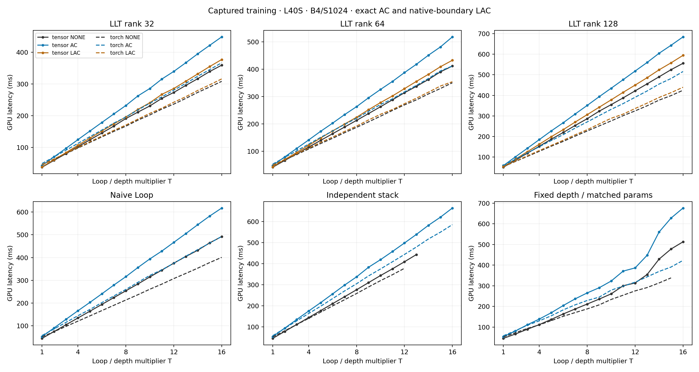
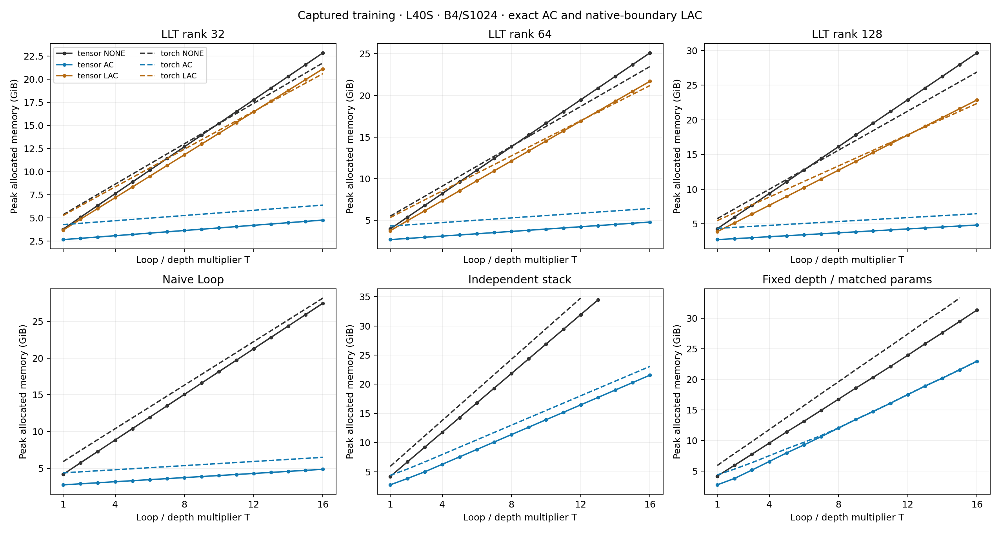

# L40S exact native-latent checkpoint and rank sweep

> Historical study. The current main result is [LOOP_SWEEP.md](../../experiments/l40s/LOOP_SWEEP.md); see the [archive index](../README.md) for context.

## Exact rank, AC, and native-boundary LAC results

**672 primary performance records:** 416 new cases and 256 unchanged original cases. **664 passed; 8 recorded OOM.** There are 12 small qualification cases and 12 full-size T=16 qualification cases, with 954 independently hashed sm89 CUDA artifacts.

All runs use B4/S1024, width 768, 12 heads, 12 base blocks, vocabulary 50,304, and T=1..16. LLT KV ranks are 32, 64, and 128. Conventional model geometry, the exact stack/fixed-depth parameter match, precision, seeded tokens, optimizer, timing samples, and primary graph-capture setup follow the [original protocol](../../experiments/l40s/LOOP_SWEEP.md).

**AC** checkpoints one full Transformer block with non-reentrant recomputation. **LAC** checkpoints only LLT’s existing latent attention and folded output projection, using the original projected queries Q_r, shared KV latent C, and folded output weight as explicit inputs. It adds no codec or trainable parameters and preserves all gradient paths. LAC uses the model’s existing rank; there is no separate checkpoint-compression rank. Naive Loop and both conventional stacked controls have no such latent boundary and show **LAC: N/A**.

The policies cover different regions: AC recomputes a whole block; LAC recomputes the latent attention/output branch. Query formation, residual and MLP paths remain outside LAC and contribute to peak memory. The shared latent alone does not reconstruct those states or establish constant total training memory. This is exact checkpointing of the unchanged forward model.

Inference stores no backward activations, so AC/LAC do not create separate inference configurations. Rank-32/rank-128 LLT inference is newly measured; rank-64 and baseline inference is reused. The original 256 records are preserved, and supplementary capture-setup retries are not substituted for primary OOMs. A skipped graph after eager OOM is labelled separately. Compilation/warmup are excluded; every successful full training profile checks finite loss/gradients and all 42 optimizer updates.

### Exactness and cache qualification

The small checks cover every variant at T=4 and T=16 with width 128, two base blocks, batch 2, and sequence 32. Both backends compare AC and applicable LAC gradients against uncheckpointed gradients, and Tensor against Torch within BF16 tolerances. Full-size checks use width 768, 12 base blocks, B4/S1024 at T=16, unchanged initial weights, no optimizer between policies, and CPU reference gradients to bound GPU residency. Each full-size check repeats uncheckpointed backward before comparing policies. Torch correctness checks enable deterministic algorithms and CUBLAS_WORKSPACE_CONFIG=:4096:8; Tensor checks use the unchanged kernels. These correctness controls do not replace or alter the primary performance settings. All parameter relative L2 errors must be below 1e-5; forward losses must agree exactly. Every check also compares supplied-token cached decode after a prefix with matching full-forward logits (maximum error <0.05; relative L2 <0.03). These qualify numerical behavior and do not establish trained language-model quality.

Default Torch BF16 backward is not a bitwise reference at full size. In the rank-32 diagnostic, two unchanged uncheckpointed runs differ by about 0.6% in the worst parameter, with comparable AC/LAC differences. Disabling the autocast cache does not remove this variation. Deterministic execution gives zero error for repeated uncheckpointed backward, AC and LAC. This is floating-point execution variability, without an approximate checkpoint codec. The [diagnostics](../../experiments/l40s/results/loop-sweep/diagnostics) retain both the original failed strict check and the repeat/control results.

Observed worst within-backend checkpoint gradient relative L2: **1.44652e-09**. Full details: [exact-gradient CSV](../../experiments/l40s/results/loop-sweep/exact-gradient-checks.csv).

### T=16 training endpoint

Cells are **CUDA graph ms / capture peak allocated GiB**, per batch of four.

**Tensor**

| Architecture | None | AC | LAC |
|---|---:|---:|---:|
| LLT rank 32 | 359.60 / 22.85 | 448.67 / 4.78 | 377.38 / 21.12 |
| LLT rank 64 | 411.77 / 25.11 | 518.51 / 4.79 | 432.84 / 21.70 |
| LLT rank 128 | 555.65 / 29.65 | 683.96 / 4.83 | 594.31 / 22.87 |
| Naive Loop | 492.07 / 27.45 | 617.41 / 4.88 | N/A |
| Independent stack | OOM | 663.75 / 21.56 | N/A |
| Fixed depth / matched params | 513.00 / 31.32 | 676.68 / 22.95 | N/A |

**Torch**

| Architecture | None | AC | LAC |
|---|---:|---:|---:|
| LLT rank 32 | 308.60 / 21.76 | 367.12 / 6.40 | 316.28 / 20.60 |
| LLT rank 64 | 350.49 / 23.47 | 411.93 / 6.42 | 354.35 / 21.19 |
| LLT rank 128 | 424.60 / 26.89 | 515.76 / 6.47 | 439.27 / 22.36 |
| Naive Loop | 400.78 / 28.14 | 492.85 / 6.50 | N/A |
| Independent stack | — (eager OOM) | 584.96 / 23.06 | N/A |
| Fixed depth / matched params | OOM | 422.95 / 22.98 | N/A |

### Data, figures, and reproduction

- [Complete combined CSV](../../experiments/l40s/results/loop-sweep/combined.csv), including eager GPU/wall latency, serving startup, capture peak allocation, origin, parameters, cache bytes, and raw-record paths. Raw records also retain replay allocation.
- [Audit](../../experiments/l40s/results/loop-sweep/audit.json) and [manifest](../../experiments/l40s/results/loop-sweep/run-manifest.json).
- Numerical kernels use [Tensor](https://github.com/kreasof-ai/tensor); successful Tensor cases have zero implicit numerical fallback. GPU jobs run sequentially in fresh processes.

```bash
LLT_RESUME=1 experiments/l40s/run_latent_checkpoint_sweep.sh
python experiments/l40s/latent_checkpoint_summary.py
python experiments/l40s/latent_checkpoint_report.py
python experiments/l40s/latent_checkpoint_manifest.py
```






PNG/PDF exports for eager training, prompt inference, serving startup and cached decode are beside the captured training figures. Raw samples, runtime versions, compiled artifact hashes and source snapshots remain available.

### Combined tables for every loop count

Cells are **CUDA graph ms / capture peak allocated GiB**, per batch of four. S=1024. All checkpoint policies are exact. LAC is N/A without an existing latent boundary. AC checkpoints full blocks; LAC checkpoints the latent attention/output region.

### Tensor — all loop counts

| T | Architecture | Train: none | Train: AC | Train: LAC | Prompt inference | Cached decode |
|---:|---|---:|---:|---:|---:|---:|
| 1 | LLT rank 32 | 37.94 / 3.79 | 43.36 / 2.67 | 38.98 / 3.70 | 6.08 / 0.85 | 0.63 / 0.75 |
| 1 | LLT rank 64 | 41.16 / 3.97 | 47.61 / 2.69 | 42.75 / 3.75 | 6.86 / 0.87 | 0.68 / 0.78 |
| 1 | LLT rank 128 | 50.57 / 4.30 | 58.53 / 2.73 | 53.12 / 3.88 | 8.84 / 0.91 | 0.78 / 0.81 |
| 1 | Naive Loop | 45.03 / 4.19 | 52.91 / 2.77 | N/A | 7.81 / 0.97 | 0.98 / 1.00 |
| 1 | Independent stack | 45.07 / 4.19 | 52.92 / 2.77 | N/A | 7.81 / 0.97 | 0.98 / 1.00 |
| 1 | Fixed depth / matched params | 45.06 / 4.19 | 52.92 / 2.77 | N/A | 7.82 / 0.97 | 0.98 / 1.00 |
| 2 | LLT rank 32 | 59.55 / 5.08 | 70.60 / 2.81 | 61.59 / 4.87 | 11.63 / 0.85 | 1.07 / 0.75 |
| 2 | LLT rank 64 | 65.80 / 5.39 | 78.80 / 2.83 | 69.12 / 4.96 | 13.10 / 0.87 | 1.18 / 0.78 |
| 2 | LLT rank 128 | 84.67 / 5.99 | 100.68 / 2.86 | 89.74 / 5.14 | 17.01 / 0.91 | 1.39 / 0.81 |
| 2 | Naive Loop | 74.94 / 5.76 | 90.72 / 2.91 | N/A | 15.38 / 0.97 | 1.79 / 1.14 |
| 2 | Independent stack | 77.90 / 6.72 | 93.56 / 3.86 | N/A | 15.35 / 1.47 | 1.79 / 1.64 |
| 2 | Fixed depth / matched params | 66.17 / 5.97 | 80.48 / 3.82 | N/A | 13.55 / 1.52 | 1.27 / 1.48 |
| 3 | LLT rank 32 | 80.86 / 6.36 | 97.52 / 2.95 | 84.04 / 6.03 | 17.14 / 0.85 | 1.51 / 0.75 |
| 3 | LLT rank 64 | 90.27 / 6.80 | 109.86 / 2.97 | 95.06 / 6.16 | 19.39 / 0.87 | 1.69 / 0.78 |
| 3 | LLT rank 128 | 118.59 / 7.68 | 142.57 / 3.01 | 125.83 / 6.41 | 25.24 / 0.91 | 1.99 / 0.81 |
| 3 | Naive Loop | 104.86 / 7.31 | 128.79 / 3.05 | N/A | 22.92 / 0.97 | 2.60 / 1.28 |
| 3 | Independent stack | 110.78 / 9.24 | 134.37 / 5.01 | N/A | 22.99 / 1.97 | 2.60 / 2.28 |
| 3 | Fixed depth / matched params | 89.24 / 7.77 | 110.91 / 5.18 | N/A | 19.71 / 2.05 | 1.57 / 1.94 |
| 4 | LLT rank 32 | 102.68 / 7.63 | 124.98 / 3.09 | 107.05 / 7.19 | 22.81 / 0.85 | 1.97 / 0.75 |
| 4 | LLT rank 64 | 114.77 / 8.21 | 140.97 / 3.11 | 121.28 / 7.36 | 25.65 / 0.87 | 2.19 / 0.78 |
| 4 | LLT rank 128 | 152.55 / 9.37 | 184.86 / 3.15 | 162.18 / 7.68 | 33.64 / 0.91 | 2.61 / 0.81 |
| 4 | Naive Loop | 134.68 / 8.86 | 166.50 / 3.19 | N/A | 30.56 / 0.97 | 3.41 / 1.42 |
| 4 | Independent stack | 143.82 / 11.76 | 174.85 / 6.28 | N/A | 30.51 / 2.47 | 3.41 / 2.92 |
| 4 | Fixed depth / matched params | 111.85 / 9.58 | 138.69 / 6.58 | N/A | 23.86 / 2.60 | 1.83 / 2.42 |
| 5 | LLT rank 32 | 124.32 / 8.89 | 152.13 / 3.23 | 129.68 / 8.35 | 28.26 / 0.85 | 2.39 / 0.75 |
| 5 | LLT rank 64 | 139.42 / 9.62 | 172.63 / 3.25 | 148.00 / 8.55 | 31.94 / 0.87 | 2.70 / 0.78 |
| 5 | LLT rank 128 | 186.87 / 11.06 | 227.17 / 3.29 | 199.03 / 8.94 | 42.81 / 0.91 | 3.22 / 0.81 |
| 5 | Naive Loop | 164.41 / 10.41 | 203.15 / 3.33 | N/A | 38.05 / 0.97 | 4.21 / 1.57 |
| 5 | Independent stack | 176.76 / 14.28 | 214.61 / 7.55 | N/A | 38.00 / 2.97 | 4.21 / 3.56 |
| 5 | Fixed depth / matched params | 137.14 / 11.40 | 169.43 / 7.98 | N/A | 29.20 / 3.16 | 2.11 / 2.91 |
| 6 | LLT rank 32 | 145.83 / 10.16 | 179.15 / 3.37 | 152.06 / 9.52 | 33.89 / 0.85 | 2.83 / 0.75 |
| 6 | LLT rank 64 | 163.83 / 11.03 | 202.56 / 3.39 | 174.19 / 9.75 | 38.24 / 0.87 | 3.20 / 0.78 |
| 6 | LLT rank 128 | 219.41 / 12.75 | 266.96 / 3.43 | 233.34 / 10.21 | 49.33 / 0.91 | 3.81 / 0.81 |
| 6 | Naive Loop | 194.41 / 11.96 | 240.94 / 3.47 | N/A | 45.64 / 0.97 | 5.03 / 1.71 |
| 6 | Independent stack | 209.80 / 16.80 | 256.14 / 8.83 | N/A | 45.59 / 3.47 | 5.03 / 4.20 |
| 6 | Fixed depth / matched params | 163.44 / 13.14 | 204.32 / 9.27 | N/A | 34.41 / 3.69 | 2.39 / 3.37 |
| 7 | LLT rank 32 | 167.72 / 11.43 | 206.02 / 3.51 | 174.45 / 10.68 | 39.56 / 0.85 | 3.27 / 0.75 |
| 7 | LLT rank 64 | 188.31 / 12.44 | 233.83 / 3.53 | 199.23 / 10.94 | 44.49 / 0.87 | 3.70 / 0.78 |
| 7 | LLT rank 128 | 253.69 / 14.44 | 309.48 / 3.57 | 270.17 / 11.47 | 58.37 / 0.91 | 4.43 / 0.81 |
| 7 | Naive Loop | 224.25 / 13.51 | 279.32 / 3.61 | N/A | 53.22 / 0.97 | 5.84 / 1.85 |
| 7 | Independent stack | 242.72 / 19.33 | 297.99 / 10.10 | N/A | 53.16 / 3.97 | 5.85 / 4.84 |
| 7 | Fixed depth / matched params | 187.68 / 14.94 | 236.79 / 10.64 | N/A | 40.01 / 4.23 | 2.68 / 3.84 |
| 8 | LLT rank 32 | 191.40 / 12.70 | 232.47 / 3.65 | 196.24 / 11.84 | 46.30 / 0.85 | 3.72 / 0.75 |
| 8 | LLT rank 64 | 212.72 / 13.84 | 262.87 / 3.67 | 224.18 / 12.14 | 50.70 / 0.87 | 4.21 / 0.78 |
| 8 | LLT rank 128 | 286.51 / 16.13 | 351.02 / 3.71 | 306.16 / 12.74 | 65.52 / 0.91 | 5.02 / 0.81 |
| 8 | Naive Loop | 254.00 / 15.06 | 316.13 / 3.75 | N/A | 60.83 / 0.97 | 6.65 / 1.99 |
| 8 | Independent stack | 275.84 / 21.85 | 337.02 / 11.38 | N/A | 60.72 / 4.47 | 6.66 / 5.48 |
| 8 | Fixed depth / matched params | 211.50 / 16.76 | 265.42 / 12.04 | N/A | 45.49 / 4.79 | 2.97 / 4.32 |
| 9 | LLT rank 32 | 211.46 / 13.97 | 262.54 / 3.79 | 220.04 / 13.00 | 52.04 / 0.85 | 4.16 / 0.75 |
| 9 | LLT rank 64 | 237.66 / 15.25 | 295.44 / 3.81 | 251.70 / 13.33 | 57.05 / 0.87 | 4.71 / 0.78 |
| 9 | LLT rank 128 | 322.92 / 17.82 | 393.38 / 3.85 | 342.20 / 14.01 | 75.38 / 0.91 | 5.63 / 0.81 |
| 9 | Naive Loop | 283.90 / 16.61 | 355.99 / 3.89 | N/A | 68.38 / 0.97 | 7.45 / 2.13 |
| 9 | Independent stack | 309.73 / 24.37 | 382.59 / 12.65 | N/A | 69.14 / 4.97 | 7.46 / 6.12 |
| 9 | Fixed depth / matched params | 235.45 / 18.57 | 290.50 / 13.43 | N/A | 51.05 / 5.34 | 3.25 / 4.81 |
| 10 | LLT rank 32 | 231.05 / 15.24 | 286.08 / 3.93 | 241.27 / 14.16 | 56.01 / 0.85 | 4.59 / 0.75 |
| 10 | LLT rank 64 | 262.70 / 16.66 | 326.03 / 3.95 | 277.91 / 14.53 | 63.71 / 0.87 | 5.23 / 0.78 |
| 10 | LLT rank 128 | 354.77 / 19.51 | 434.48 / 3.99 | 378.08 / 15.27 | 83.36 / 0.91 | 6.23 / 0.81 |
| 10 | Naive Loop | 314.86 / 18.15 | 394.01 / 4.03 | N/A | 76.43 / 0.97 | 8.27 / 2.27 |
| 10 | Independent stack | 343.26 / 26.89 | 418.68 / 13.92 | N/A | 76.39 / 5.46 | 8.27 / 6.76 |
| 10 | Fixed depth / matched params | 260.87 / 20.31 | 322.95 / 14.73 | N/A | 60.07 / 5.87 | 3.53 / 5.27 |
| 11 | LLT rank 32 | 254.94 / 16.51 | 315.79 / 4.07 | 267.50 / 15.32 | 63.35 / 0.85 | 5.04 / 0.75 |
| 11 | LLT rank 64 | 288.14 / 18.07 | 355.47 / 4.09 | 302.28 / 15.73 | 71.83 / 0.87 | 5.75 / 0.78 |
| 11 | LLT rank 128 | 387.64 / 21.20 | 476.10 / 4.13 | 414.57 / 16.54 | 89.81 / 0.91 | 6.83 / 0.81 |
| 11 | Naive Loop | 344.72 / 19.70 | 428.43 / 4.17 | N/A | 83.68 / 0.97 | 9.08 / 2.41 |
| 11 | Independent stack | 375.32 / 29.41 | 457.62 / 15.19 | N/A | 84.02 / 5.96 | 9.08 / 7.40 |
| 11 | Fixed depth / matched params | 300.16 / 22.10 | 371.03 / 16.09 | N/A | 67.52 / 6.41 | 4.36 / 5.74 |
| 12 | LLT rank 32 | 273.58 / 17.78 | 339.85 / 4.21 | 285.99 / 16.48 | 66.94 / 0.85 | 5.46 / 0.75 |
| 12 | LLT rank 64 | 314.02 / 19.48 | 387.70 / 4.23 | 328.93 / 16.92 | 78.09 / 0.87 | 6.24 / 0.78 |
| 12 | LLT rank 128 | 421.75 / 22.89 | 518.07 / 4.27 | 449.74 / 17.80 | 98.82 / 0.91 | 7.44 / 0.81 |
| 12 | Naive Loop | 375.32 / 21.25 | 466.69 / 4.31 | N/A | 93.12 / 0.97 | 9.90 / 2.55 |
| 12 | Independent stack | 408.77 / 31.94 | 497.81 / 16.47 | N/A | 92.48 / 6.46 | 9.90 / 8.04 |
| 12 | Fixed depth / matched params | 313.54 / 23.93 | 386.62 / 17.49 | N/A | 74.00 / 6.96 | 4.11 / 6.22 |
| 13 | LLT rank 32 | 295.70 / 19.04 | 367.14 / 4.35 | 308.88 / 17.64 | 72.80 / 0.85 | 5.90 / 0.75 |
| 13 | LLT rank 64 | 337.51 / 20.89 | 418.33 / 4.37 | 355.55 / 18.12 | 85.07 / 0.87 | 6.76 / 0.78 |
| 13 | LLT rank 128 | 455.68 / 24.58 | 559.60 / 4.41 | 485.61 / 19.07 | 107.82 / 0.91 | 8.04 / 0.81 |
| 13 | Naive Loop | 404.44 / 22.80 | 504.99 / 4.46 | N/A | 99.10 / 0.97 | 10.70 / 2.69 |
| 13 | Independent stack | 443.08 / 34.46 | 538.69 / 17.74 | N/A | 98.93 / 6.96 | 10.70 / 8.68 |
| 13 | Fixed depth / matched params | 354.42 / 25.80 | 447.80 / 18.89 | N/A | 86.85 / 7.52 | 4.40 / 6.71 |
| 14 | LLT rank 32 | 316.93 / 20.31 | 395.36 / 4.49 | 331.98 / 18.80 | 78.24 / 0.85 | 6.34 / 0.75 |
| 14 | LLT rank 64 | 362.51 / 22.30 | 451.34 / 4.51 | 381.51 / 19.31 | 92.62 / 0.87 | 7.26 / 0.78 |
| 14 | LLT rank 128 | 490.08 / 26.27 | 604.33 / 4.55 | 523.94 / 20.34 | 118.50 / 0.91 | 8.69 / 0.81 |
| 14 | Naive Loop | 432.17 / 24.35 | 544.28 / 4.60 | N/A | 105.60 / 0.97 | 11.51 / 2.83 |
| 14 | Independent stack | OOM | 581.74 / 19.02 | N/A | 105.43 / 7.46 | 11.54 / 9.32 |
| 14 | Fixed depth / matched params | 429.22 / 27.60 | 560.55 / 20.19 | N/A | 123.55 / 8.05 | 4.69 / 7.17 |
| 15 | LLT rank 32 | 339.56 / 21.58 | 422.13 / 4.63 | 355.24 / 19.96 | 84.03 / 0.85 | 6.79 / 0.75 |
| 15 | LLT rank 64 | 390.41 / 23.71 | 481.64 / 4.65 | 409.16 / 20.51 | 96.29 / 0.87 | 7.76 / 0.78 |
| 15 | LLT rank 128 | 524.58 / 27.96 | 643.22 / 4.69 | 557.90 / 21.60 | 123.69 / 0.91 | 9.25 / 0.81 |
| 15 | Naive Loop | 464.64 / 25.90 | 582.35 / 4.74 | N/A | 115.41 / 0.97 | 12.34 / 2.97 |
| 15 | Independent stack | OOM | 620.28 / 20.29 | N/A | 116.51 / 7.96 | 12.33 / 9.96 |
| 15 | Fixed depth / matched params | 478.17 / 29.45 | 628.15 / 21.55 | N/A | 142.42 / 8.59 | 6.59 / 7.64 |
| 16 | LLT rank 32 | 359.60 / 22.85 | 448.67 / 4.78 | 377.38 / 21.12 | 89.33 / 0.85 | 7.22 / 0.75 |
| 16 | LLT rank 64 | 411.77 / 25.11 | 518.51 / 4.79 | 432.84 / 21.70 | 101.80 / 0.87 | 8.26 / 0.78 |
| 16 | LLT rank 128 | 555.65 / 29.65 | 683.96 / 4.83 | 594.31 / 22.87 | 130.19 / 0.91 | 9.86 / 0.81 |
| 16 | Naive Loop | 492.07 / 27.45 | 617.41 / 4.88 | N/A | 122.17 / 0.97 | 13.13 / 3.11 |
| 16 | Independent stack | OOM | 663.75 / 21.56 | N/A | 122.48 / 8.46 | 13.14 / 10.60 |
| 16 | Fixed depth / matched params | 513.00 / 31.32 | 676.68 / 22.95 | N/A | 154.36 / 9.14 | 9.56 / 8.12 |

### Torch — all loop counts

| T | Architecture | Train: none | Train: AC | Train: LAC | Prompt inference | Cached decode |
|---:|---|---:|---:|---:|---:|---:|
| 1 | LLT rank 32 | 45.83 / 5.36 | 49.56 / 4.29 | 46.24 / 5.27 | 5.42 / 0.86 | 0.92 / 0.77 |
| 1 | LLT rank 64 | 48.20 / 5.50 | 52.68 / 4.32 | 48.80 / 5.33 | 6.14 / 0.88 | 1.00 / 0.80 |
| 1 | LLT rank 128 | 53.19 / 5.75 | 58.48 / 4.36 | 54.11 / 5.47 | 7.69 / 0.93 | 1.08 / 0.82 |
| 1 | Naive Loop | 51.82 / 5.93 | 57.75 / 4.39 | N/A | 6.87 / 0.99 | 1.33 / 1.02 |
| 1 | Independent stack | 51.82 / 5.93 | 57.73 / 4.39 | N/A | 6.91 / 0.99 | 1.33 / 1.02 |
| 1 | Fixed depth / matched params | 51.81 / 5.93 | 57.67 / 4.39 | N/A | 6.89 / 0.99 | 1.33 / 1.02 |
| 2 | LLT rank 32 | 63.25 / 6.47 | 70.49 / 4.43 | 64.10 / 6.31 | 10.33 / 0.86 | 1.69 / 0.77 |
| 2 | LLT rank 64 | 67.77 / 6.70 | 76.96 / 4.45 | 69.39 / 6.41 | 11.79 / 0.88 | 1.86 / 0.80 |
| 2 | LLT rank 128 | 78.39 / 7.17 | 89.25 / 4.49 | 79.90 / 6.61 | 14.87 / 0.93 | 2.02 / 0.82 |
| 2 | Naive Loop | 74.59 / 7.43 | 86.22 / 4.54 | N/A | 13.55 / 0.99 | 2.53 / 1.16 |
| 2 | Independent stack | 81.06 / 8.55 | 92.64 / 5.48 | N/A | 13.64 / 1.49 | 2.53 / 1.66 |
| 2 | Fixed depth / matched params | 72.35 / 7.90 | 82.34 / 5.34 | N/A | 11.50 / 1.53 | 1.59 / 1.50 |
| 3 | LLT rank 32 | 80.73 / 7.56 | 91.60 / 4.57 | 82.05 / 7.34 | 15.26 / 0.86 | 2.46 / 0.77 |
| 3 | LLT rank 64 | 87.80 / 7.90 | 101.26 / 4.59 | 90.23 / 7.47 | 17.44 / 0.88 | 2.71 / 0.80 |
| 3 | LLT rank 128 | 103.17 / 8.58 | 119.83 / 4.64 | 105.85 / 7.73 | 21.96 / 0.93 | 2.96 / 0.82 |
| 3 | Naive Loop | 97.66 / 8.92 | 115.39 / 4.68 | N/A | 20.29 / 0.99 | 3.72 / 1.30 |
| 3 | Independent stack | 110.52 / 11.17 | 128.02 / 6.70 | N/A | 20.22 / 1.99 | 3.72 / 2.30 |
| 3 | Fixed depth / matched params | 93.32 / 9.83 | 108.81 / 6.39 | N/A | 16.70 / 2.06 | 1.83 / 1.95 |
| 4 | LLT rank 32 | 98.52 / 8.65 | 113.13 / 4.71 | 100.15 / 8.36 | 20.36 / 0.86 | 3.24 / 0.77 |
| 4 | LLT rank 64 | 107.80 / 9.10 | 125.76 / 4.73 | 111.02 / 8.53 | 23.11 / 0.88 | 3.57 / 0.80 |
| 4 | LLT rank 128 | 127.99 / 9.99 | 150.32 / 4.78 | 131.69 / 8.85 | 29.10 / 0.93 | 3.88 / 0.82 |
| 4 | Naive Loop | 120.87 / 10.39 | 144.60 / 4.82 | N/A | 26.98 / 0.99 | 4.92 / 1.44 |
| 4 | Independent stack | 140.02 / 13.79 | 163.04 / 7.96 | N/A | 27.12 / 2.49 | 4.92 / 2.94 |
| 4 | Fixed depth / matched params | 110.61 / 11.79 | 130.16 / 7.52 | N/A | 21.44 / 2.62 | 2.03 / 2.44 |
| 5 | LLT rank 32 | 116.19 / 9.75 | 134.33 / 4.85 | 118.38 / 9.38 | 25.36 / 0.86 | 4.01 / 0.77 |
| 5 | LLT rank 64 | 127.86 / 10.30 | 150.58 / 4.87 | 132.21 / 9.58 | 28.72 / 0.88 | 4.42 / 0.80 |
| 5 | LLT rank 128 | 152.95 / 11.39 | 180.27 / 4.92 | 156.60 / 9.98 | 36.15 / 0.93 | 4.81 / 0.82 |
| 5 | Naive Loop | 143.86 / 11.87 | 172.21 / 4.96 | N/A | 33.67 / 0.99 | 6.12 / 1.58 |
| 5 | Independent stack | 169.41 / 16.41 | 197.62 / 9.22 | N/A | 33.69 / 2.99 | 6.12 / 3.58 |
| 5 | Fixed depth / matched params | 131.27 / 13.76 | 154.60 / 8.65 | N/A | 26.14 / 3.18 | 2.34 / 2.93 |
| 6 | LLT rank 32 | 133.66 / 10.84 | 155.23 / 4.99 | 136.23 / 10.40 | 30.27 / 0.86 | 4.78 / 0.77 |
| 6 | LLT rank 64 | 147.15 / 11.49 | 173.76 / 5.01 | 151.59 / 10.64 | 34.40 / 0.88 | 5.27 / 0.80 |
| 6 | LLT rank 128 | 176.28 / 12.80 | 209.12 / 5.06 | 181.61 / 11.11 | 43.02 / 0.93 | 5.75 / 0.82 |
| 6 | Naive Loop | 167.14 / 13.35 | 202.18 / 5.10 | N/A | 40.55 / 0.99 | 7.32 / 1.72 |
| 6 | Independent stack | 199.10 / 19.04 | 233.82 / 10.47 | N/A | 40.30 / 3.48 | 7.32 / 4.22 |
| 6 | Fixed depth / matched params | 152.11 / 15.69 | 183.29 / 9.72 | N/A | 30.98 / 3.71 | 2.58 / 3.39 |
| 7 | LLT rank 32 | 150.97 / 11.93 | 177.00 / 5.13 | 154.15 / 11.42 | 35.38 / 0.86 | 5.56 / 0.77 |
| 7 | LLT rank 64 | 167.60 / 12.69 | 197.99 / 5.15 | 172.18 / 11.69 | 40.12 / 0.88 | 6.13 / 0.80 |
| 7 | LLT rank 128 | 201.99 / 14.21 | 240.87 / 5.20 | 208.22 / 12.23 | 50.45 / 0.93 | 6.71 / 0.82 |
| 7 | Naive Loop | 190.43 / 14.83 | 231.56 / 5.24 | N/A | 47.17 / 0.99 | 8.51 / 1.86 |
| 7 | Independent stack | 228.62 / 21.66 | 270.12 / 11.73 | N/A | 47.06 / 3.98 | 8.51 / 4.86 |
| 7 | Fixed depth / matched params | 170.28 / 17.66 | 207.71 / 10.82 | N/A | 35.46 / 4.25 | 2.84 / 3.86 |
| 8 | LLT rank 32 | 167.31 / 13.02 | 196.20 / 5.27 | 170.73 / 12.44 | 39.87 / 0.86 | 6.32 / 0.77 |
| 8 | LLT rank 64 | 187.15 / 13.89 | 220.36 / 5.30 | 191.77 / 12.75 | 45.68 / 0.88 | 6.98 / 0.80 |
| 8 | LLT rank 128 | 226.64 / 15.62 | 270.76 / 5.34 | 232.83 / 13.36 | 58.10 / 0.93 | 7.65 / 0.82 |
| 8 | Naive Loop | 213.55 / 16.31 | 259.99 / 5.38 | N/A | 53.89 / 0.99 | 9.71 / 2.00 |
| 8 | Independent stack | 257.97 / 24.28 | 304.31 / 12.99 | N/A | 53.91 / 4.48 | 9.72 / 5.50 |
| 8 | Fixed depth / matched params | 187.94 / 19.60 | 228.71 / 12.07 | N/A | 40.49 / 4.80 | 3.10 / 4.34 |
| 9 | LLT rank 32 | 186.19 / 14.12 | 218.23 / 5.41 | 189.43 / 13.46 | 45.18 / 0.86 | 7.09 / 0.77 |
| 9 | LLT rank 64 | 207.27 / 15.09 | 245.76 / 5.44 | 214.29 / 13.80 | 51.47 / 0.88 | 7.84 / 0.80 |
| 9 | LLT rank 128 | 251.34 / 17.03 | 301.39 / 5.48 | 261.17 / 14.48 | 64.74 / 0.93 | 8.56 / 0.82 |
| 9 | Naive Loop | 236.68 / 17.79 | 291.03 / 5.52 | N/A | 60.66 / 0.99 | 10.91 / 2.15 |
| 9 | Independent stack | 289.10 / 26.90 | 341.52 / 14.25 | N/A | 61.36 / 4.98 | 10.92 / 6.14 |
| 9 | Fixed depth / matched params | 207.45 / 21.57 | 244.91 / 13.46 | N/A | 45.55 / 5.36 | 3.36 / 4.83 |
| 10 | LLT rank 32 | 202.68 / 15.21 | 239.65 / 5.55 | 207.63 / 14.48 | 50.23 / 0.86 | 7.87 / 0.77 |
| 10 | LLT rank 64 | 228.11 / 16.29 | 270.75 / 5.58 | 235.04 / 14.86 | 58.06 / 0.88 | 8.70 / 0.80 |
| 10 | LLT rank 128 | 275.80 / 18.44 | 331.92 / 5.62 | 288.40 / 15.61 | 71.75 / 0.93 | 9.49 / 0.82 |
| 10 | Naive Loop | 260.92 / 19.27 | 321.59 / 5.66 | N/A | 68.25 / 0.99 | 12.12 / 2.29 |
| 10 | Independent stack | 319.11 / 29.52 | 374.56 / 15.51 | N/A | 68.85 / 5.48 | 12.11 / 6.78 |
| 10 | Fixed depth / matched params | 233.74 / 23.50 | 278.87 / 14.76 | N/A | 52.48 / 5.89 | 3.60 / 5.29 |
| 11 | LLT rank 32 | 221.06 / 16.30 | 259.71 / 5.69 | 224.04 / 15.50 | 54.99 / 0.86 | 8.63 / 0.77 |
| 11 | LLT rank 64 | 249.20 / 17.48 | 291.73 / 5.72 | 252.60 / 15.91 | 64.72 / 0.88 | 9.58 / 0.80 |
| 11 | LLT rank 128 | 301.17 / 19.85 | 359.79 / 5.76 | 308.73 / 16.73 | 78.60 / 0.93 | 10.42 / 0.82 |
| 11 | Naive Loop | 283.27 / 20.75 | 346.13 / 5.80 | N/A | 74.24 / 0.99 | 13.30 / 2.43 |
| 11 | Independent stack | 347.36 / 32.15 | 408.83 / 16.77 | N/A | 74.76 / 5.98 | 13.32 / 7.42 |
| 11 | Fixed depth / matched params | 254.34 / 25.44 | 298.38 / 16.13 | N/A | 58.60 / 6.42 | 4.32 / 5.75 |
| 12 | LLT rank 32 | 236.87 / 17.39 | 280.86 / 5.83 | 242.75 / 16.52 | 59.73 / 0.86 | 9.41 / 0.77 |
| 12 | LLT rank 64 | 269.48 / 18.68 | 317.04 / 5.86 | 273.72 / 16.97 | 69.23 / 0.88 | 10.41 / 0.80 |
| 12 | LLT rank 128 | 324.45 / 21.26 | 390.56 / 5.90 | 335.89 / 17.86 | 85.68 / 0.93 | 11.35 / 0.82 |
| 12 | Naive Loop | 307.68 / 22.23 | 375.04 / 5.94 | N/A | 81.40 / 0.99 | 14.51 / 2.57 |
| 12 | Independent stack | 377.72 / 34.77 | 443.43 / 18.03 | N/A | 81.32 / 6.48 | 14.50 / 8.06 |
| 12 | Fixed depth / matched params | 275.21 / 27.40 | 317.51 / 17.52 | N/A | 63.18 / 6.98 | 4.08 / 6.24 |
| 13 | LLT rank 32 | 254.80 / 18.48 | 302.07 / 5.97 | 260.11 / 17.54 | 64.83 / 0.86 | 10.18 / 0.77 |
| 13 | LLT rank 64 | 287.95 / 19.88 | 341.11 / 6.00 | 294.15 / 18.02 | 74.85 / 0.88 | 11.26 / 0.80 |
| 13 | LLT rank 128 | 349.17 / 22.66 | 421.10 / 6.04 | 361.99 / 18.98 | 92.82 / 0.93 | 12.28 / 0.82 |
| 13 | Naive Loop | 330.28 / 23.71 | 405.74 / 6.08 | N/A | 88.12 / 0.99 | 15.71 / 2.71 |
| 13 | Independent stack | OOM | 478.96 / 19.28 | N/A | 87.71 / 6.98 | 15.70 / 8.70 |
| 13 | Fixed depth / matched params | 291.40 / 29.39 | 343.22 / 18.92 | N/A | 68.00 / 7.54 | 4.31 / 6.72 |
| 14 | LLT rank 32 | 273.76 / 19.58 | 324.60 / 6.11 | 279.95 / 18.56 | 70.17 / 0.86 | 10.97 / 0.77 |
| 14 | LLT rank 64 | 309.59 / 21.08 | 366.11 / 6.14 | 315.97 / 19.08 | 80.44 / 0.88 | 12.12 / 0.80 |
| 14 | LLT rank 128 | 376.69 / 24.07 | 454.80 / 6.19 | 389.60 / 20.11 | 101.07 / 0.93 | 13.23 / 0.82 |
| 14 | Naive Loop | 353.41 / 25.19 | 435.01 / 6.22 | N/A | 94.94 / 0.99 | 16.90 / 2.85 |
| 14 | Independent stack | OOM | 516.84 / 20.54 | N/A | 95.24 / 7.48 | 16.90 / 9.34 |
| 14 | Fixed depth / matched params | 313.71 / 31.30 | 369.50 / 20.22 | N/A | 75.26 / 8.07 | 4.56 / 7.18 |
| 15 | LLT rank 32 | 290.89 / 20.67 | 345.56 / 6.26 | 297.56 / 19.58 | 75.29 / 0.86 | 11.73 / 0.77 |
| 15 | LLT rank 64 | 329.49 / 22.28 | 393.90 / 6.28 | 338.46 / 20.13 | 86.21 / 0.88 | 12.97 / 0.80 |
| 15 | LLT rank 128 | 398.62 / 25.48 | 481.63 / 6.33 | 412.94 / 21.23 | 107.16 / 0.93 | 14.15 / 0.82 |
| 15 | Naive Loop | 378.01 / 26.67 | 463.48 / 6.36 | N/A | 101.93 / 0.99 | 18.11 / 2.99 |
| 15 | Independent stack | — (earlier OOM) | 549.08 / 21.80 | N/A | 101.84 / 7.98 | 18.11 / 9.98 |
| 15 | Fixed depth / matched params | 338.26 / 33.26 | 390.85 / 21.59 | N/A | 81.62 / 8.61 | 4.80 / 7.65 |
| 16 | LLT rank 32 | 308.60 / 21.76 | 367.12 / 6.40 | 316.28 / 20.60 | 80.29 / 0.86 | 12.52 / 0.77 |
| 16 | LLT rank 64 | 350.49 / 23.47 | 411.93 / 6.42 | 354.35 / 21.19 | 92.74 / 0.88 | 13.83 / 0.80 |
| 16 | LLT rank 128 | 424.60 / 26.89 | 515.76 / 6.47 | 439.27 / 22.36 | 114.91 / 0.93 | 15.10 / 0.82 |
| 16 | Naive Loop | 400.78 / 28.14 | 492.85 / 6.50 | N/A | 109.90 / 0.99 | 19.29 / 3.13 |
| 16 | Independent stack | — (earlier OOM) | 584.96 / 23.06 | N/A | 110.70 / 8.48 | 19.31 / 10.62 |
| 16 | Fixed depth / matched params | OOM | 422.95 / 22.98 | N/A | 83.56 / 9.16 | 5.04 / 8.14 |
