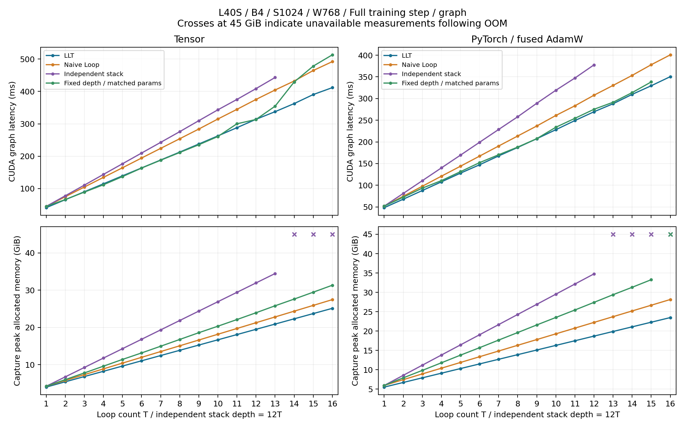
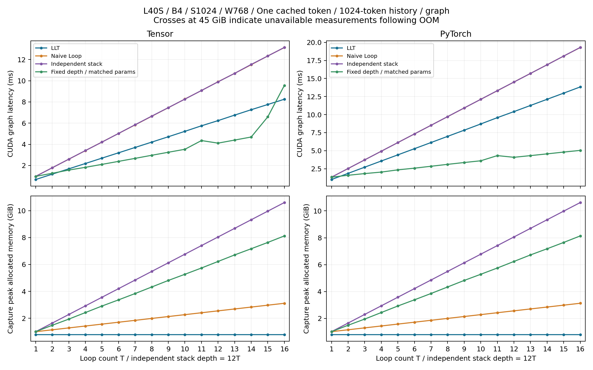
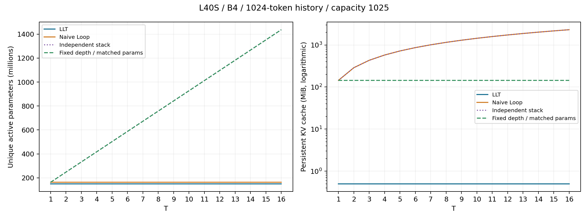

# L40S four-model loop sweep — 2026-10-08

> Historical study. The current main result is [LOOP_SWEEP.md](../../experiments/l40s/LOOP_SWEEP.md); see the [archive index](../README.md) for context.

Batch **4**, sequence length **1024**, and loop counts **1 through 16**. The complete grid covers LLT, Naive Loop, an independent deeper stack, and a fixed-depth model whose active parameter count exactly matches that stack. [Tensor](https://github.com/kreasof-ai/tensor) supplies numerical kernels, with matched PyTorch / Flash SDPA / fused AdamW controls.

All **256 requested cases** were attempted: **248 passed**, **8 recorded OOMs**. Eight small-geometry output/all-parameter-gradient/cache checks passed, and **544 CUDA artifacts** were audited against their SHA-256 hashes and `sm_89` target. No numerical fallback was reported by any successful Tensor case.

Six supplementary capture retries released eager gradients before capture: five passed and one remained OOM. The original grid is preserved.

These are seeded synthetic performance measurements. Model quality is not compared. All latencies are per batch, and cached decoding produces one token for each of the four sequences.

## Model definitions

| Architecture | Unique blocks | Applied blocks | MLP hidden width |
|---|---:|---:|---:|
| LLT | 12 | 12T | 3072 |
| Naive Loop | 12 | 12T | 3072 |
| Independent stack | 12T | 12T | 3072 |
| Fixed depth, matched parameters | 12 | 12 | 768(6T−2) |

Every model uses width 768, 12 heads, head dimension 64, vocabulary 50,304, untied input/output embeddings, exact GELU, unweighted RMSNorm, and learned absolute positions with capacity 1025. LLT shares a rank-64 latent across every block and pass. Residuals/master weights/embeddings/AdamW states are FP32; projections and attention are BF16. Inference retains explicit BF16 linear-weight copies on both backends.

The fixed-depth model matches the **stack**, not the recurrent models. It uses all matching parameters in its MLPs. Its attention depth stays at 12; equal parameter counts therefore do not imply equal attention work or activation memory. At T=1, the three conventional architectures coincide and were measured independently.

| T | LLT parameters | Naive Loop parameters | Stack = fixed-depth parameters |
|---:|---:|---:|---:|
| 1 | 150,061,824 | 162,988,800 | 162,988,800 |
| 4 | 150,061,824 | 162,988,800 | 417,792,768 |
| 8 | 150,061,824 | 162,988,800 | 757,531,392 |
| 16 | 150,061,824 | 162,988,800 | 1,437,008,640 |

## Sixteen-loop results

Full training step CUDA graph latency / capture peak allocated memory (**ms / GiB**). This includes full-token logits/loss, backward, global gradient clipping, and AdamW. No activation checkpointing or streamed classifier is enabled. This table uses the primary capture setup; successful cleared-gradient retries are listed below.

| Architecture | Tensor | PyTorch / fused AdamW |
|---|---:|---:|
| LLT | 411.77 / 25.11 | 350.49 / 23.47 |
| Naive Loop | 492.07 / 27.45 | 400.78 / 28.14 |
| Independent stack | OOM | OOM |
| Fixed depth, matched params | 513.00 / 31.32 | OOM |

Cached single-token inference after a 1024-token history, with persistent KV stores. Latency / capture peak allocated memory (**ms / GiB**). Logical rewind is included in graph replay; sampling and beam search are outside this experiment.

| Architecture | Tensor | PyTorch | KV cache, Tensor (MiB) |
|---|---:|---:|---:|
| LLT | 8.26 / 0.78 | 13.83 / 0.80 | 0.50 |
| Naive Loop | 13.13 / 3.11 | 19.29 / 3.13 | 2306.26 |
| Independent stack | 13.14 / 10.60 | 19.31 / 10.62 | 2306.26 |
| Fixed depth, matched params | 9.56 / 8.12 | 5.04 / 8.14 | 144.14 |

Prompt processing (causal 1024-token forward, last logits, no persistent KV allocation) and serving startup (including KV allocation/copy and LLT fold rebuild) are separate measurements. Tensor CUDA graph latency / capture peak allocated memory (**ms / GiB**):

| Architecture | Prompt | Serving startup |
|---|---:|---:|
| LLT | 101.80 / 0.87 | 102.05 / 0.87 |
| Naive Loop | 122.17 / 0.97 | 129.25 / 5.36 |
| Independent stack | 122.48 / 8.46 | 130.07 / 12.85 |
| Fixed depth, matched params | 154.36 / 9.14 | 154.78 / 9.27 |

## Scaling and memory limits

LLT’s persistent KV cache stays at approximately **0.50 MiB** across T. Naive Loop and the independent stack retain approximately **144.14 MiB × T**. The fixed-depth model keeps 12 KV stores (approximately 144.14 MiB), while its parameter memory grows to match the deeper stack. Prompt-only inference can discard intermediate K/V; its memory does not imply the same saving as persistent serving.

Total LLT training memory grows with T. The backend speed and memory comparisons also change with T; the figures retain every requested loop count and show eager execution separately from CUDA graph replay.

Largest successful T in the primary capture setup (cleared-gradient retries are reported separately below):

| Architecture | Tensor eager training | Tensor graph training | Torch eager training | Torch graph training |
|---|---:|---:|---:|---:|
| LLT | 16 | 16 | 16 | 16 |
| Naive Loop | 16 | 16 | 16 | 16 |
| Independent stack | 16 | 13 | 14 | 12 |
| Fixed depth, matched params | 16 | 16 | 16 | 15 |

Recorded failures:

- Fixed depth, matched params / torch / T=16 / `training_graph`.
- Independent stack / tensor / T=14 / `training_graph`.
- Independent stack / tensor / T=15 / `training_graph`.
- Independent stack / tensor / T=16 / `training_graph`.
- Independent stack / torch / T=13 / `training_graph`.
- Independent stack / torch / T=14 / `training_graph`.
- Independent stack / torch / T=15 / `training_eager`.
- Independent stack / torch / T=16 / `training_eager`.

A recorded OOM does not substitute a smaller batch, shorter sequence, or checkpointed model. Operations completed before an OOM remain in the CSV; later skipped operations have no timing value.

## Controlled capture retries

These additional measurements release eager gradients, collect garbage, and empty cached allocations after graph warmup and before capture. Batch, sequence, model parameters, numerical kernels, optimizer, and the 42-update counter check stay identical. They do not replace the original grid. A capture OOM is therefore distinguished from an eager-training OOM and from avoidable setup storage.

| Architecture | Backend | T | Retry graph ms / peak GiB | Released gradients (GiB) |
|---|---|---:|---:|---:|
| Fixed depth, matched params | torch | 16 | 346.83 / 35.22 | 5.36 |
| Independent stack | tensor | 14 | 474.42 / 36.98 | 4.92 |
| Independent stack | tensor | 15 | 506.83 / 39.50 | 5.25 |
| Independent stack | tensor | 16 | OOM | — |
| Independent stack | torch | 13 | 406.72 / 37.39 | 4.57 |
| Independent stack | torch | 14 | 437.58 / 40.01 | 4.94 |

## Figures and complete data







- [Every case and metric as CSV](../../experiments/l40s/results/loop-baseline/summary.csv).
- [Controlled capture retry CSV](../../experiments/l40s/results/loop-baseline/capture-recovery/summary.csv).
- [All 16 Tensor loop counts as latency/memory tables](../../experiments/l40s/results/loop-baseline/tables.md).
- [Prompt graphs](../../experiments/l40s/results/loop-baseline/prompt-graph.png) and [serving-startup graphs](../../experiments/l40s/results/loop-baseline/startup-graph.png).
- [Eager training](../../experiments/l40s/results/loop-baseline/training-eager.png), [prompt](../../experiments/l40s/results/loop-baseline/prompt-eager.png), [startup](../../experiments/l40s/results/loop-baseline/startup-eager.png), and [decode](../../experiments/l40s/results/loop-baseline/decode-eager.png).
- Every PNG has a matching standalone PDF in [the results directory](../../experiments/l40s/results/loop-baseline).
- [Raw artifact/input audit](../../experiments/l40s/results/loop-baseline/audit.json) and [runtime/source manifest](../../experiments/l40s/results/loop-baseline/run-manifest.json).

## Measurement and reproduction

Each GPU case uses a fresh process; all jobs run sequentially. There are three warmups and nine timing samples. Eager measurements retain CUDA-event and synchronized wall time. Each CUDA graph sample averages three replays. Training checks finite losses and every parameter gradient, and verifies that GPU optimizer counters reach exactly 42 updates. Graph capture records kernels without executing an update. Compilation/warmup are excluded from latency.

Eager peak memory is the maximum **allocated** during the measured call. Graph peak memory is the maximum allocated during **capture**, including temporaries and private graph storage. These include weights, prepared inference copies, gradients, optimizer state, and live KV stores where applicable. Replay allocation and allocator reservation peaks are retained separately in JSON. Driver/context allocations and allocator reservations are outside the plotted allocated metric.

See the [complete reproduction protocol](../../experiments/l40s/LOOP_SWEEP.md). Run:

```bash
LLT_RESUME=1 experiments/l40s/run_loop_sweep.sh
LLT_RESUME=1 experiments/l40s/run_loop_sweep_recovery.sh
python experiments/l40s/loop_sweep_summary.py
python experiments/l40s/loop_sweep_manifest.py
python experiments/l40s/loop_sweep_report.py
```

The Tensor dependency is pinned in each raw report. Tensor development records remain in the [Tensor repository](https://github.com/kreasof-ai/tensor). The earlier [actual nanoGPT profile](L40S_NANOGPT.md) is retained as a separate study.
