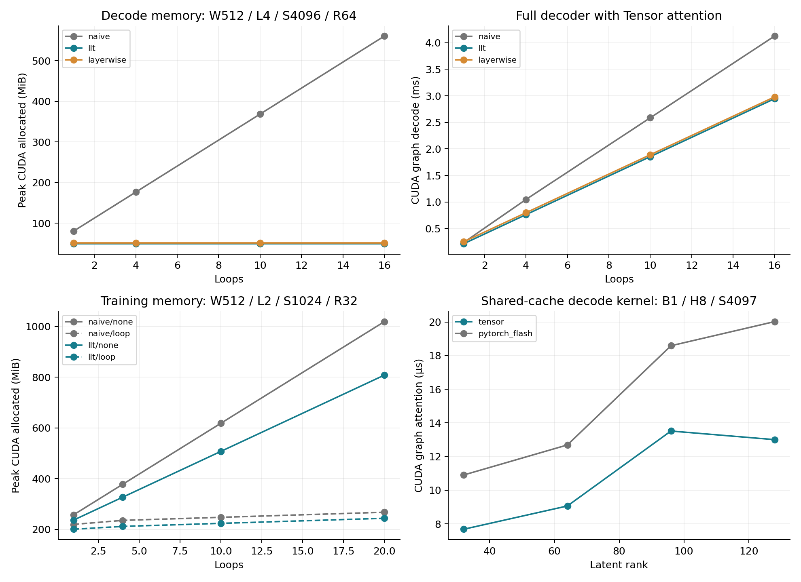

# L40S CUDA kernel and memory study — 2026-10-08

**LLT's shared-cache inference memory scaling holds on the L40S, and a partitioned
Tensor decode kernel makes useful graph-executed regimes possible through rank
128. The GPU training experiments do not meet the combined memory/latency target.**
Ordinary Tensor adapter calls also have material Python overhead; graph results
must not be presented as ordinary eager serving latency. No trained-quality
comparison is claimed.

## Hardware, implementation and scope

One NVIDIA L40S, 46,068 MiB reported VRAM, sm_89, driver 595.91.07. Python 3.12.14,
PyTorch 2.14.0+cu130, Tensor 0.1.0, TileLang 0.1.14, TVM FFI 0.1.12 and NVRTC 12.9.86.
The Tensor checkout is `caf0118d870739b176a88f487ae9e54de1d5d214`; its tracked source
was not changed. Compiler/runtime environments were installed locally.

Tensor compiles and executes the attention kernels through `.tbin` artifacts and
the Torch adapter. Embeddings, RMS normalization, projections, GELU MLPs and all
training backward/AdamW work use PyTorch. Thus “Tensor decoder” below means a
complete decoder **with Tensor attention**, not an entirely Tensor-native model.

The model retains full residuals and ties the block weights across loops. LLT
computes one latent from initial token/position embeddings and shares it across
heads, layers and loops. Its query/output projection folding is differentiable
in training. A layerwise latent control isolates sharing across layers. It also
computes latents from initial embeddings; it is not an author-system reproduction
of MLA, YOCO or LLA. All models use learned absolute positions. RoPE is untested.

Completed suites cover 32 attention geometries for each of the serial and
partitioned variants, 14 partition-sensitivity geometries with four schedules,
30 complete-decoder geometries, 10 full causal-prefill geometries, and 20 GPU
training geometries with six architecture/policy combinations each. They include
rank 32–128, batch 1/4/8, up to 16 inference loops, up to 20 training loops,
64K attention histories, sequence-4096 training, and width 768 with 12 layers.
An independent nine-round rotating-order repeat covers eight decoder methods.

## Tensor decode kernel

The first serial online-softmax implementation leaves too few CTAs active for
one-token decode. The improved version partitions the history, computes FP32
partial accumulators and normalization statistics, then merges them with a stable
softmax rescaling. The full decoder uses a fixed **32 partitions**. All 8/16/32/64
schedule observations are retained; no per-case best schedule is substituted.

At batch 1, eight query heads, one stored KV head and 4,097 keys, including the
current token, the following are medians of nine samples under CUDA graph replay.
Each attention sample averages 20 calls; outputs are preallocated. Scale is
`1/sqrt(64)` at every rank.

| Rank | Serial Tensor µs | Partitioned Tensor µs | PyTorch Flash µs | Serial → partitioned speedup |
|---:|---:|---:|---:|---:|
| 32 | 60.77 | 7.68 | 10.91 | 7.91x |
| 64 | 77.41 | 9.06 | 12.69 | 8.54x |
| 96 | 96.10 | 13.52 | 18.59 | 7.11x |
| 128 | 111.00 | 13.00 | 20.02 | 8.54x |

The current causal prefill kernel retains a serial tile schedule. It can be
slower than Flash SDPA on longer queries and larger batches. The decode speedup
does not imply a general attention speedup. See [attention observations](results/l40s/attention.json),
[serial control](results/l40s/attention-serial.json) and
[partition/context sensitivity](results/l40s/decode-partitions.json).

## Complete decoder: memory stays flat across loops

The original project geometry is included: width 768, 12 layers, 12 heads of width
64, batch 1, 4,096 historical tokens, ten loops and 256 output logits. Histories
are synthetic. The current token is written into preallocated cache slots; full
history copying and projection folding are outside token timing.

The table uses captured-graph allocator peaks from the isolated broad sweep and
GPU times from the independent repeat with a new seed and rotating method order.
Both runs use the same geometry. Times include all decoder operators and cache
slot writes. Peak allocation includes weights, folds, caches and observable
operator/cuBLAS workspaces; it excludes CUDA driver/module allocations.

| Method | Cache MiB | Peak CUDA allocated MiB | Independent median graph ms |
|---|---:|---:|---:|
| Naive looping, Tensor attention | 1,440.352 | 1,651.081 | 9.974 |
| Naive looping, PyTorch Flash | 1,440.352 | 1,651.037 | 10.609 |
| LLT rank 32, Tensor attention | 0.250 | 195.979 | 6.172 |
| LLT rank 64, Tensor attention | 0.500 | 210.949 | 6.712 |
| LLT rank 128, Tensor attention | 1.000 | 240.891 | 7.441 |

Rank 64 saves **87.2%** peak allocation versus same-backend naive and is **32.7%
faster** by the independent graph median. Against naive Flash, it is **36.7%
faster**. Every paired rank-64 Tensor/same-backend-naive ratio in the repeat is
at most 0.674. Ranks 32 and 128 save **88.1% / 85.4%**, respectively. Their
same-backend repeat latency reductions are **38.1% / 25.4%**.

Unlike the older Vulkan result, rank 128 meets the resource criteria at this CUDA
decode geometry. This is hardware/schedule-specific, not a universal rank limit.
In the broad sweep, **42 of 60 architecture/backend LLT comparisons** meet the
existing >=50% peak-memory saving, <=20% graph-latency tax and <=25% overhead
relative to non-loop LLT criteria. Rank-64 width-512/L4/context-512 at ten loops
saves only **44.4%** total allocation and misses the memory criterion despite a
large cache compression ratio. Weight/workspace floors matter.

The layerwise rank-64 control in the original geometry uses 6.001 MiB of cache and
217.491 MiB peak allocation. Global LLT uses a 12x smaller cache but only **3.0%**
less total allocation. Most of the large LLT-versus-naive gain here is the overall
latent-cache representation; cross-layer sharing contributes a smaller additional
whole-model saving once weights dominate.

There is an execution-mode caveat: in the broad sweep's ordinary Python calls,
rank-64 Tensor LLT takes **65.5 ms**, versus **50.8 ms** for naive Flash and **40.9
ms** for LLT Flash. The Tensor/native-naive wall-time ratio is **1.29x**, exceeding
the 20% latency target. The graph-executed gains therefore require graph replay
or a comparably efficient submission path. Kernel timing, ordinary event timing
with submission gaps, and synchronized wall timing are reported separately.

[Complete decoder](results/l40s/inference.json) ·
[Independent rotating repeat](results/l40s/repeat.json) ·
[Derived qualification](results/l40s/summary.json)

## Actual causal prefill

Full prefill runs on random tokens and retains the actual per-loop MHA caches or
shared latent caches from the causal model. At width 512, four layers, four loops,
batch 1 and sequence 4,096:

| Method | Peak graph allocated MiB | Median graph ms |
|---|---:|---:|
| Naive, PyTorch Flash | 228.656 | 6.391 |
| LLT rank 32, Tensor attention | 87.188 | 5.609 |
| LLT rank 32, PyTorch Flash | 87.188 | 4.806 |
| LLT rank 64, Tensor attention | 93.719 | 6.782 |
| LLT rank 64, PyTorch Flash | 93.719 | 5.719 |

Rank-64 Tensor prefill is 6.1% slower than naive Flash at this point and 18.6%
slower than LLT Flash. Learned generation quality is not tested. See the
[prefill report](results/l40s/prefill.json) for all batch/context/depth cases.

## GPU training: checkpoints dominate the gross saving

Training uses FP32 parameters and AdamW states, BF16 autocast, FP32 residual states,
forced CUDA Flash SDPA, full-token cross entropy and `foreach=False` AdamW. Both
architectures receive identical `none` and exact per-loop checkpoint policies.
Timing includes forward, loss, backward and update, without allocation hooks or
CUDA graph capture. It includes host submission gaps in the eager training path.
This CUDA model includes trainable token and position embeddings; the earlier CPU
fixture started from supplied hidden states. CUDA also uses BF16 saved activations
and Flash attention instead of the earlier FP32 CPU path. The new CPU/GPU figures
therefore are not an identical-model hardware comparison. Architecture and
checkpoint comparisons within this CUDA study use matching graphs and policies.

Width 512, two layers, eight heads, rank 32, batch 1, sequence 1,024 and vocabulary
4,096 give these nine-sample medians:

| Loops | Naive none MiB / ms | Naive loop checkpoints MiB / ms | LLT loop checkpoints MiB / ms |
|---:|---:|---:|---:|
| 1 | 257.4 / 5.71 | 219.4 / 8.69 | 200.4 / 8.87 |
| 4 | 377.6 / 14.95 | 235.4 / 26.88 | 211.6 / 23.36 |
| 10 | 618.1 / 33.33 | 247.4 / 62.81 | 223.6 / 52.14 |
| 20 | 1,018.9 / 63.39 | 267.4 / 121.87 | 243.6 / 98.81 |

At 20 loops, checkpointed LLT saves **76.1%** against uncheckpointed naive but
costs **55.9%** more time. Against equally checkpointed naive, it saves **8.9%**
memory and takes **18.9%** less time. Uncheckpointed LLT still uses 808.0 MiB,
showing that shared KV alone does not eliminate saved residual/MLP activations.

With vocabulary **50,257** at the same geometry and 20 loops, naive checkpointing
uses 1,462.4 MiB and 127.24 ms, while LLT checkpointing uses 1,455.6 MiB and
104.90 ms. The architecture-specific memory saving is only **0.47%**. The
vocabulary, loss and optimizer create a large floor. The gross saving versus
uncheckpointed naive is 34.9%, below the 50% threshold.

At width 768, 12 layers, sequence 1,024, ten loops and rank 64, the matched-policy
memory saving is **13.5%**, but checkpointed LLT still has a **50.9%** latency tax
versus uncheckpointed naive. **None of the 20 training geometries meets all three
resource criteria.** This updates the earlier CPU observation rather than
transferring its qualifying regime to the GPU. Full residual checkpoint storage
still grows with depth; exact backward from one KV latent remains unestablished.

[All GPU training measurements](results/l40s/training.json)

## Correctness, provenance and Tensor work

Independent float64 unfolded-K/V checks match folded outputs within 3.34e-16 and
gradients within 1.04e-17 maximum absolute error. Checkpoint gradients match
exactly in both the float64 fixture and actual CUDA BF16 Flash fixture. Future
token perturbations leave earlier outputs unchanged, and cached decode matches
the corresponding causal-prefill token. Tensor attention matches explicit FP32
attention/Flash references, including odd tails, empty partitions, KV aliasing,
batches, 64K histories and large query magnitudes.

The [audit](results/l40s/audit.json) verifies eight completed reports, **149 unique
CUDA sm_89 binaries**, preserved source snapshots, binary/export hashes,
checkpoint-policy coverage and timing sample counts. Compiled artifacts and logs
remain locally available under ignored paths. Raw reports and figures are retained
in the repository. [PNG](results/l40s/scaling.png) and [PDF](results/l40s/scaling.pdf)
figures can be exported. This is an allocator measurement, not process VRAM, a
tail-latency guarantee, a distributed study or an equal-quality model comparison.

Tensor follow-ups have concrete evidence and reproduction commands:

1. BF16 DLPack import currently fails and the ABI has no BF16 dtype. Matching this
   study's training precision requires BF16 interoperability.
2. Optimized shared-K=V attention backward/autograd is needed to replace the
   PyTorch Flash backward path.
3. Promote shared-KV prefill/cached decode into the Torch adapter profile and
   reduce ordinary functional-call submission overhead.
4. Pinned TileLang rejects scalar extraction from a reduced fragment. A minimal
   lowering-failure reproducer is included; staging through shared memory works.

See [Tensor follow-ups](../experiments/l40s/TENSOR_FOLLOWUPS.md) and the
[implementation/protocol/reproduction guide](../experiments/l40s/README.md).
