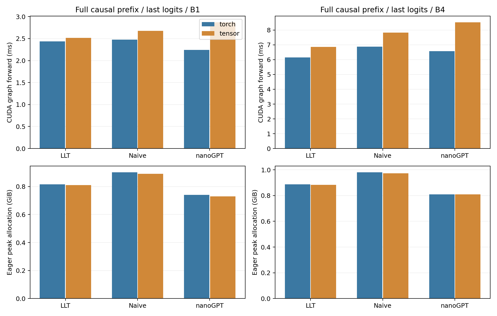
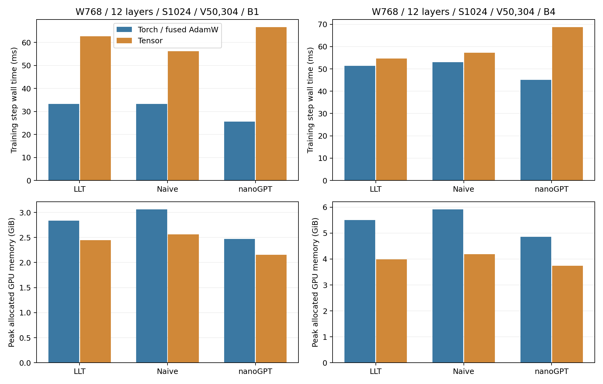
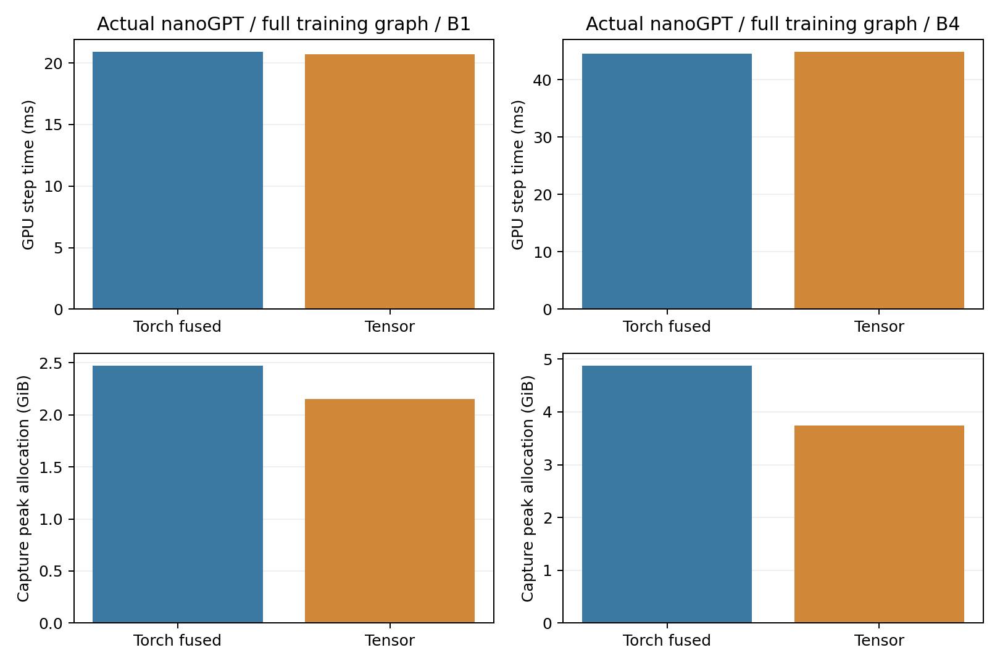

# L40S nanoGPT-scale inference and training

The optimized Tensor backend improves cached LLT decode and reaches near Torch
training throughput for actual nanoGPT when the complete step is captured in a
CUDA graph. Eager Tensor execution still has a substantial submission/autograd
overhead. Full-prefix inference remains slower for several geometries.

This study contains **66 performance methods**, five full-geometry correctness
checks and **238 independently hashed sm89 artifacts**. It follows the
[Tensor optimization qualification](https://github.com/kreasof-ai/tensor/blob/main/docs/research/llt-optimization.md).
Tensor implementation `9d03a69` includes the qualified projections and explicit
serving weight preparation. Tensor development records and diagnostics remain
in the [Tensor repository](https://github.com/kreasof-ai/tensor).

## Models and protocols

All models use width 768, 12 heads, 12 layers, context 1024, vocabulary 50,304,
exact GELU, zero dropout, FP32 master weights and BF16 projections/attention.
Microbatches are 1 and 4. LLT/naive use one or four tied passes and learned
absolute positions, with capacity 1028 for four continuation tokens. LLT rank
is 64. Parameters are counted once per shared tensor:

| Model | Parameters | Architectural differences |
|---|---:|---|
| LLT | 150,064,128 | Global initial-input latent, folded projections, unweighted RMSNorm, untied input/output embedding |
| Naive loop | 162,991,104 | Per-layer/per-loop KV, unweighted RMSNorm, untied input/output embedding |
| Actual nanoGPT | 124,475,904 | Fused QKV, learned LayerNorm/bias, tied embedding/classifier, one pass |

The actual [nanoGPT model](https://github.com/karpathy/nanoGPT/blob/3adf61e154c3fe3fca428ad6bc3818b27a3b8291/model.py)
is vendored unchanged with its MIT license at revision
`3adf61e154c3fe3fca428ad6bc3818b27a3b8291`. Torch executes the upstream modules.
Its inference adapter replaces only the CPU-list last-token index with an
equivalent basic slice for CUDA capture, and prepares projection copies.
The Tensor adapter preserves all parameter names and weight tying while routing
numerical primitives to Tensor. Linear bias currently uses a separate BF16
epilogue; its extra rounding is covered by numerical checks.

These are geometry comparisons, **not equal-parameter or equal-quality models**.
Weights and token/target microbatches are seeded; no corpus, tokenizer,
pretrained checkpoint or language-quality evaluation is involved.

Serving retains FP32 masters plus explicit prepared BF16 projection copies in
both backends. Embeddings stay FP32, including nanoGPT's tied master embedding.
Warmup prepares these copies; cold compilation and one-time preparation are
excluded. Their resident storage is included in allocation measurements.
Torch disables automatic weight caching under inference mode, so using its
cache-enabled autocast flag alone would be an unequal comparison. The earlier
observed unprepared Torch runs are retained separately and excluded below.

Training includes zeroing gradients, full-vocabulary loss, backward, global
clipping at 1 and AdamW with FP32 moments, LR .0006, betas (.9, .95), decay .1 for
matrices and zero for vectors. Scalar Torch AdamW controls remain in raw data;
the main training comparison uses CUDA fused AdamW, as selected by upstream
nanoGPT. Torch/Inductor compilation, accumulation over multiple microbatches,
and data-loader/tokenizer costs are outside this profile.

## Full-prefix inference

Causal forward computes all 1024 hidden positions and only the last-position
logits. Values below are CUDA graph GPU medians; each has nine samples, with ten
replays per sample. This is not serving startup: no capacity-cache conversion is
included here.

| Batch | Model | Torch graph ms | Tensor graph ms |
|---:|---|---:|---:|
| 1 | llt | 2.438 | 2.518 |
| 1 | naive | 2.477 | 2.678 |
| 1 | nanogpt | 2.245 | 2.872 |
| 4 | llt | 6.143 | 6.864 |
| 4 | naive | 6.888 | 7.827 |
| 4 | nanogpt | 6.567 | 8.527 |



The figure's memory panel is **eager peak allocation** for the same full-prefix
function, rather than an estimate of the graph's private pool footprint. Graph
replay allocation in the raw inference data does not include the capture peak.
Eager dispatch also matters: at batch 1, LLT full-prefix GPU elapsed time is
6.55 ms Torch versus 12.19 ms Tensor; nanoGPT is 4.08 versus 13.57 ms.

## Serving startup and continuation

LLT/naive serving startup includes full-prefix forward, persistent KV allocation
and copies, and LLT's serving fold construction. Both backends select only the
last logits. The existing implementation constructs folds inside forward and
again for serving; both are charged here. Warmed serving weight copies remain
resident and their initial conversion is excluded.

At batch 4/four passes, Tensor LLT startup uses **903.7 MiB** peak allocation
versus **2036.2 MiB** for Tensor naive (55.6% less), taking **25.920 versus
32.356 ms** in CUDA graphs. Their eager GPU times are 41.91 and 54.14 ms. Startup
peak includes the temporary raw-prefix KV arrays plus capacity-cache copies.

The prepared four-token continuation uses supplied fixed token IDs. Eager
fixture rewind is outside timing; graph timing includes rewind of logical
length/control buffers. All cache appends, attention and projections are inside
both measurements. Latent cache storage is constant across tied passes; total
weights, folds and framework/graph storage must be counted separately.

| Batch | Passes | Torch LLT graph ms | Tensor LLT graph ms | Tensor LLT cache MiB | Tensor naive cache MiB |
|---:|---:|---:|---:|---:|---:|
| 1 | 1 | 3.210 | 2.165 | 0.1255 | 36.141 |
| 1 | 4 | 11.129 | 7.208 | 0.1255 | 144.563 |
| 4 | 1 | 4.003 | 2.706 | 0.5020 | 144.563 |
| 4 | 4 | 14.281 | 8.756 | 0.5020 | 578.251 |

LLT's folds add **27 MiB**, independent of tied pass count. At batch 4, Tensor
LLT cached eager peak stays 802.9 MiB from one to four passes; naive grows from
1027.4 to 1461.1 MiB. Eager Tensor LLT continuation is still slower than eager
Torch: 36.54 versus 19.28 ms at batch 1/one pass. CUDA graph gains do not imply
lower Python request latency.

Actual nanoGPT has no upstream KV-cache interface. Its deterministic four-token
continuation repeatedly calls the actual full-prefix model, crops to context
1024, selects argmax and appends the selected token. This differs from upstream
sampling and from LLT's supplied-token cached workload; no cross-protocol speed
ratio is asserted. Four-token graph times are **9.047/11.538 ms** (Torch/Tensor,
batch 1) and **26.106/34.012 ms** (batch 4).

## Complete training step

One-pass eager wall-time medians and peak allocated GiB:

| Batch | Model | Torch fused ms | Tensor ms | Torch GiB | Tensor GiB |
|---:|---|---:|---:|---:|---:|
| 1 | llt | 33.26 | 62.68 | 2.838 | 2.446 |
| 1 | naive | 33.19 | 56.23 | 3.061 | 2.561 |
| 1 | nanogpt | 25.60 | 66.66 | 2.470 | 2.153 |
| 4 | llt | 51.40 | 54.68 | 5.502 | 3.983 |
| 4 | naive | 53.07 | 57.24 | 5.916 | 4.192 |
| 4 | nanogpt | 45.16 | 68.75 | 4.860 | 3.741 |



The scalar Torch optimizer takes 29.63/50.32 ms for nanoGPT at batch 1/4,
compared with fused AdamW's 25.60/45.16 ms. Tensor's apparent batch-4 LLT win
against scalar AdamW (54.68 versus 58.23 ms) becomes a 6.4% tax against fused
AdamW (51.40 ms). The report therefore does not claim an eager training win
against that stronger Torch control.

For actual nanoGPT, capturing the **entire training step**, including backward,
clipping and optimizer, removes most of Tensor's dispatch gap:

| Batch | Torch graph ms | Tensor graph ms | Torch capture peak GiB | Tensor capture peak GiB | Torch capture reserved GiB | Tensor capture reserved GiB |
|---:|---:|---:|---:|---:|---:|---:|
| 1 | 20.882 | 20.698 | 2.471 | 2.154 | 3.992 | 3.502 |
| 4 | 44.550 | 44.839 | 4.871 | 3.741 | 10.613 | 6.416 |

Tensor is within 1% of the fused Torch graph control in both microbatches, with
12.8%/23.2% less capture peak allocation. Capture-reserved memory also includes
eager allocator history and cached/free pool blocks; it is not live tensor
storage or whole-process VRAM. All parameter device counters reach **105**:
12 eager steps, three graph warmups and 90 timed replays. Capture records kernels
without running an update. Final captured loss is finite. This confirms optimizer
replay on changing weights; these are repeated fixed microbatches, not a training
run on a dataset. Captured training is measured for actual nanoGPT only.



The [Tensor attribution diagnostic](https://github.com/kreasof-ai/tensor/blob/main/docs/research/llt-scale-attribution.md)
keeps kernel/runtime development evidence in that repository. Profiler overhead
is excluded from the tables above.

## Pass count and exact checkpointing

Batch 4/four tied passes, matched checkpoint policies:

| Backend | Model | No checkpoint ms / GiB | Exact loop checkpoint ms / GiB |
|---|---|---:|---:|
| Torch fused | llt | 113.12 / 9.097 | 146.78 / 4.218 |
| Torch fused | naive | 125.21 / 10.374 | 168.39 / 4.285 |
| Tensor | llt | 142.70 / 8.223 | 211.68 / 3.655 |
| Tensor | naive | 195.34 / 8.858 | 294.12 / 3.939 |

Tensor LLT's uncheckpointed peak grows from **4078.6 MiB** at one pass to
**8420.1 MiB** at four. Exact loop checkpoints reduce the latter to **3742.7 MiB**
while increasing time from 142.70 to 211.68 ms. With the same checkpoints,
naive uses 4033.3 MiB: LLT's additional saving is only 7.2%. Constant latent KV
therefore does not establish constant total training memory or an equal-quality
training advantage.

## Verification and measurement limits

Five checks use full width/layers/vocabulary and batch-1 context 1024. Worst
all-parameter gradient relative L2 is **.02203**; worst logits relative L2 is
**.00781**, below preregistered .08/.04 limits. LLT/naive cached four-token
trajectories match full causal forward within .04 absolute error, and selecting
only final logits matches full-output selection. Every timed training loss is
finite. Small-model eight-step paired nanoGPT updates were independently
qualified in Tensor before profiling. The pre-graph update counters are not a
paired 105-step convergence or language-quality test.

One GPU process runs at a time. Eager measurements use three warmups and nine
synchronized samples, retaining both wall and GPU elapsed time. GPU elapsed time
includes launch gaps in eager execution. CUDA graphs use three additional stream
warmups and nine groups of ten replays. Compilation, weight preparation,
optimizer initialization and data generation are excluded.

Memory measures PyTorch's CUDA allocator, including Tensor outputs, model/master
weights, prepared copies, gradients, dense optimizer state and workspaces backed
by that allocator. Driver/context, compiler process memory, CUDA executable
metadata and untracked library allocations are excluded. Eager peaks, capture
peaks and post-capture replay allocations have separate meanings. Inference
memory comparisons use eager peaks; replay-only graph allocation is diagnostic.
The four captured-training runs additionally retain capture peak/reserved data.
Earlier runs without capture peak measurements remain in
`observed-before-capture-memory`; unprepared Torch controls remain in
`observed-unprepared`. Neither is selected into the main summary.

All raw samples, source snapshots, pins and hashes are retained in
[results](results/l40s-nanogpt), with [summary](results/l40s-nanogpt/summary.json)
and [artifact audit](results/l40s-nanogpt/audit.json).
A single L40S, fixed-shape graphs and seeded data do not validate distributed
scaling, deployment tail latency, mixed request sizes, or trained quality.

## Reproduction

Install the qualified [Tensor](https://github.com/kreasof-ai/tensor) environment
and matching Torch C++ executor, then run from this repository:

```sh
# LLT_PYTHON selects that environment; TENSOR_NVRTC_HOME selects NVRTC 12.9.
experiments/l40s/run_nanogpt_scale.sh
# Use LLT_RESUME=1 to skip existing raw method reports.
python experiments/l40s/nanogpt_scale_summary.py
```

The plotting Python needs Matplotlib; the GPU Python needs the qualified Tensor
and Torch packages. This machine uses Torch 2.14.0+cu130, TileLang 0.1.14 and
NVRTC 12.9 on sm89. The vendored nanoGPT source and its license remain unchanged.
The runner retains all controls, including scalar/fused Torch optimizer variants
and actual nanoGPT whole-step CUDA graphs.
