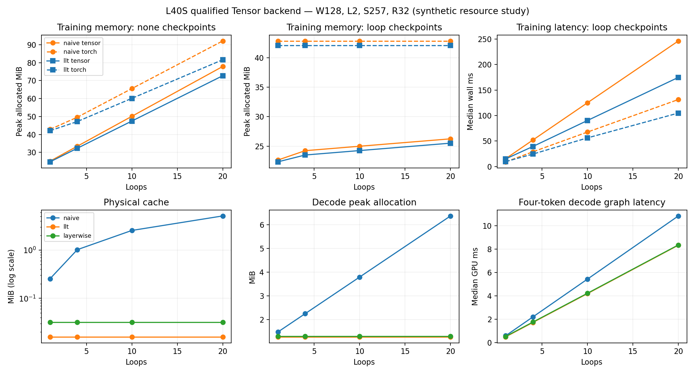

# L40S full-model Tensor study — 2026-10-08

**The qualified Tensor backend runs LLT forward, backward and optimization
correctly. Global cache storage stays constant across loop counts. Total training
memory still misses the combined resource target, and the full Tensor numerical
backend has substantial latency regressions against optimized Torch.**

This extends the [archived attention-only study](L40S.md). It measures the actual
LLT composition using [Tensor](https://github.com/kreasof-ai/tensor), rather than
transferring the dependency qualification fixture's performance to this model.
There is no trained-quality, distributed or constant-total-training-memory claim.

## Model and execution

One NVIDIA L40S, sm_89, driver 595.91.07; Torch 2.14.0+cu130, TileLang 0.1.14,
TVM FFI 0.1.12 and NVRTC 12.9. The Tensor implementation pin is
[`ab17948fe94dd7c7b857c8f067c465e901329b94`](https://github.com/kreasof-ai/tensor/commit/ab17948fe94dd7c7b857c8f067c465e901329b94).
The documentation-only Tensor HEAD recorded in the reports has identical
compiler/runtime/operator sources. No Tensor source change was needed for this
LLT integration; its development records remain in its repository.

The [frozen architecture](../research/MODEL.md) has full residuals, unweighted
RMSNorm (epsilon 1e-5), exact GELU, a 4W MLP, learned absolute positions and
block weights tied across loops. Global LLT projects the initial embeddings into
one latent shared by all heads/layers/loops. The layerwise control has one such
initial-input latent per layer. These are geometry controls, not faithful
YOCO/U-YOCO implementations or mutable reasoning workspaces.

Tensor executes embeddings, normalization, projections, batched differentiable
head folds, attention/backward, GELU, residual adds, cross entropy, clipping and
AdamW. PyTorch controls layouts, autograd, exact checkpoint scheduling and shared
gradient accumulation. The Torch control forces Flash SDPA. Every heavy numerical
operator in the explicit Tensor profile has an artifact; no semantic fallback
was reported. Native launch plans and warmed artifacts exclude compilation from
timing. Training uses FP32 master/residual/moment state and BF16 matrix operations.
Inference prepares BF16 projection weights once and retains FP32 embeddings and
residuals. Both backends use the same geometry and data at every comparison.

## Correctness

- The original FP64 folded model matches the new batched-fold composition:
  zero maximum output error and at most 1.74e-18 all-parameter gradient error.
  Explicit unfolded-K/V outputs also pass the 1e-11 absolute / 1e-9 relative check.
- All BF16 parameter gradients pass for naive, global and layerwise models.
  Maximum relative L2 error against Torch is **0.004938** (0.494%); maximum
  output error is 0.001953. Exact loop-checkpoint outputs match bitwise, and
  checkpoint gradient error is at most 2.33e-10.
- Each architecture receives 32 matched Tensor/Torch updates. The largest
  absolute loss drift is **0.003374**. This is short backend validation, not a
  held-out quality comparison.
- Using these updated weights, causal perturbations pass and four consecutive
  cached tokens match full causal forwards exactly on the small fixtures.
  Cache pointers remain stable; version-tracked parameter changes reject stale
  serving state. In the larger systems sweep, final cached/full-forward output
  error is at most **0.014649**, within the predeclared BF16 tolerance.

See [raw correctness](results/l40s-native/correctness.json).

## Training: equal checkpoint policies remain essential

Nineteen geometries produce **152 full training methods**: naive/global LLT,
Torch/Tensor and no/exact-loop checkpointing. Sweeps cover widths 128/512/768,
layers 2/12, ranks 32/64/128, loops 1/4/10/20, batches 1/4, sequences
257/1025/4097 and vocabularies 4096/50257. Each recurrence configuration has a
matched one-loop baseline. Timing includes loss, backward, global clipping and
AdamW. Every median has nine retained observations.

At width 512, two layers, eight heads, rank 32, batch 1, sequence 1025 and
vocabulary 4096, Tensor results are:

| Loops | Naive none MiB / ms | Naive loop checkpoints MiB / ms | LLT none MiB / ms | LLT loop checkpoints MiB / ms |
|---:|---:|---:|---:|---:|
| 1 | 204.1 / 11.25 | 197.1 / 15.51 | 186.2 / 11.50 | 180.1 / 15.15 |
| 10 | 634.9 / 81.47 | 242.1 / 125.48 | 528.9 / 58.84 | 213.2 / 91.52 |
| 20 | 1115.7 / 159.53 | 261.1 / 244.24 | 909.7 / 109.40 | 233.2 / 174.98 |

At 20 loops, checkpointed LLT saves **79.1%** against uncheckpointed naive with
a **9.7%** latency tax. Against equally checkpointed naive, the saving is only
**10.7%**, with a **28.4%** latency reduction. Its allocation is **29.5%** above
one-loop checkpointed LLT, exceeding the 25% non-loop overhead criterion.
The gross checkpoint saving is therefore not evidence for constant training
memory or an LLT-specific 79% reduction.

At vocabulary **50,257**, width 512, rank 64, sequence 1025 and ten loops,
checkpointed Tensor naive/LLT use **941.2 / 936.3 MiB** and
**127.21 / 92.40 ms**. The additional LLT memory saving is **0.53%**: embeddings,
classifier, gradients and optimizer dominate. At width 768, 12 layers, sequence
257 and ten loops, matched checkpoint peaks are **1519.3 / 1369.2 MiB** and
steps take **725.97 / 512.23 ms** for Tensor naive/LLT.

Across **76 same-backend, same-policy architecture comparisons**, **zero** meet
all three criteria: at least 50% less total peak allocation, no more than 20%
latency tax and no more than 25% overhead over one-loop LLT. This conclusion is
limited to the tested geometries. No lossy activation reconstruction or latent
activation checkpointing was used; exact checkpoints retain full residual states.

Tensor/Torch step-time ratios across the 76 corresponding backend pairs range
from **0.912 to 2.621**; Tensor is faster in only **three** pairs, all in the
one-loop large-vocabulary regime. Peak ratios range from **0.529 to 1.073**.
Small-model cross-backend allocation differences include cuBLAS workspace;
large-vocabulary differences include the loss and optimizer implementation.
These are backend effects, rather than architectural cache compression gains.

See [all training observations](results/l40s-native/training.json).

## Persistent inference: cache scaling holds, backend speed differs

Fourteen geometries have **84 architecture/backend methods** for full causal
forward and actual four-token persistent decoding. Prefixes have 257/1025/4097
tokens; cache capacity includes four additional slots. Global LLT stores keys
and values in one aliased buffer; naive stores separate K/V for every layer-loop
invocation. Decode writes only new slots, with no historical-prefix recopy.

At width 768, 12 layers, 12 heads, rank 64, batch 1, a real 4097-token prefix,
ten loops and vocabulary 256:

| Method | Physical cache MiB | Peak decode graph MiB | Four-token graph ms | Four-token eager wall ms |
|---|---:|---:|---:|---:|
| Naive, Torch Flash | 1441.758 | 1644.108 | 42.991 | 209.409 |
| Naive, Tensor | 1441.759 | 1636.395 | 179.096 | 446.899 |
| Global LLT, Torch Flash | 0.501 | 204.192 | 30.268 | 157.615 |
| Global LLT, Tensor | 0.501 | 196.738 | 134.939 | 320.650 |
| Layerwise LLT, Tensor | 6.007 | 203.291 | 136.920 | 329.122 |

Tensor global LLT saves **88.0%** total graph allocation and **24.7%** graph
latency versus Tensor naive. The payload compression factor is 2880x here;
total peak memory improves by only 8.3x because weights, folds and embeddings
remain. Folding contributes 27 MiB in both latent variants. Sharing globally
instead of layerwise saves only **3.2%** additional total peak allocation at this
point, despite the 12x difference in latent cache payload.

The Tensor LLT decoder is **4.46x slower** than the same-architecture Torch
control and **3.14x slower** than Torch naive in graph mode. Its same-backend
architecture gain does not establish a gain over optimized Torch serving. These
are four-token measurements; the older attention-only, FP16, synthetic-history
one-token numbers use a different backend and protocol.

The corresponding causal-forward/raw-prefix graph timings and peaks are:

| Method | Peak graph MiB | Median graph ms |
|---|---:|---:|
| Naive, Torch Flash | 1742.661 | 88.561 |
| Naive, Tensor | 1734.786 | 497.861 |
| Global LLT, Torch Flash | 304.146 | 78.650 |
| Global LLT, Tensor | 296.646 | 419.045 |

This prefill measure includes the complete causal forward, refreshed folds and
retained raw prefix tensors. Conversion to preallocated serving capacity and
generation-fold preparation happen outside decode timing and are not included
in this causal-forward timing. It is not an entire serving-startup or first-token
latency measure. Decode fixture rewinds are also outside timed work and outside
graph capture. Graph replay measures a fixed four-token trajectory from the same
prefix, rather than a production variable-length scheduler.

Across architecture/backend/phase/execution-mode comparisons, **40 of 112**
meet all three resource criteria. There are 14 geometries per row below; phases
and eager/graph measurements are correlated views of the same geometries:

| Backend | Causal forward eager / graph qualifying | Four-token decode eager / graph qualifying |
|---|---:|---:|
| Tensor | 5 / 5 | 7 / 7 |
| Torch | 3 / 3 | 5 / 5 |

See [all inference observations](results/l40s-native/inference.json) and
[derived criteria](results/l40s-native/summary.json).

## Measurement limits and reproducibility

Peaks count PyTorch CUDA allocator storage: weights, gradients/moments, residuals,
operator temporaries, folded weights, actual caches and visible workspaces.
CUDA context, driver/module storage and on-chip resources are excluded. Reserved
bytes are recorded separately. Unused cuBLAS workspaces are cleared between
methods; an active Torch operation recreates its required workspace. Eager and
graph peaks accompany their respective execution modes. Compilation, fixture
allocation, warmup and initial optimizer-state creation are outside timing.
Measurements run sequentially with one GPU experiment process active at a time.

The [audit](results/l40s-native/audit.json) verifies three complete raw reports,
source snapshots, binary/export identities, matched policies, finite losses,
nine observations and **706 unique CUDA sm_89 artifacts**. Reports record the
executed LLT sources by hash, rather than treating the pre-experiment base commit
as the modified source revision. Generated binaries, compiler caches and logs
remain on this machine; JSON, source snapshots and figures are committed.
[PNG](results/l40s-native/scaling.png) and [PDF](results/l40s-native/scaling.pdf)
can be exported. [Protocol and one-command reproduction](../experiments/l40s/NATIVE.md)
describe the supported Tensor environment and exact workload.

Tensor dependency acceptance and implementation evidence remain in the
[Tensor readiness report](https://github.com/kreasof-ai/tensor/blob/main/docs/research/llt-readiness.md).
LLT quality, RoPE integration, mutable workspace controls, whole serving startup
and distributed claims remain open in the [research roadmap](../research/ROADMAP.md).
