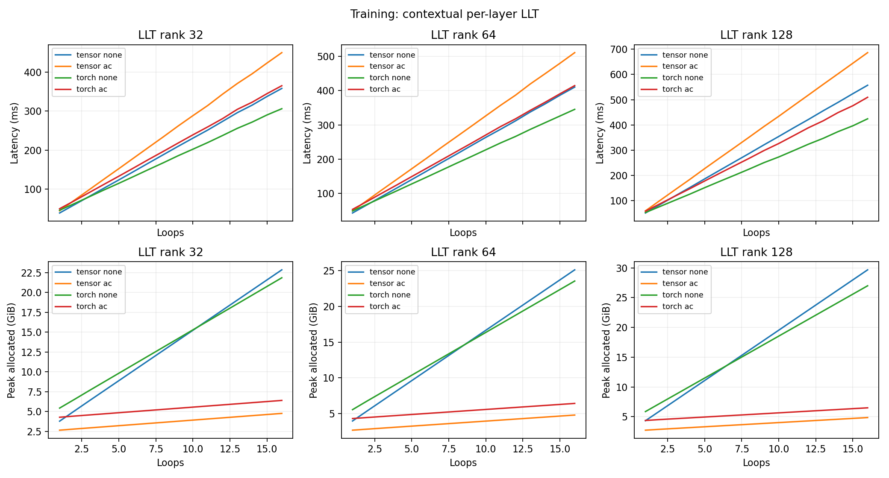
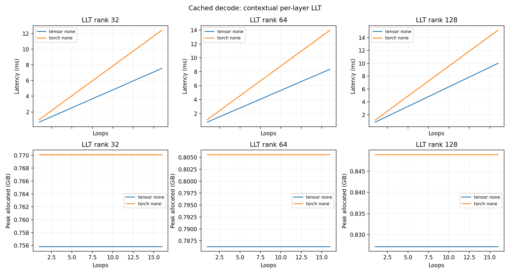

# L40S loop and rank sweep: contextual LLT

This is the current kernel latency and peak-memory study: **B4/S1024, T=1–16**, LLT ranks **32/64/128**, and training with **none or standard AC**. LAC is excluded. Tensor and matched Torch backends are profiled. These synthetic-token measurements do not establish trained language-model quality.

## Corrected LLT architecture

LLT stores one contextual rank-R latent cache per physical layer. During the first loop, layer i constructs C_i from its normalized input residual and uses it as attention memory. Later loops reuse that same C_i while their queries and residual states evolve. The first layer's memory is embedding-derived; deeper layers' memories contain preceding first-loop computations. Historical memory is not refreshed on later loops. There are 12 banks, independent of T; BF16 KV payload is 2*B*S*R*12 bytes.

Each physical layer has its own down projection and head-specific K/V expansion weights. Expansion is folded into queries and output projections; cache keys and values share one physical latent tensor. The full-width residual evolves through all 12T applications. See [architecture](../../docs/ARCHITECTURE.md) and [implementation](../../model/contextual_llt.py).

The previous globally shared embedding-derived LLT rows are **superseded**, not relabeled or reused. Their raw records remain unchanged; the [historical report](../../archive/reports/L40S_GLOBAL_LATENT_SWEEP.md) retains their results. All non-LLT rows below retain their original measurements, dates, and source provenance.

## Measurement protocol

Width 768, 12 heads, head dimension 64, 12 tied blocks, vocabulary 50,304, position capacity 1025, MLP width 3072, unweighted RMSNorm epsilon 1e-5, and exact GELU. FP32 masters, embeddings, residuals, losses, and optimizer state; BF16 projections and attention. Attention scaling stays 1/sqrt(64).

Training includes full-token logits/loss, backward, gradient clipping at 1, and AdamW (lr 0.0006, betas 0.9/0.95, weight decay 0.1). Standard non-reentrant AC recomputes full block regions and preserves all latent-memory gradient paths. Three warmups, nine samples, three graph replays per sample; 42 optimizer updates are checked. Each case runs in a fresh process, sequentially on NVIDIA L40S. Compilation is excluded.

Inference measures causal prompt with last-position logits, serving startup including persistent-cache allocation/copies and fold rebuild, and one supplied cached token after 1024 tokens. Capacity is 1025; captured decode includes logical rewind. BF16 serving weight copies are counted. Current LLT prompt/startup computes all query positions in every loop. Fixed first-loop memories permit last-position-only queries in later loops, but that serving optimization is not implemented here. U-YOCO retains its measured last-cross-query optimization. No sampling or beam search is included. Graph memory is peak allocated during capture, including graph pool and temporaries; allocator reservations and driver memory are excluded. Eager timing and memory remain in CSVs.

Controls retain their original adaptations: U-YOCO has 6T+6 attention/FFN applications, GRT 8T+4 with BF16 core residuals, and attention-only loop 12T attention updates but 12 FFNs. Other variants apply 12T blocks, except fixed depth with 12 blocks and widened MLPs matching the independent stack's parameters. Thus T and parameters do not imply matched compute. [Baseline contracts](../../docs/RESEARCH_BASELINES.md) document source fidelity and checkpoint boundaries.

## Results

**1056 active records: 1048 passed, 8 OOM.** This replaces 384 historical LLT records (including LAC) with 288 new LLT records and preserves 768 non-LLT records. New LLT: 288 passed, 0 OOM.

Cells are **CUDA graph milliseconds / capture peak allocated GiB**, per batch of four. Cache is persistent payload plus Tensor counters, separately from total GPU memory.

## All architectures at T=16

### Tensor

| Architecture | Parameters (M) | Train: none | Train: AC | Prompt | Startup | Cached decode | Cache (MiB) |
|---|---:|---:|---:|---:|---:|---:|---:|
| LLT rank 32 | 149.72 | 358.07 / 22.84 | 449.79 / 4.77 | 89.71 / 0.85 | 89.92 / 0.85 | 7.54 / 0.76 | 3.00 |
| LLT rank 64 | 150.60 | 410.40 / 25.11 | 511.08 / 4.80 | 101.12 / 0.88 | 101.50 / 0.88 | 8.35 / 0.79 | 6.01 |
| LLT rank 128 | 152.37 | 557.24 / 29.66 | 686.30 / 4.85 | 132.26 / 0.93 | 133.26 / 0.93 | 9.99 / 0.83 | 12.01 |
| Naive Loop | 162.99 | 492.07 / 27.45 | 617.41 / 4.88 | 122.17 / 0.97 | 129.25 / 5.36 | 13.13 / 3.11 | 2306.26 |
| Independent stack | 1437.01 | OOM | 663.75 / 21.56 | 122.48 / 8.46 | 130.07 / 12.85 | 13.14 / 10.60 | 2306.26 |
| Fixed depth / matched params | 1437.01 | 513.00 / 31.32 | 676.68 / 22.95 | 154.36 / 9.14 | 154.78 / 9.27 | 9.56 / 8.12 | 144.14 |
| U-YOCO / SWA | 163.40 | 307.38 / 18.16 | 382.28 / 3.85 | 70.71 / 0.99 | 73.04 / 2.58 | 7.22 / 1.44 | 588.01 |
| LPT cache layout | 162.99 | 506.68 / 29.56 | 650.32 / 5.02 | 132.39 / 1.12 | 135.75 / 3.39 | 13.55 / 1.14 | 281.26 |
| GRT / full KV (BF16 core) | 165.96 | 346.02 / 18.71 | 427.44 / 5.45 | 89.07 / 1.04 | 94.15 / 3.97 | 9.24 / 2.43 | 1585.55 |
| Per-layer latent loop (MLA-style) | 150.60 | 434.40 / 25.20 | 539.49 / 4.79 | 105.17 / 0.88 | 106.26 / 0.98 | 9.59 / 0.87 | 96.10 |
| Attention-only loop / FFN once | 162.99 | 280.02 / 14.79 | 339.74 / 5.05 | 63.47 / 0.93 | 71.08 / 5.36 | 8.60 / 3.11 | 2306.26 |

### Torch

| Architecture | Parameters (M) | Train: none | Train: AC | Prompt | Startup | Cached decode | Cache (MiB) |
|---|---:|---:|---:|---:|---:|---:|---:|
| LLT rank 32 | 149.72 | 306.11 / 21.84 | 365.02 / 6.40 | 79.40 / 0.86 | 79.88 / 0.86 | 12.42 / 0.77 | 3.00 |
| LLT rank 64 | 150.60 | 345.37 / 23.55 | 414.71 / 6.43 | 90.67 / 0.89 | 91.14 / 0.89 | 13.98 / 0.81 | 6.01 |
| LLT rank 128 | 152.37 | 424.47 / 26.98 | 509.61 / 6.48 | 113.31 / 0.94 | 113.96 / 0.94 | 15.15 / 0.85 | 12.01 |
| Naive Loop | 162.99 | 400.78 / 28.14 | 492.85 / 6.50 | 109.90 / 0.99 | 115.02 / 5.38 | 19.29 / 3.13 | 2306.25 |
| Independent stack | 1437.01 | — (earlier OOM) | 584.96 / 23.06 | 110.70 / 8.48 | 117.63 / 12.87 | 19.31 / 10.62 | 2306.25 |
| Fixed depth / matched params | 1437.01 | OOM | 422.95 / 22.98 | 83.56 / 9.16 | 84.06 / 9.29 | 5.04 / 8.14 | 144.14 |
| U-YOCO / SWA | 163.40 | 300.37 / 22.41 | 371.83 / 5.50 | 87.79 / 1.01 | 87.33 / 2.59 | 16.38 / 1.46 | 588.01 |
| LPT cache layout | 162.99 | 442.75 / 30.24 | 547.75 / 6.65 | 119.81 / 1.14 | 124.05 / 3.40 | 21.36 / 1.17 | 281.25 |
| GRT / full KV (BF16 core) | 165.96 | 294.20 / 22.39 | 355.86 / 6.71 | 80.89 / 1.05 | 85.84 / 3.99 | 13.35 / 2.44 | 1585.55 |
| Per-layer latent loop (MLA-style) | 150.60 | 354.25 / 24.69 | 422.06 / 6.42 | 93.14 / 0.90 | 93.70 / 0.99 | 15.60 / 0.89 | 96.09 |
| Attention-only loop / FFN once | 162.99 | 223.09 / 16.55 | 269.10 / 6.68 | 55.54 / 0.95 | 63.12 / 5.38 | 12.50 / 3.13 | 2306.25 |

## Numerical qualification and provenance

12 qualifications cover all ranks at small T=4/16 and full B4/S1024 T=16 on both backends. AC loss and every parameter gradient must match none (relative L2 <1e-5). Small cross-backend gradients must be below 0.15 relative L2. Cached logits must match full causal execution (max absolute error <0.05; relative L2 <0.03). Full-size checks use deterministic controls separately from performance timings. Cache bank counts and byte formulas are checked. The audit verifies 308 hashed CUDA artifacts and zero implicit Tensor numerical fallback.

- [Active joined CSV](results/contextual-llt/views/all-architectures.csv).
- [New LLT CSV](results/contextual-llt/views/summary.csv) and [audit](results/contextual-llt/views/audit.json).
- [Reproduction harness](run_contextual_llt_sweep.sh).

## Every loop count

### Tensor — T=1–16

| T | Architecture | Parameters (M) | Train: none | Train: AC | Prompt | Startup | Cached decode | Cache (MiB) |
|---:|---|---:|---:|---:|---:|---:|---:|---:|
| 1 | LLT rank 32 | 149.72 | 38.97 / 3.79 | 44.69 / 2.65 | 6.26 / 0.85 | 6.57 / 0.85 | 0.71 / 0.76 | 3.00 |
| 1 | LLT rank 64 | 150.60 | 42.48 / 3.97 | 48.83 / 2.68 | 7.02 / 0.88 | 7.36 / 0.88 | 0.76 / 0.79 | 6.01 |
| 1 | LLT rank 128 | 152.37 | 51.58 / 4.31 | 60.00 / 2.73 | 8.93 / 0.93 | 9.38 / 0.93 | 0.86 / 0.83 | 12.01 |
| 1 | Naive Loop | 162.99 | 45.03 / 4.19 | 52.91 / 2.77 | 7.81 / 0.97 | 8.22 / 1.14 | 0.98 / 1.00 | 144.14 |
| 1 | Independent stack | 162.99 | 45.07 / 4.19 | 52.92 / 2.77 | 7.81 / 0.97 | 8.22 / 1.14 | 0.98 / 1.00 | 144.14 |
| 1 | Fixed depth / matched params | 162.99 | 45.06 / 4.19 | 52.92 / 2.77 | 7.82 / 0.97 | 8.23 / 1.14 | 0.98 / 1.00 | 144.14 |
| 1 | U-YOCO / SWA | 163.40 | 48.62 / 4.42 | 56.59 / 2.79 | 5.04 / 0.99 | 5.22 / 1.05 | 0.90 / 0.91 | 48.01 |
| 1 | LPT cache layout | 162.99 | 45.12 / 4.19 | 53.05 / 2.76 | 7.83 / 1.11 | 8.26 / 1.14 | 0.98 / 1.00 | 144.14 |
| 1 | GRT / full KV (BF16 core) | 165.96 | 45.47 / 4.15 | 53.02 / 2.87 | 8.01 / 1.02 | 8.46 / 1.16 | 0.99 / 1.02 | 144.14 |
| 1 | Per-layer latent loop (MLA-style) | 150.60 | 42.74 / 3.97 | 49.32 / 2.68 | 7.12 / 0.88 | 7.17 / 0.89 | 0.76 / 0.79 | 6.01 |
| 1 | Attention-only loop / FFN once | 162.99 | 45.13 / 4.19 | 52.53 / 2.90 | 7.84 / 0.93 | 8.23 / 1.14 | 0.97 / 1.00 | 144.14 |
| 2 | LLT rank 32 | 149.72 | 60.15 / 5.07 | 71.76 / 2.80 | 11.78 / 0.85 | 12.14 / 0.85 | 1.16 / 0.76 | 3.00 |
| 2 | LLT rank 64 | 150.60 | 66.80 / 5.39 | 79.62 / 2.83 | 13.27 / 0.88 | 13.64 / 0.88 | 1.26 / 0.79 | 6.01 |
| 2 | LLT rank 128 | 152.37 | 85.44 / 6.00 | 101.88 / 2.88 | 17.03 / 0.93 | 17.50 / 0.93 | 1.47 / 0.83 | 12.01 |
| 2 | Naive Loop | 162.99 | 74.94 / 5.76 | 90.72 / 2.91 | 15.38 / 0.97 | 16.22 / 1.42 | 1.79 / 1.14 | 288.28 |
| 2 | Independent stack | 247.92 | 77.90 / 6.72 | 93.56 / 3.86 | 15.35 / 1.47 | 16.21 / 1.92 | 1.79 / 1.64 | 288.28 |
| 2 | Fixed depth / matched params | 247.92 | 66.17 / 5.97 | 80.48 / 3.82 | 13.55 / 1.52 | 13.96 / 1.65 | 1.27 / 1.48 | 144.14 |
| 2 | U-YOCO / SWA | 163.40 | 65.83 / 5.35 | 78.27 / 2.86 | 9.37 / 0.99 | 9.71 / 1.12 | 1.32 / 0.95 | 84.01 |
| 2 | LPT cache layout | 162.99 | 75.75 / 5.90 | 92.73 / 3.05 | 16.02 / 1.12 | 16.68 / 1.29 | 1.81 / 1.01 | 153.28 |
| 2 | GRT / full KV (BF16 core) | 165.96 | 65.64 / 5.12 | 78.21 / 3.04 | 13.27 / 1.04 | 14.04 / 1.35 | 1.54 / 1.11 | 240.23 |
| 2 | Per-layer latent loop (MLA-style) | 150.60 | 68.75 / 5.40 | 82.27 / 2.82 | 13.73 / 0.88 | 13.80 / 0.89 | 1.34 / 0.79 | 12.01 |
| 2 | Attention-only loop / FFN once | 162.99 | 61.00 / 4.92 | 71.64 / 3.04 | 11.61 / 0.93 | 12.40 / 1.42 | 1.48 / 1.14 | 288.28 |
| 3 | LLT rank 32 | 149.72 | 81.33 / 6.35 | 98.68 / 2.94 | 17.36 / 0.85 | 17.71 / 0.85 | 1.62 / 0.76 | 3.00 |
| 3 | LLT rank 64 | 150.60 | 91.32 / 6.80 | 110.52 / 2.97 | 19.54 / 0.88 | 19.95 / 0.88 | 1.77 / 0.79 | 6.01 |
| 3 | LLT rank 128 | 152.37 | 119.04 / 7.69 | 143.41 / 3.02 | 25.11 / 0.93 | 25.56 / 0.93 | 2.08 / 0.83 | 12.01 |
| 3 | Naive Loop | 162.99 | 104.86 / 7.31 | 128.79 / 3.05 | 22.92 / 0.97 | 24.22 / 1.71 | 2.60 / 1.28 | 432.42 |
| 3 | Independent stack | 332.86 | 110.78 / 9.24 | 134.37 / 5.01 | 22.99 / 1.97 | 24.28 / 2.70 | 2.60 / 2.28 | 432.42 |
| 3 | Fixed depth / matched params | 332.86 | 89.24 / 7.77 | 110.91 / 5.18 | 19.71 / 2.05 | 20.01 / 2.18 | 1.57 / 1.94 | 144.14 |
| 3 | U-YOCO / SWA | 163.40 | 82.91 / 6.26 | 99.80 / 2.93 | 13.71 / 0.99 | 14.20 / 1.20 | 1.74 / 0.98 | 120.01 |
| 3 | LPT cache layout | 162.99 | 106.40 / 7.59 | 132.08 / 3.19 | 24.25 / 1.12 | 25.08 / 1.44 | 2.65 / 1.02 | 162.42 |
| 3 | GRT / full KV (BF16 core) | 165.96 | 85.33 / 6.09 | 102.82 / 3.22 | 18.46 / 1.04 | 19.59 / 1.54 | 2.09 / 1.21 | 336.33 |
| 3 | Per-layer latent loop (MLA-style) | 150.60 | 94.49 / 6.81 | 114.83 / 2.96 | 20.22 / 0.88 | 20.44 / 0.90 | 1.93 / 0.80 | 18.02 |
| 3 | Attention-only loop / FFN once | 162.99 | 76.58 / 5.62 | 90.77 / 3.18 | 15.32 / 0.93 | 16.64 / 1.71 | 1.99 / 1.28 | 432.42 |
| 4 | LLT rank 32 | 149.72 | 102.71 / 7.62 | 125.78 / 3.08 | 22.96 / 0.85 | 23.34 / 0.85 | 2.07 / 0.76 | 3.00 |
| 4 | LLT rank 64 | 150.60 | 115.71 / 8.21 | 141.04 / 3.11 | 25.74 / 0.88 | 26.16 / 0.88 | 2.28 / 0.79 | 6.01 |
| 4 | LLT rank 128 | 152.37 | 152.41 / 9.38 | 184.68 / 3.16 | 33.13 / 0.93 | 33.60 / 0.93 | 2.69 / 0.83 | 12.01 |
| 4 | Naive Loop | 162.99 | 134.68 / 8.86 | 166.50 / 3.19 | 30.56 / 0.97 | 32.29 / 1.99 | 3.41 / 1.42 | 576.56 |
| 4 | Independent stack | 417.79 | 143.82 / 11.76 | 174.85 / 6.28 | 30.51 / 2.47 | 32.32 / 3.48 | 3.41 / 2.92 | 576.56 |
| 4 | Fixed depth / matched params | 417.79 | 111.85 / 9.58 | 138.69 / 6.58 | 23.86 / 2.60 | 24.23 / 2.73 | 1.83 / 2.42 | 144.14 |
| 4 | U-YOCO / SWA | 163.40 | 99.81 / 7.18 | 121.11 / 3.00 | 18.00 / 0.99 | 18.63 / 1.31 | 2.16 / 1.02 | 156.01 |
| 4 | LPT cache layout | 162.99 | 137.09 / 9.28 | 171.63 / 3.33 | 32.50 / 1.12 | 33.58 / 1.59 | 3.48 / 1.03 | 171.56 |
| 4 | GRT / full KV (BF16 core) | 165.96 | 105.18 / 7.07 | 127.50 / 3.39 | 23.53 / 1.04 | 24.98 / 1.72 | 2.64 / 1.30 | 432.42 |
| 4 | Per-layer latent loop (MLA-style) | 150.60 | 120.46 / 8.23 | 147.31 / 3.10 | 26.74 / 0.88 | 27.02 / 0.91 | 2.52 / 0.80 | 24.02 |
| 4 | Attention-only loop / FFN once | 162.99 | 92.35 / 6.33 | 109.89 / 3.33 | 19.09 / 0.93 | 20.88 / 1.99 | 2.50 / 1.43 | 576.56 |
| 5 | LLT rank 32 | 149.72 | 123.74 / 8.89 | 152.58 / 3.22 | 28.43 / 0.85 | 28.83 / 0.85 | 2.53 / 0.76 | 3.00 |
| 5 | LLT rank 64 | 150.60 | 140.14 / 9.62 | 171.78 / 3.25 | 32.01 / 0.88 | 32.33 / 0.88 | 2.78 / 0.79 | 6.01 |
| 5 | LLT rank 128 | 152.37 | 186.55 / 11.07 | 227.31 / 3.30 | 41.42 / 0.93 | 41.89 / 0.93 | 3.29 / 0.83 | 12.01 |
| 5 | Naive Loop | 162.99 | 164.41 / 10.41 | 203.15 / 3.33 | 38.05 / 0.97 | 40.22 / 2.27 | 4.21 / 1.57 | 720.70 |
| 5 | Independent stack | 502.73 | 176.76 / 14.28 | 214.61 / 7.55 | 38.00 / 2.97 | 40.20 / 4.26 | 4.21 / 3.56 | 720.70 |
| 5 | Fixed depth / matched params | 502.73 | 137.14 / 11.40 | 169.43 / 7.98 | 29.20 / 3.16 | 29.60 / 3.29 | 2.11 / 2.91 | 144.14 |
| 5 | U-YOCO / SWA | 163.40 | 117.31 / 8.09 | 142.88 / 3.07 | 22.32 / 0.99 | 23.11 / 1.42 | 2.58 / 1.05 | 192.01 |
| 5 | LPT cache layout | 162.99 | 168.69 / 10.97 | 211.99 / 3.47 | 40.94 / 1.12 | 42.21 / 1.74 | 4.32 / 1.04 | 180.70 |
| 5 | GRT / full KV (BF16 core) | 165.96 | 124.98 / 8.05 | 152.23 / 3.56 | 28.84 / 1.04 | 30.63 / 1.91 | 3.19 / 1.40 | 528.52 |
| 5 | Per-layer latent loop (MLA-style) | 150.60 | 146.17 / 9.64 | 179.33 / 3.24 | 33.19 / 0.88 | 33.51 / 0.91 | 3.11 / 0.81 | 30.03 |
| 5 | Attention-only loop / FFN once | 162.99 | 107.73 / 7.03 | 128.79 / 3.47 | 22.68 / 0.93 | 25.04 / 2.27 | 3.01 / 1.57 | 720.70 |
| 6 | LLT rank 32 | 149.72 | 145.19 / 10.16 | 179.75 / 3.36 | 34.03 / 0.85 | 34.43 / 0.85 | 2.99 / 0.76 | 3.00 |
| 6 | LLT rank 64 | 150.60 | 164.66 / 11.03 | 202.55 / 3.39 | 38.31 / 0.88 | 38.61 / 0.88 | 3.29 / 0.79 | 6.01 |
| 6 | LLT rank 128 | 152.37 | 220.16 / 12.76 | 268.85 / 3.44 | 49.51 / 0.93 | 49.98 / 0.93 | 3.90 / 0.83 | 12.01 |
| 6 | Naive Loop | 162.99 | 194.41 / 11.96 | 240.94 / 3.47 | 45.64 / 0.97 | 48.30 / 2.55 | 5.03 / 1.71 | 864.85 |
| 6 | Independent stack | 587.66 | 209.80 / 16.80 | 256.14 / 8.83 | 45.59 / 3.47 | 48.30 / 5.04 | 5.03 / 4.20 | 864.85 |
| 6 | Fixed depth / matched params | 587.66 | 163.44 / 13.14 | 204.32 / 9.27 | 34.41 / 3.69 | 34.86 / 3.82 | 2.39 / 3.37 | 144.14 |
| 6 | U-YOCO / SWA | 163.40 | 134.00 / 9.01 | 164.32 / 3.14 | 26.71 / 0.99 | 27.63 / 1.52 | 3.00 / 1.09 | 228.01 |
| 6 | LPT cache layout | 162.99 | 199.28 / 12.66 | 252.02 / 3.61 | 49.16 / 1.12 | 50.70 / 1.89 | 5.15 / 1.05 | 189.85 |
| 6 | GRT / full KV (BF16 core) | 165.96 | 145.59 / 9.02 | 177.84 / 3.73 | 34.28 / 1.04 | 36.41 / 2.10 | 3.74 / 1.49 | 624.61 |
| 6 | Per-layer latent loop (MLA-style) | 150.60 | 173.43 / 11.06 | 213.99 / 3.38 | 40.69 / 0.88 | 41.03 / 0.92 | 3.71 / 0.82 | 36.04 |
| 6 | Attention-only loop / FFN once | 162.99 | 123.84 / 7.74 | 148.50 / 3.62 | 26.50 / 0.93 | 29.35 / 2.55 | 3.52 / 1.71 | 864.85 |
| 7 | LLT rank 32 | 149.72 | 166.81 / 11.42 | 206.96 / 3.50 | 39.67 / 0.85 | 40.10 / 0.85 | 3.44 / 0.76 | 3.00 |
| 7 | LLT rank 64 | 150.60 | 189.64 / 12.44 | 234.03 / 3.53 | 44.72 / 0.88 | 45.00 / 0.88 | 3.80 / 0.79 | 6.01 |
| 7 | LLT rank 128 | 152.37 | 253.70 / 14.45 | 310.08 / 3.58 | 57.51 / 0.93 | 58.02 / 0.93 | 4.51 / 0.83 | 12.01 |
| 7 | Naive Loop | 162.99 | 224.25 / 13.51 | 279.32 / 3.61 | 53.22 / 0.97 | 56.33 / 2.83 | 5.84 / 1.85 | 1008.99 |
| 7 | Independent stack | 672.60 | 242.72 / 19.33 | 297.99 / 10.10 | 53.16 / 3.97 | 56.31 / 5.83 | 5.85 / 4.84 | 1008.99 |
| 7 | Fixed depth / matched params | 672.60 | 187.68 / 14.94 | 236.79 / 10.64 | 40.01 / 4.23 | 40.44 / 4.36 | 2.68 / 3.84 | 144.14 |
| 7 | U-YOCO / SWA | 163.40 | 151.40 / 9.92 | 185.79 / 3.22 | 31.00 / 0.99 | 31.94 / 1.63 | 3.42 / 1.12 | 264.01 |
| 7 | LPT cache layout | 162.99 | 229.99 / 14.35 | 291.63 / 3.76 | 57.49 / 1.12 | 59.26 / 2.04 | 5.99 / 1.06 | 198.99 |
| 7 | GRT / full KV (BF16 core) | 165.96 | 165.16 / 9.99 | 202.50 / 3.90 | 39.53 / 1.04 | 42.01 / 2.29 | 4.29 / 1.58 | 720.70 |
| 7 | Per-layer latent loop (MLA-style) | 150.60 | 199.86 / 12.47 | 247.12 / 3.52 | 46.82 / 0.88 | 47.39 / 0.92 | 4.31 / 0.82 | 42.04 |
| 7 | Attention-only loop / FFN once | 162.99 | 139.64 / 8.44 | 167.89 / 3.77 | 30.29 / 0.93 | 33.65 / 2.83 | 4.03 / 1.85 | 1008.99 |
| 8 | LLT rank 32 | 149.72 | 188.28 / 12.69 | 233.99 / 3.64 | 45.23 / 0.85 | 45.68 / 0.85 | 3.90 / 0.76 | 3.00 |
| 8 | LLT rank 64 | 150.60 | 213.96 / 13.84 | 264.60 / 3.67 | 51.07 / 0.88 | 51.32 / 0.88 | 4.30 / 0.79 | 6.01 |
| 8 | LLT rank 128 | 152.37 | 287.12 / 16.14 | 351.64 / 3.72 | 65.58 / 0.93 | 66.06 / 0.93 | 5.12 / 0.83 | 12.01 |
| 8 | Naive Loop | 162.99 | 254.00 / 15.06 | 316.13 / 3.75 | 60.83 / 0.97 | 64.26 / 3.11 | 6.65 / 1.99 | 1153.13 |
| 8 | Independent stack | 757.53 | 275.84 / 21.85 | 337.02 / 11.38 | 60.72 / 4.47 | 64.36 / 6.61 | 6.66 / 5.48 | 1153.13 |
| 8 | Fixed depth / matched params | 757.53 | 211.50 / 16.76 | 265.42 / 12.04 | 45.49 / 4.79 | 46.15 / 4.91 | 2.97 / 4.32 | 144.14 |
| 8 | U-YOCO / SWA | 163.40 | 168.48 / 10.84 | 207.74 / 3.29 | 35.44 / 0.99 | 36.70 / 1.73 | 3.84 / 1.16 | 300.01 |
| 8 | LPT cache layout | 162.99 | 260.70 / 16.04 | 331.68 / 3.90 | 65.87 / 1.12 | 67.77 / 2.19 | 6.82 / 1.07 | 208.13 |
| 8 | GRT / full KV (BF16 core) | 165.96 | 185.48 / 10.96 | 227.81 / 4.08 | 44.85 / 1.04 | 47.59 / 2.47 | 4.84 / 1.68 | 816.80 |
| 8 | Per-layer latent loop (MLA-style) | 150.60 | 224.67 / 13.89 | 278.15 / 3.66 | 52.91 / 0.88 | 53.53 / 0.93 | 4.88 / 0.83 | 48.05 |
| 8 | Attention-only loop / FFN once | 162.99 | 154.86 / 9.15 | 186.53 / 3.92 | 33.84 / 0.93 | 37.61 / 3.11 | 4.54 / 1.99 | 1153.13 |
| 9 | LLT rank 32 | 149.72 | 209.70 / 13.96 | 261.76 / 3.78 | 50.98 / 0.85 | 51.43 / 0.85 | 4.35 / 0.76 | 3.00 |
| 9 | LLT rank 64 | 150.60 | 238.87 / 15.25 | 295.40 / 3.81 | 57.24 / 0.88 | 57.56 / 0.88 | 4.81 / 0.79 | 6.01 |
| 9 | LLT rank 128 | 152.37 | 321.23 / 17.83 | 393.79 / 3.86 | 73.86 / 0.93 | 74.32 / 0.93 | 5.73 / 0.83 | 12.01 |
| 9 | Naive Loop | 162.99 | 283.90 / 16.61 | 355.99 / 3.89 | 68.38 / 0.97 | 72.48 / 3.39 | 7.45 / 2.13 | 1297.27 |
| 9 | Independent stack | 842.47 | 309.73 / 24.37 | 382.59 / 12.65 | 69.14 / 4.97 | 73.25 / 7.39 | 7.46 / 6.12 | 1297.27 |
| 9 | Fixed depth / matched params | 842.47 | 235.45 / 18.57 | 290.50 / 13.43 | 51.05 / 5.34 | 51.63 / 5.47 | 3.25 / 4.81 | 144.14 |
| 9 | U-YOCO / SWA | 163.40 | 184.44 / 11.76 | 227.98 / 3.36 | 39.46 / 0.99 | 40.88 / 1.84 | 4.26 / 1.19 | 336.01 |
| 9 | LPT cache layout | 162.99 | 290.60 / 17.73 | 369.33 / 4.04 | 73.35 / 1.12 | 75.47 / 2.34 | 7.64 / 1.07 | 217.27 |
| 9 | GRT / full KV (BF16 core) | 165.96 | 204.81 / 11.93 | 251.49 / 4.25 | 49.82 / 1.04 | 52.97 / 2.66 | 5.38 / 1.77 | 912.89 |
| 9 | Per-layer latent loop (MLA-style) | 150.60 | 250.28 / 15.30 | 310.62 / 3.81 | 59.43 / 0.88 | 60.06 / 0.94 | 5.47 / 0.83 | 54.06 |
| 9 | Attention-only loop / FFN once | 162.99 | 170.57 / 9.85 | 205.50 / 4.07 | 37.49 / 0.93 | 41.76 / 3.39 | 5.04 / 2.13 | 1297.27 |
| 10 | LLT rank 32 | 149.72 | 230.69 / 15.23 | 288.36 / 3.92 | 56.38 / 0.85 | 56.88 / 0.85 | 4.81 / 0.76 | 3.00 |
| 10 | LLT rank 64 | 150.60 | 263.54 / 16.66 | 326.43 / 3.95 | 63.63 / 0.88 | 63.94 / 0.88 | 5.32 / 0.79 | 6.01 |
| 10 | LLT rank 128 | 152.37 | 354.48 / 19.52 | 434.35 / 4.00 | 81.63 / 0.93 | 82.16 / 0.93 | 6.34 / 0.83 | 12.01 |
| 10 | Naive Loop | 162.99 | 314.86 / 18.15 | 394.01 / 4.03 | 76.43 / 0.97 | 80.69 / 3.68 | 8.27 / 2.27 | 1441.41 |
| 10 | Independent stack | 927.40 | 343.26 / 26.89 | 418.68 / 13.92 | 76.39 / 5.46 | 80.93 / 8.17 | 8.27 / 6.76 | 1441.41 |
| 10 | Fixed depth / matched params | 927.40 | 260.87 / 20.31 | 322.95 / 14.73 | 60.07 / 5.87 | 60.62 / 6.00 | 3.53 / 5.27 | 144.14 |
| 10 | U-YOCO / SWA | 163.40 | 201.32 / 12.67 | 249.12 / 3.43 | 43.70 / 0.99 | 45.25 / 1.94 | 4.68 / 1.23 | 372.01 |
| 10 | LPT cache layout | 162.99 | 320.74 / 19.42 | 409.16 / 4.18 | 81.64 / 1.12 | 83.93 / 2.49 | 8.47 / 1.08 | 226.41 |
| 10 | GRT / full KV (BF16 core) | 165.96 | 224.50 / 12.90 | 275.96 / 4.42 | 55.08 / 1.04 | 58.51 / 2.85 | 5.93 / 1.86 | 1008.99 |
| 10 | Per-layer latent loop (MLA-style) | 150.60 | 276.98 / 16.71 | 343.78 / 3.95 | 66.31 / 0.88 | 66.89 / 0.94 | 6.07 / 0.84 | 60.06 |
| 10 | Attention-only loop / FFN once | 162.99 | 185.63 / 10.56 | 224.23 / 4.21 | 41.11 / 0.93 | 46.19 / 3.68 | 5.55 / 2.27 | 1441.41 |
| 11 | LLT rank 32 | 149.72 | 251.43 / 16.50 | 314.32 / 4.06 | 61.79 / 0.85 | 62.03 / 0.85 | 5.26 / 0.76 | 3.00 |
| 11 | LLT rank 64 | 150.60 | 287.23 / 18.07 | 357.32 / 4.10 | 69.94 / 0.88 | 70.21 / 0.88 | 5.82 / 0.79 | 6.01 |
| 11 | LLT rank 128 | 152.37 | 388.47 / 21.21 | 476.56 / 4.14 | 89.86 / 0.93 | 90.32 / 0.93 | 6.95 / 0.83 | 12.01 |
| 11 | Naive Loop | 162.99 | 344.72 / 19.70 | 428.43 / 4.17 | 83.68 / 0.97 | 88.59 / 3.96 | 9.08 / 2.41 | 1585.55 |
| 11 | Independent stack | 1012.34 | 375.32 / 29.41 | 457.62 / 15.19 | 84.02 / 5.96 | 89.15 / 8.95 | 9.08 / 7.40 | 1585.55 |
| 11 | Fixed depth / matched params | 1012.34 | 300.16 / 22.10 | 371.03 / 16.09 | 67.52 / 6.41 | 67.89 / 6.54 | 4.36 / 5.74 | 144.14 |
| 11 | U-YOCO / SWA | 163.40 | 219.06 / 13.59 | 271.81 / 3.50 | 48.25 / 0.99 | 49.93 / 2.05 | 5.10 / 1.26 | 408.01 |
| 11 | LPT cache layout | 162.99 | 353.23 / 21.11 | 450.83 / 4.32 | 90.16 / 1.12 | 93.02 / 2.64 | 9.32 / 1.09 | 235.55 |
| 11 | GRT / full KV (BF16 core) | 165.96 | 249.51 / 13.87 | 301.98 / 4.59 | 60.28 / 1.04 | 64.09 / 3.04 | 6.48 / 1.96 | 1105.08 |
| 11 | Per-layer latent loop (MLA-style) | 150.60 | 301.89 / 18.13 | 374.65 / 4.09 | 72.24 / 0.88 | 73.00 / 0.95 | 6.65 / 0.84 | 66.07 |
| 11 | Attention-only loop / FFN once | 162.99 | 201.63 / 11.26 | 243.81 / 4.35 | 44.92 / 0.93 | 50.12 / 3.96 | 6.06 / 2.41 | 1585.55 |
| 12 | LLT rank 32 | 149.72 | 273.64 / 17.77 | 343.37 / 4.20 | 67.83 / 0.85 | 68.00 / 0.85 | 5.72 / 0.76 | 3.00 |
| 12 | LLT rank 64 | 150.60 | 311.60 / 19.48 | 386.63 / 4.24 | 75.75 / 0.88 | 75.98 / 0.88 | 6.33 / 0.79 | 6.01 |
| 12 | LLT rank 128 | 152.37 | 421.66 / 22.90 | 518.42 / 4.28 | 98.01 / 0.93 | 98.53 / 0.93 | 7.56 / 0.83 | 12.01 |
| 12 | Naive Loop | 162.99 | 375.32 / 21.25 | 466.69 / 4.31 | 93.12 / 0.97 | 97.75 / 4.24 | 9.90 / 2.55 | 1729.69 |
| 12 | Independent stack | 1097.27 | 408.77 / 31.94 | 497.81 / 16.47 | 92.48 / 6.46 | 97.54 / 9.73 | 9.90 / 8.04 | 1729.69 |
| 12 | Fixed depth / matched params | 1097.27 | 313.54 / 23.93 | 386.62 / 17.49 | 74.00 / 6.96 | 75.34 / 7.09 | 4.11 / 6.22 | 144.14 |
| 12 | U-YOCO / SWA | 163.40 | 235.75 / 14.50 | 293.29 / 3.57 | 52.61 / 0.99 | 54.48 / 2.15 | 5.51 / 1.30 | 444.01 |
| 12 | LPT cache layout | 162.99 | 385.34 / 22.80 | 493.30 / 4.46 | 102.50 / 1.12 | 104.08 / 2.79 | 10.16 / 1.10 | 244.69 |
| 12 | GRT / full KV (BF16 core) | 165.96 | 263.81 / 14.84 | 325.33 / 4.77 | 65.45 / 1.04 | 69.61 / 3.22 | 7.03 / 2.05 | 1201.17 |
| 12 | Per-layer latent loop (MLA-style) | 150.60 | 328.73 / 19.54 | 409.19 / 4.23 | 79.27 / 0.88 | 80.01 / 0.95 | 7.24 / 0.85 | 72.07 |
| 12 | Attention-only loop / FFN once | 162.99 | 217.51 / 11.97 | 263.00 / 4.49 | 48.66 / 0.93 | 54.41 / 4.24 | 6.57 / 2.55 | 1729.69 |
| 13 | LLT rank 32 | 149.72 | 296.02 / 19.03 | 370.77 / 4.35 | 73.36 / 0.85 | 73.61 / 0.85 | 6.19 / 0.76 | 3.00 |
| 13 | LLT rank 64 | 150.60 | 337.67 / 20.89 | 419.55 / 4.38 | 82.82 / 0.88 | 83.17 / 0.88 | 6.85 / 0.79 | 6.01 |
| 13 | LLT rank 128 | 152.37 | 456.17 / 24.59 | 560.67 / 4.42 | 106.03 / 0.93 | 106.52 / 0.93 | 8.17 / 0.83 | 12.01 |
| 13 | Naive Loop | 162.99 | 404.44 / 22.80 | 504.99 / 4.46 | 99.10 / 0.97 | 104.99 / 4.52 | 10.70 / 2.69 | 1873.83 |
| 13 | Independent stack | 1182.20 | 443.08 / 34.46 | 538.69 / 17.74 | 98.93 / 6.96 | 104.60 / 10.51 | 10.70 / 8.68 | 1873.83 |
| 13 | Fixed depth / matched params | 1182.20 | 354.42 / 25.80 | 447.80 / 18.89 | 86.85 / 7.52 | 86.71 / 7.65 | 4.40 / 6.71 | 144.14 |
| 13 | U-YOCO / SWA | 163.40 | 252.33 / 15.42 | 313.47 / 3.64 | 56.63 / 0.99 | 58.75 / 2.26 | 5.93 / 1.33 | 480.01 |
| 13 | LPT cache layout | 162.99 | 413.25 / 24.49 | 529.61 / 4.60 | 106.56 / 1.12 | 109.40 / 2.94 | 10.97 / 1.11 | 253.83 |
| 13 | GRT / full KV (BF16 core) | 165.96 | 284.37 / 15.81 | 350.86 / 4.94 | 70.77 / 1.04 | 75.30 / 3.41 | 7.58 / 2.15 | 1297.27 |
| 13 | Per-layer latent loop (MLA-style) | 150.60 | 354.66 / 20.96 | 441.98 / 4.37 | 85.83 / 0.88 | 86.79 / 0.96 | 7.83 / 0.86 | 78.08 |
| 13 | Attention-only loop / FFN once | 162.99 | 233.19 / 12.68 | 282.26 / 4.63 | 52.37 / 0.93 | 58.64 / 4.52 | 7.08 / 2.69 | 1873.83 |
| 14 | LLT rank 32 | 149.72 | 315.32 / 20.30 | 395.63 / 4.49 | 78.53 / 0.85 | 78.75 / 0.85 | 6.63 / 0.76 | 3.00 |
| 14 | LLT rank 64 | 150.60 | 361.27 / 22.30 | 449.49 / 4.52 | 89.03 / 0.88 | 89.14 / 0.88 | 7.34 / 0.79 | 6.01 |
| 14 | LLT rank 128 | 152.37 | 489.32 / 26.28 | 602.31 / 4.56 | 115.34 / 0.93 | 116.22 / 0.93 | 8.77 / 0.83 | 12.01 |
| 14 | Naive Loop | 162.99 | 432.17 / 24.35 | 544.28 / 4.60 | 105.60 / 0.97 | 111.90 / 4.80 | 11.51 / 2.83 | 2017.97 |
| 14 | Independent stack | 1267.14 | OOM | 581.74 / 19.02 | 105.43 / 7.46 | 111.88 / 11.29 | 11.54 / 9.32 | 2017.97 |
| 14 | Fixed depth / matched params | 1267.14 | 429.22 / 27.60 | 560.55 / 20.19 | 123.55 / 8.05 | 123.96 / 8.18 | 4.69 / 7.17 | 144.14 |
| 14 | U-YOCO / SWA | 163.40 | 269.77 / 16.33 | 335.47 / 3.71 | 61.00 / 0.99 | 63.34 / 2.36 | 6.35 / 1.37 | 516.01 |
| 14 | LPT cache layout | 162.99 | 444.26 / 26.18 | 568.60 / 4.74 | 114.58 / 1.12 | 117.55 / 3.09 | 11.80 / 1.12 | 262.97 |
| 14 | GRT / full KV (BF16 core) | 165.96 | 304.02 / 16.78 | 376.23 / 5.11 | 76.06 / 1.04 | 80.95 / 3.60 | 8.13 / 2.24 | 1393.36 |
| 14 | Per-layer latent loop (MLA-style) | 150.60 | 381.10 / 22.37 | 474.96 / 4.51 | 92.96 / 0.88 | 93.75 / 0.96 | 8.43 / 0.86 | 84.09 |
| 14 | Attention-only loop / FFN once | 162.99 | 250.05 / 13.38 | 302.10 / 4.77 | 56.28 / 0.93 | 63.18 / 4.80 | 7.59 / 2.83 | 2017.97 |
| 15 | LLT rank 32 | 149.72 | 337.41 / 21.57 | 423.08 / 4.63 | 84.32 / 0.85 | 84.56 / 0.85 | 7.09 / 0.76 | 3.00 |
| 15 | LLT rank 64 | 150.60 | 386.53 / 23.71 | 479.84 / 4.66 | 94.84 / 0.88 | 95.09 / 0.88 | 7.85 / 0.79 | 6.01 |
| 15 | LLT rank 128 | 152.37 | 523.73 / 27.97 | 644.25 / 4.71 | 122.27 / 0.93 | 122.72 / 0.93 | 9.38 / 0.83 | 12.01 |
| 15 | Naive Loop | 162.99 | 464.64 / 25.90 | 582.35 / 4.74 | 115.41 / 0.97 | 121.72 / 5.08 | 12.34 / 2.97 | 2162.11 |
| 15 | Independent stack | 1352.07 | OOM | 620.28 / 20.29 | 116.51 / 7.96 | 122.50 / 12.07 | 12.33 / 9.96 | 2162.11 |
| 15 | Fixed depth / matched params | 1352.07 | 478.17 / 29.45 | 628.15 / 21.55 | 142.42 / 8.59 | 142.93 / 8.72 | 6.59 / 7.64 | 144.14 |
| 15 | U-YOCO / SWA | 163.40 | 288.08 / 17.25 | 359.29 / 3.78 | 65.99 / 0.99 | 68.49 / 2.47 | 6.80 / 1.40 | 552.01 |
| 15 | LPT cache layout | 162.99 | 476.74 / 27.87 | 608.66 / 4.88 | 122.99 / 1.12 | 125.72 / 3.24 | 12.63 / 1.13 | 272.11 |
| 15 | GRT / full KV (BF16 core) | 165.96 | 327.43 / 17.74 | 404.72 / 5.28 | 83.97 / 1.04 | 87.84 / 3.79 | 8.69 / 2.33 | 1489.46 |
| 15 | Per-layer latent loop (MLA-style) | 150.60 | 407.33 / 23.79 | 507.59 / 4.65 | 100.43 / 0.88 | 102.48 / 0.97 | 9.04 / 0.87 | 90.09 |
| 15 | Attention-only loop / FFN once | 162.99 | 265.74 / 14.09 | 322.22 / 4.91 | 60.16 / 0.93 | 67.71 / 5.08 | 8.11 / 2.97 | 2162.11 |
| 16 | LLT rank 32 | 149.72 | 358.07 / 22.84 | 449.79 / 4.77 | 89.71 / 0.85 | 89.92 / 0.85 | 7.54 / 0.76 | 3.00 |
| 16 | LLT rank 64 | 150.60 | 410.40 / 25.11 | 511.08 / 4.80 | 101.12 / 0.88 | 101.50 / 0.88 | 8.35 / 0.79 | 6.01 |
| 16 | LLT rank 128 | 152.37 | 557.24 / 29.66 | 686.30 / 4.85 | 132.26 / 0.93 | 133.26 / 0.93 | 9.99 / 0.83 | 12.01 |
| 16 | Naive Loop | 162.99 | 492.07 / 27.45 | 617.41 / 4.88 | 122.17 / 0.97 | 129.25 / 5.36 | 13.13 / 3.11 | 2306.26 |
| 16 | Independent stack | 1437.01 | OOM | 663.75 / 21.56 | 122.48 / 8.46 | 130.07 / 12.85 | 13.14 / 10.60 | 2306.26 |
| 16 | Fixed depth / matched params | 1437.01 | 513.00 / 31.32 | 676.68 / 22.95 | 154.36 / 9.14 | 154.78 / 9.27 | 9.56 / 8.12 | 144.14 |
| 16 | U-YOCO / SWA | 163.40 | 307.38 / 18.16 | 382.28 / 3.85 | 70.71 / 0.99 | 73.04 / 2.58 | 7.22 / 1.44 | 588.01 |
| 16 | LPT cache layout | 162.99 | 506.68 / 29.56 | 650.32 / 5.02 | 132.39 / 1.12 | 135.75 / 3.39 | 13.55 / 1.14 | 281.26 |
| 16 | GRT / full KV (BF16 core) | 165.96 | 346.02 / 18.71 | 427.44 / 5.45 | 89.07 / 1.04 | 94.15 / 3.97 | 9.24 / 2.43 | 1585.55 |
| 16 | Per-layer latent loop (MLA-style) | 150.60 | 434.40 / 25.20 | 539.49 / 4.79 | 105.17 / 0.88 | 106.26 / 0.98 | 9.59 / 0.87 | 96.10 |
| 16 | Attention-only loop / FFN once | 162.99 | 280.02 / 14.79 | 339.74 / 5.05 | 63.47 / 0.93 | 71.08 / 5.36 | 8.60 / 3.11 | 2306.26 |

### Torch — T=1–16

| T | Architecture | Parameters (M) | Train: none | Train: AC | Prompt | Startup | Cached decode | Cache (MiB) |
|---:|---|---:|---:|---:|---:|---:|---:|---:|
| 1 | LLT rank 32 | 149.72 | 45.98 / 5.43 | 49.88 / 4.28 | 5.53 / 0.86 | 5.83 / 0.86 | 1.01 / 0.77 | 3.00 |
| 1 | LLT rank 64 | 150.60 | 48.40 / 5.55 | 53.00 / 4.31 | 6.26 / 0.89 | 6.58 / 0.89 | 1.10 / 0.81 | 6.01 |
| 1 | LLT rank 128 | 152.37 | 53.42 / 5.85 | 58.80 / 4.36 | 7.74 / 0.94 | 8.18 / 0.94 | 1.18 / 0.85 | 12.01 |
| 1 | Naive Loop | 162.99 | 51.82 / 5.93 | 57.75 / 4.39 | 6.87 / 0.99 | 7.29 / 1.16 | 1.33 / 1.02 | 144.14 |
| 1 | Independent stack | 162.99 | 51.82 / 5.93 | 57.73 / 4.39 | 6.91 / 0.99 | 7.28 / 1.16 | 1.33 / 1.02 | 144.14 |
| 1 | Fixed depth / matched params | 162.99 | 51.81 / 5.93 | 57.67 / 4.39 | 6.89 / 0.99 | 7.29 / 1.16 | 1.33 / 1.02 | 144.14 |
| 1 | U-YOCO / SWA | 163.40 | 57.93 / 6.48 | 65.82 / 4.45 | 6.28 / 1.01 | 6.33 / 1.07 | 1.64 / 0.93 | 48.01 |
| 1 | LPT cache layout | 162.99 | 52.21 / 5.92 | 58.03 / 4.39 | 6.98 / 1.13 | 7.44 / 1.16 | 1.33 / 1.02 | 144.14 |
| 1 | GRT / full KV (BF16 core) | 165.96 | 52.09 / 6.07 | 57.51 / 4.49 | 7.26 / 1.04 | 7.67 / 1.18 | 1.30 / 1.04 | 144.14 |
| 1 | Per-layer latent loop (MLA-style) | 150.60 | 48.70 / 5.57 | 53.01 / 4.31 | 6.35 / 0.90 | 6.39 / 0.90 | 1.10 / 0.81 | 6.01 |
| 1 | Attention-only loop / FFN once | 162.99 | 52.23 / 5.92 | 57.27 / 4.53 | 7.00 / 0.95 | 7.44 / 1.16 | 1.33 / 1.02 | 144.14 |
| 2 | LLT rank 32 | 149.72 | 63.11 / 6.53 | 70.32 / 4.43 | 10.41 / 0.86 | 10.73 / 0.86 | 1.78 / 0.77 | 3.00 |
| 2 | LLT rank 64 | 150.60 | 67.99 / 6.78 | 76.56 / 4.46 | 11.83 / 0.89 | 12.22 / 0.89 | 1.96 / 0.81 | 6.01 |
| 2 | LLT rank 128 | 152.37 | 77.71 / 7.26 | 88.40 / 4.52 | 14.70 / 0.94 | 15.17 / 0.94 | 2.11 / 0.85 | 12.01 |
| 2 | Naive Loop | 162.99 | 74.59 / 7.43 | 86.22 / 4.54 | 13.55 / 0.99 | 14.41 / 1.44 | 2.53 / 1.16 | 288.28 |
| 2 | Independent stack | 247.92 | 81.06 / 8.55 | 92.64 / 5.48 | 13.64 / 1.49 | 14.41 / 1.94 | 2.53 / 1.66 | 288.28 |
| 2 | Fixed depth / matched params | 247.92 | 72.35 / 7.90 | 82.34 / 5.34 | 11.50 / 1.53 | 11.94 / 1.66 | 1.59 / 1.50 | 144.14 |
| 2 | U-YOCO / SWA | 163.40 | 73.91 / 7.54 | 85.96 / 4.52 | 11.72 / 1.01 | 11.76 / 1.14 | 2.63 / 0.96 | 84.01 |
| 2 | LPT cache layout | 162.99 | 77.54 / 7.56 | 89.59 / 4.68 | 14.36 / 1.14 | 15.05 / 1.31 | 2.68 / 1.04 | 153.28 |
| 2 | GRT / full KV (BF16 core) | 165.96 | 68.24 / 7.18 | 77.60 / 4.63 | 12.27 / 1.05 | 12.93 / 1.36 | 2.10 / 1.13 | 240.23 |
| 2 | Per-layer latent loop (MLA-style) | 150.60 | 69.02 / 6.86 | 77.74 / 4.45 | 12.20 / 0.90 | 12.25 / 0.91 | 2.06 / 0.81 | 12.01 |
| 2 | Attention-only loop / FFN once | 162.99 | 63.26 / 6.63 | 71.12 / 4.67 | 10.28 / 0.95 | 11.01 / 1.44 | 2.08 / 1.16 | 288.28 |
| 3 | LLT rank 32 | 149.72 | 80.45 / 7.64 | 91.34 / 4.57 | 15.34 / 0.86 | 15.66 / 0.86 | 2.54 / 0.77 | 3.00 |
| 3 | LLT rank 64 | 150.60 | 87.82 / 7.98 | 100.77 / 4.60 | 17.48 / 0.89 | 17.86 / 0.89 | 2.82 / 0.81 | 6.01 |
| 3 | LLT rank 128 | 152.37 | 102.11 / 8.67 | 118.38 / 4.66 | 21.74 / 0.94 | 22.20 / 0.94 | 3.04 / 0.85 | 12.01 |
| 3 | Naive Loop | 162.99 | 97.66 / 8.92 | 115.39 / 4.68 | 20.29 / 0.99 | 21.50 / 1.72 | 3.72 / 1.30 | 432.42 |
| 3 | Independent stack | 332.86 | 110.52 / 11.17 | 128.02 / 6.70 | 20.22 / 1.99 | 21.51 / 2.72 | 3.72 / 2.30 | 432.42 |
| 3 | Fixed depth / matched params | 332.86 | 93.32 / 9.83 | 108.81 / 6.39 | 16.70 / 2.06 | 17.16 / 2.19 | 1.83 / 1.95 | 144.14 |
| 3 | U-YOCO / SWA | 163.40 | 90.31 / 8.60 | 106.78 / 4.59 | 17.21 / 1.01 | 17.19 / 1.22 | 3.61 / 1.00 | 120.01 |
| 3 | LPT cache layout | 162.99 | 103.76 / 9.18 | 122.06 / 4.82 | 21.68 / 1.14 | 22.63 / 1.46 | 4.01 / 1.05 | 162.42 |
| 3 | GRT / full KV (BF16 core) | 165.96 | 84.10 / 8.27 | 97.13 / 4.78 | 17.05 / 1.05 | 18.00 / 1.55 | 2.90 / 1.22 | 336.33 |
| 3 | Per-layer latent loop (MLA-style) | 150.60 | 89.59 / 8.13 | 102.81 / 4.59 | 18.14 / 0.90 | 18.24 / 0.91 | 3.04 / 0.82 | 18.02 |
| 3 | Attention-only loop / FFN once | 162.99 | 74.83 / 7.35 | 85.34 / 4.82 | 13.59 / 0.95 | 14.87 / 1.72 | 2.82 / 1.30 | 432.42 |
| 4 | LLT rank 32 | 149.72 | 98.05 / 8.73 | 112.40 / 4.71 | 20.25 / 0.86 | 20.54 / 0.86 | 3.30 / 0.77 | 3.00 |
| 4 | LLT rank 64 | 150.60 | 107.44 / 9.17 | 124.62 / 4.74 | 22.99 / 0.89 | 23.38 / 0.89 | 3.68 / 0.81 | 6.01 |
| 4 | LLT rank 128 | 152.37 | 126.31 / 10.08 | 147.79 / 4.80 | 28.62 / 0.94 | 29.14 / 0.94 | 3.97 / 0.85 | 12.01 |
| 4 | Naive Loop | 162.99 | 120.87 / 10.39 | 144.60 / 4.82 | 26.98 / 0.99 | 28.69 / 2.00 | 4.92 / 1.44 | 576.56 |
| 4 | Independent stack | 417.79 | 140.02 / 13.79 | 163.04 / 7.96 | 27.12 / 2.49 | 28.86 / 3.50 | 4.92 / 2.94 | 576.56 |
| 4 | Fixed depth / matched params | 417.79 | 110.61 / 11.79 | 130.16 / 7.52 | 21.44 / 2.62 | 21.87 / 2.75 | 2.03 / 2.44 | 144.14 |
| 4 | U-YOCO / SWA | 163.40 | 106.23 / 9.67 | 127.11 / 4.66 | 22.61 / 1.01 | 22.59 / 1.33 | 4.59 / 1.03 | 156.01 |
| 4 | LPT cache layout | 162.99 | 129.65 / 10.80 | 154.23 / 4.96 | 29.10 / 1.14 | 30.25 / 1.61 | 5.35 / 1.06 | 171.56 |
| 4 | GRT / full KV (BF16 core) | 165.96 | 100.06 / 9.36 | 116.66 / 4.93 | 21.92 / 1.05 | 23.17 / 1.74 | 3.71 / 1.32 | 432.42 |
| 4 | Per-layer latent loop (MLA-style) | 150.60 | 110.04 / 9.40 | 127.44 / 4.73 | 23.88 / 0.90 | 24.00 / 0.92 | 4.00 / 0.82 | 24.02 |
| 4 | Attention-only loop / FFN once | 162.99 | 86.47 / 8.05 | 99.86 / 4.96 | 16.97 / 0.95 | 18.67 / 2.00 | 3.56 / 1.44 | 576.56 |
| 5 | LLT rank 32 | 149.72 | 115.04 / 9.82 | 133.24 / 4.85 | 25.14 / 0.86 | 25.48 / 0.86 | 4.06 / 0.77 | 3.00 |
| 5 | LLT rank 64 | 150.60 | 127.46 / 10.37 | 148.96 / 4.88 | 28.64 / 0.89 | 29.14 / 0.89 | 4.53 / 0.81 | 6.01 |
| 5 | LLT rank 128 | 152.37 | 151.80 / 11.49 | 178.27 / 4.94 | 35.82 / 0.94 | 36.31 / 0.94 | 4.90 / 0.85 | 12.01 |
| 5 | Naive Loop | 162.99 | 143.86 / 11.87 | 172.21 / 4.96 | 33.67 / 0.99 | 35.81 / 2.28 | 6.12 / 1.58 | 720.70 |
| 5 | Independent stack | 502.73 | 169.41 / 16.41 | 197.62 / 9.22 | 33.69 / 2.99 | 35.70 / 4.28 | 6.12 / 3.58 | 720.70 |
| 5 | Fixed depth / matched params | 502.73 | 131.27 / 13.76 | 154.60 / 8.65 | 26.14 / 3.18 | 26.47 / 3.31 | 2.34 / 2.93 | 144.14 |
| 5 | U-YOCO / SWA | 163.40 | 122.28 / 10.73 | 147.77 / 4.73 | 28.17 / 1.01 | 28.10 / 1.43 | 5.57 / 1.07 | 192.01 |
| 5 | LPT cache layout | 162.99 | 156.44 / 12.42 | 186.62 / 5.10 | 36.32 / 1.14 | 37.58 / 1.76 | 6.68 / 1.07 | 180.70 |
| 5 | GRT / full KV (BF16 core) | 165.96 | 115.70 / 10.44 | 136.13 / 5.08 | 26.65 / 1.05 | 28.16 / 1.93 | 4.51 / 1.41 | 528.52 |
| 5 | Per-layer latent loop (MLA-style) | 150.60 | 130.06 / 10.67 | 151.35 / 4.87 | 29.49 / 0.90 | 29.68 / 0.93 | 4.97 / 0.83 | 30.03 |
| 5 | Attention-only loop / FFN once | 162.99 | 97.47 / 8.77 | 113.47 / 5.11 | 20.03 / 0.95 | 22.15 / 2.28 | 4.30 / 1.58 | 720.70 |
| 6 | LLT rank 32 | 149.72 | 132.49 / 10.91 | 154.41 / 4.99 | 30.03 / 0.86 | 30.38 / 0.86 | 4.81 / 0.77 | 3.00 |
| 6 | LLT rank 64 | 150.60 | 147.18 / 11.57 | 173.03 / 5.02 | 34.33 / 0.89 | 34.64 / 0.89 | 5.39 / 0.81 | 6.01 |
| 6 | LLT rank 128 | 152.37 | 176.46 / 12.90 | 208.47 / 5.08 | 42.94 / 0.94 | 43.47 / 0.94 | 5.83 / 0.85 | 12.01 |
| 6 | Naive Loop | 162.99 | 167.14 / 13.35 | 202.18 / 5.10 | 40.55 / 0.99 | 43.09 / 2.57 | 7.32 / 1.72 | 864.84 |
| 6 | Independent stack | 587.66 | 199.10 / 19.04 | 233.82 / 10.47 | 40.30 / 3.48 | 43.02 / 5.06 | 7.32 / 4.22 | 864.84 |
| 6 | Fixed depth / matched params | 587.66 | 152.11 / 15.69 | 183.29 / 9.72 | 30.98 / 3.71 | 31.33 / 3.84 | 2.58 / 3.39 | 144.14 |
| 6 | U-YOCO / SWA | 163.40 | 138.70 / 11.79 | 168.44 / 4.80 | 33.57 / 1.01 | 33.46 / 1.54 | 6.55 / 1.10 | 228.01 |
| 6 | LPT cache layout | 162.99 | 182.42 / 14.04 | 220.18 / 5.24 | 43.86 / 1.14 | 45.33 / 1.91 | 8.01 / 1.08 | 189.84 |
| 6 | GRT / full KV (BF16 core) | 165.96 | 132.50 / 11.53 | 156.88 / 5.22 | 31.83 / 1.05 | 33.63 / 2.11 | 5.32 / 1.51 | 624.61 |
| 6 | Per-layer latent loop (MLA-style) | 150.60 | 151.62 / 11.95 | 177.15 / 5.01 | 35.53 / 0.90 | 35.69 / 0.93 | 5.94 / 0.83 | 36.04 |
| 6 | Attention-only loop / FFN once | 162.99 | 109.31 / 9.47 | 127.91 / 5.26 | 23.32 / 0.95 | 26.03 / 2.57 | 5.06 / 1.72 | 864.84 |
| 7 | LLT rank 32 | 149.72 | 150.23 / 12.01 | 175.91 / 5.13 | 35.08 / 0.86 | 35.43 / 0.86 | 5.57 / 0.77 | 3.00 |
| 7 | LLT rank 64 | 150.60 | 167.30 / 12.77 | 197.30 / 5.16 | 39.88 / 0.89 | 40.31 / 0.89 | 6.25 / 0.81 | 6.01 |
| 7 | LLT rank 128 | 152.37 | 200.62 / 14.30 | 238.32 / 5.22 | 50.05 / 0.94 | 50.56 / 0.94 | 6.77 / 0.85 | 12.01 |
| 7 | Naive Loop | 162.99 | 190.43 / 14.83 | 231.56 / 5.24 | 47.17 / 0.99 | 50.35 / 2.85 | 8.51 / 1.86 | 1008.98 |
| 7 | Independent stack | 672.60 | 228.62 / 21.66 | 270.12 / 11.73 | 47.06 / 3.98 | 50.20 / 5.84 | 8.51 / 4.86 | 1008.98 |
| 7 | Fixed depth / matched params | 672.60 | 170.28 / 17.66 | 207.71 / 10.82 | 35.46 / 4.25 | 35.91 / 4.38 | 2.84 / 3.86 | 144.14 |
| 7 | U-YOCO / SWA | 163.40 | 154.92 / 12.85 | 188.16 / 4.87 | 39.10 / 1.01 | 38.96 / 1.64 | 7.54 / 1.14 | 264.01 |
| 7 | LPT cache layout | 162.99 | 208.41 / 15.66 | 251.57 / 5.38 | 51.06 / 1.14 | 52.92 / 2.06 | 9.34 / 1.08 | 198.98 |
| 7 | GRT / full KV (BF16 core) | 165.96 | 148.67 / 12.61 | 177.11 / 5.37 | 36.78 / 1.05 | 38.96 / 2.30 | 6.12 / 1.60 | 720.70 |
| 7 | Per-layer latent loop (MLA-style) | 150.60 | 172.16 / 13.22 | 202.61 / 5.15 | 41.45 / 0.90 | 41.74 / 0.94 | 6.91 / 0.84 | 42.04 |
| 7 | Attention-only loop / FFN once | 162.99 | 120.94 / 10.19 | 142.48 / 5.41 | 26.64 / 0.95 | 29.91 / 2.85 | 5.80 / 1.86 | 1008.98 |
| 8 | LLT rank 32 | 149.72 | 167.59 / 13.10 | 196.77 / 5.27 | 39.97 / 0.86 | 40.37 / 0.86 | 6.34 / 0.77 | 3.00 |
| 8 | LLT rank 64 | 150.60 | 187.41 / 13.97 | 221.58 / 5.30 | 45.56 / 0.89 | 45.98 / 0.89 | 7.11 / 0.81 | 6.01 |
| 8 | LLT rank 128 | 152.37 | 225.26 / 15.71 | 267.86 / 5.36 | 56.96 / 0.94 | 57.61 / 0.94 | 7.70 / 0.85 | 12.01 |
| 8 | Naive Loop | 162.99 | 213.55 / 16.31 | 259.99 / 5.38 | 53.89 / 0.99 | 57.18 / 3.13 | 9.71 / 2.00 | 1153.12 |
| 8 | Independent stack | 757.53 | 257.97 / 24.28 | 304.31 / 12.99 | 53.91 / 4.48 | 57.21 / 6.62 | 9.72 / 5.50 | 1153.12 |
| 8 | Fixed depth / matched params | 757.53 | 187.94 / 19.60 | 228.71 / 12.07 | 40.49 / 4.80 | 40.88 / 4.93 | 3.10 / 4.34 | 144.14 |
| 8 | U-YOCO / SWA | 163.40 | 171.66 / 13.91 | 209.56 / 4.94 | 44.63 / 1.01 | 44.43 / 1.75 | 8.52 / 1.18 | 300.01 |
| 8 | LPT cache layout | 162.99 | 233.69 / 17.28 | 284.31 / 5.52 | 58.49 / 1.14 | 60.57 / 2.21 | 10.67 / 1.09 | 208.12 |
| 8 | GRT / full KV (BF16 core) | 165.96 | 164.56 / 13.70 | 196.00 / 5.52 | 41.43 / 1.05 | 43.77 / 2.49 | 6.91 / 1.69 | 816.80 |
| 8 | Per-layer latent loop (MLA-style) | 150.60 | 192.07 / 14.50 | 226.82 / 5.29 | 47.20 / 0.90 | 47.52 / 0.94 | 7.86 / 0.85 | 48.05 |
| 8 | Attention-only loop / FFN once | 162.99 | 131.79 / 10.89 | 156.12 / 5.56 | 29.68 / 0.95 | 33.27 / 3.13 | 6.54 / 2.00 | 1153.12 |
| 9 | LLT rank 32 | 149.72 | 185.62 / 14.19 | 218.11 / 5.42 | 45.06 / 0.86 | 45.39 / 0.86 | 7.09 / 0.77 | 3.00 |
| 9 | LLT rank 64 | 150.60 | 207.02 / 15.16 | 245.76 / 5.44 | 51.31 / 0.89 | 51.46 / 0.89 | 7.97 / 0.81 | 6.01 |
| 9 | LLT rank 128 | 152.37 | 250.84 / 17.12 | 298.62 / 5.50 | 63.98 / 0.94 | 64.51 / 0.94 | 8.63 / 0.85 | 12.01 |
| 9 | Naive Loop | 162.99 | 236.68 / 17.79 | 291.03 / 5.52 | 60.66 / 0.99 | 64.83 / 3.41 | 10.91 / 2.15 | 1297.27 |
| 9 | Independent stack | 842.47 | 289.10 / 26.90 | 341.52 / 14.25 | 61.36 / 4.98 | 66.62 / 7.40 | 10.92 / 6.14 | 1297.27 |
| 9 | Fixed depth / matched params | 842.47 | 207.45 / 21.57 | 244.91 / 13.46 | 45.55 / 5.36 | 45.99 / 5.49 | 3.36 / 4.83 | 144.14 |
| 9 | U-YOCO / SWA | 163.40 | 186.84 / 14.98 | 228.82 / 5.01 | 49.81 / 1.01 | 49.58 / 1.85 | 9.50 / 1.21 | 336.01 |
| 9 | LPT cache layout | 162.99 | 258.50 / 18.90 | 315.69 / 5.66 | 65.70 / 1.14 | 68.00 / 2.36 | 12.00 / 1.10 | 217.27 |
| 9 | GRT / full KV (BF16 core) | 165.96 | 179.86 / 14.79 | 215.43 / 5.67 | 46.22 / 1.05 | 48.77 / 2.68 | 7.72 / 1.79 | 912.89 |
| 9 | Per-layer latent loop (MLA-style) | 150.60 | 212.39 / 15.77 | 251.31 / 5.44 | 53.11 / 0.90 | 53.42 / 0.95 | 8.83 / 0.85 | 54.05 |
| 9 | Attention-only loop / FFN once | 162.99 | 143.17 / 11.61 | 169.95 / 5.70 | 32.81 / 0.95 | 36.88 / 3.41 | 7.29 / 2.14 | 1297.27 |
| 10 | LLT rank 32 | 149.72 | 202.44 / 15.28 | 239.20 / 5.56 | 49.94 / 0.86 | 50.32 / 0.86 | 7.85 / 0.77 | 3.00 |
| 10 | LLT rank 64 | 150.60 | 227.17 / 16.36 | 270.45 / 5.58 | 57.02 / 0.89 | 57.32 / 0.89 | 8.82 / 0.81 | 6.01 |
| 10 | LLT rank 128 | 152.37 | 273.31 / 18.53 | 326.60 / 5.64 | 70.54 / 0.94 | 71.15 / 0.94 | 9.56 / 0.85 | 12.01 |
| 10 | Naive Loop | 162.99 | 260.92 / 19.27 | 321.59 / 5.66 | 68.25 / 0.99 | 73.14 / 3.69 | 12.12 / 2.29 | 1441.41 |
| 10 | Independent stack | 927.40 | 319.11 / 29.52 | 374.56 / 15.51 | 68.85 / 5.48 | 72.64 / 8.18 | 12.11 / 6.78 | 1441.41 |
| 10 | Fixed depth / matched params | 927.40 | 233.74 / 23.50 | 278.87 / 14.76 | 52.48 / 5.89 | 53.44 / 6.02 | 3.60 / 5.29 | 144.14 |
| 10 | U-YOCO / SWA | 163.40 | 202.37 / 16.04 | 248.62 / 5.08 | 54.95 / 1.01 | 54.75 / 1.96 | 10.48 / 1.25 | 372.01 |
| 10 | LPT cache layout | 162.99 | 284.41 / 20.52 | 348.52 / 5.80 | 73.06 / 1.14 | 75.48 / 2.51 | 13.33 / 1.11 | 226.41 |
| 10 | GRT / full KV (BF16 core) | 165.96 | 196.07 / 15.87 | 235.59 / 5.82 | 51.23 / 1.05 | 54.15 / 2.87 | 8.52 / 1.88 | 1008.98 |
| 10 | Per-layer latent loop (MLA-style) | 150.60 | 233.26 / 17.04 | 276.46 / 5.58 | 58.98 / 0.90 | 59.41 / 0.96 | 9.81 / 0.86 | 60.06 |
| 10 | Attention-only loop / FFN once | 162.99 | 155.37 / 12.31 | 185.23 / 5.84 | 36.49 / 0.95 | 41.05 / 3.69 | 8.03 / 2.29 | 1441.41 |
| 11 | LLT rank 32 | 149.72 | 219.44 / 16.38 | 259.56 / 5.70 | 54.62 / 0.86 | 54.98 / 0.86 | 8.61 / 0.77 | 3.00 |
| 11 | LLT rank 64 | 150.60 | 247.30 / 17.56 | 295.17 / 5.72 | 62.61 / 0.89 | 62.97 / 0.89 | 9.68 / 0.81 | 6.01 |
| 11 | LLT rank 128 | 152.37 | 298.38 / 19.94 | 357.58 / 5.78 | 78.00 / 0.94 | 78.66 / 0.94 | 10.49 / 0.85 | 12.01 |
| 11 | Naive Loop | 162.99 | 283.27 / 20.75 | 346.13 / 5.80 | 74.24 / 0.99 | 79.23 / 3.97 | 13.30 / 2.43 | 1585.55 |
| 11 | Independent stack | 1012.34 | 347.36 / 32.15 | 408.83 / 16.77 | 74.76 / 5.98 | 81.13 / 8.97 | 13.32 / 7.42 | 1585.55 |
| 11 | Fixed depth / matched params | 1012.34 | 254.34 / 25.44 | 298.38 / 16.13 | 58.60 / 6.42 | 58.52 / 6.55 | 4.32 / 5.75 | 144.14 |
| 11 | U-YOCO / SWA | 163.40 | 219.52 / 17.10 | 270.24 / 5.15 | 60.86 / 1.01 | 60.78 / 2.07 | 11.47 / 1.28 | 408.01 |
| 11 | LPT cache layout | 162.99 | 312.17 / 22.14 | 383.02 / 5.94 | 82.64 / 1.14 | 85.86 / 2.66 | 14.68 / 1.12 | 235.55 |
| 11 | GRT / full KV (BF16 core) | 165.96 | 211.62 / 16.96 | 254.69 / 5.97 | 55.82 / 1.05 | 59.00 / 3.05 | 9.33 / 1.98 | 1105.08 |
| 11 | Per-layer latent loop (MLA-style) | 150.60 | 252.31 / 18.32 | 298.92 / 5.72 | 64.13 / 0.90 | 64.58 / 0.96 | 10.77 / 0.86 | 66.06 |
| 11 | Attention-only loop / FFN once | 162.99 | 165.98 / 13.02 | 198.26 / 5.98 | 39.30 / 0.95 | 44.28 / 3.97 | 8.77 / 2.43 | 1585.55 |
| 12 | LLT rank 32 | 149.72 | 237.41 / 17.47 | 280.68 / 5.84 | 59.52 / 0.86 | 59.86 / 0.86 | 9.37 / 0.77 | 3.00 |
| 12 | LLT rank 64 | 150.60 | 266.03 / 18.76 | 317.54 / 5.86 | 67.90 / 0.89 | 68.28 / 0.89 | 10.54 / 0.81 | 6.01 |
| 12 | LLT rank 128 | 152.37 | 323.79 / 21.35 | 388.89 / 5.92 | 85.40 / 0.94 | 86.16 / 0.94 | 11.43 / 0.85 | 12.01 |
| 12 | Naive Loop | 162.99 | 307.68 / 22.23 | 375.04 / 5.94 | 81.40 / 0.99 | 86.80 / 4.25 | 14.51 / 2.57 | 1729.69 |
| 12 | Independent stack | 1097.27 | 377.72 / 34.77 | 443.43 / 18.03 | 81.32 / 6.48 | 87.25 / 9.75 | 14.50 / 8.06 | 1729.69 |
| 12 | Fixed depth / matched params | 1097.27 | 275.21 / 27.40 | 317.51 / 17.52 | 63.18 / 6.98 | 63.39 / 7.11 | 4.08 / 6.24 | 144.14 |
| 12 | U-YOCO / SWA | 163.40 | 235.92 / 18.16 | 291.31 / 5.22 | 66.64 / 1.01 | 66.48 / 2.17 | 12.46 / 1.32 | 444.01 |
| 12 | LPT cache layout | 162.99 | 337.26 / 23.76 | 412.24 / 6.08 | 87.47 / 1.14 | 90.34 / 2.81 | 15.99 / 1.13 | 244.69 |
| 12 | GRT / full KV (BF16 core) | 165.96 | 227.68 / 18.04 | 274.65 / 6.12 | 60.91 / 1.05 | 64.46 / 3.24 | 10.13 / 2.07 | 1201.17 |
| 12 | Per-layer latent loop (MLA-style) | 150.60 | 273.54 / 19.59 | 324.43 / 5.86 | 70.11 / 0.90 | 70.60 / 0.97 | 11.73 / 0.87 | 72.07 |
| 12 | Attention-only loop / FFN once | 162.99 | 177.69 / 13.72 | 212.82 / 6.12 | 42.69 / 0.95 | 48.15 / 4.25 | 9.52 / 2.57 | 1729.69 |
| 13 | LLT rank 32 | 149.72 | 255.87 / 18.56 | 304.55 / 5.98 | 65.37 / 0.86 | 65.75 / 0.86 | 10.14 / 0.77 | 3.00 |
| 13 | LLT rank 64 | 150.60 | 286.82 / 19.96 | 342.41 / 6.01 | 73.93 / 0.89 | 74.32 / 0.89 | 11.40 / 0.81 | 6.01 |
| 13 | LLT rank 128 | 152.37 | 347.03 / 22.76 | 416.38 / 6.06 | 91.56 / 0.94 | 92.34 / 0.94 | 12.36 / 0.85 | 12.01 |
| 13 | Naive Loop | 162.99 | 330.28 / 23.71 | 405.74 / 6.08 | 88.12 / 0.99 | 93.56 / 4.54 | 15.71 / 2.71 | 1873.83 |
| 13 | Independent stack | 1182.20 | OOM | 478.96 / 19.28 | 87.71 / 6.98 | 93.55 / 10.53 | 15.70 / 8.70 | 1873.83 |
| 13 | Fixed depth / matched params | 1182.20 | 291.40 / 29.39 | 343.22 / 18.92 | 68.00 / 7.54 | 68.62 / 7.67 | 4.31 / 6.72 | 144.14 |
| 13 | U-YOCO / SWA | 163.40 | 250.87 / 19.22 | 309.89 / 5.29 | 71.24 / 1.01 | 70.90 / 2.28 | 13.43 / 1.35 | 480.01 |
| 13 | LPT cache layout | 162.99 | 362.35 / 25.38 | 444.36 / 6.22 | 95.04 / 1.14 | 98.24 / 2.95 | 17.32 / 1.14 | 253.83 |
| 13 | GRT / full KV (BF16 core) | 165.96 | 244.23 / 19.13 | 294.89 / 6.27 | 65.83 / 1.05 | 69.71 / 3.43 | 10.93 / 2.16 | 1297.27 |
| 13 | Per-layer latent loop (MLA-style) | 150.60 | 293.81 / 20.87 | 349.13 / 6.00 | 75.88 / 0.90 | 76.38 / 0.97 | 12.70 / 0.88 | 78.08 |
| 13 | Attention-only loop / FFN once | 162.99 | 189.17 / 14.43 | 227.02 / 6.26 | 45.92 / 0.95 | 52.00 / 4.53 | 10.26 / 2.71 | 1873.83 |
| 14 | LLT rank 32 | 149.72 | 271.87 / 19.65 | 322.80 / 6.12 | 69.38 / 0.86 | 69.83 / 0.86 | 10.89 / 0.77 | 3.00 |
| 14 | LLT rank 64 | 150.60 | 306.34 / 21.15 | 366.07 / 6.15 | 79.22 / 0.89 | 79.74 / 0.89 | 12.26 / 0.81 | 6.01 |
| 14 | LLT rank 128 | 152.37 | 373.54 / 24.17 | 448.94 / 6.20 | 99.26 / 0.94 | 99.98 / 0.94 | 13.29 / 0.85 | 12.01 |
| 14 | Naive Loop | 162.99 | 353.41 / 25.19 | 435.01 / 6.22 | 94.94 / 0.99 | 101.47 / 4.82 | 16.90 / 2.85 | 2017.97 |
| 14 | Independent stack | 1267.14 | OOM | 516.84 / 20.54 | 95.24 / 7.48 | 101.74 / 11.31 | 16.90 / 9.34 | 2017.97 |
| 14 | Fixed depth / matched params | 1267.14 | 313.71 / 31.30 | 369.50 / 20.22 | 75.26 / 8.07 | 76.78 / 8.19 | 4.56 / 7.18 | 144.14 |
| 14 | U-YOCO / SWA | 163.40 | 267.21 / 20.29 | 330.73 / 5.36 | 76.81 / 1.01 | 76.58 / 2.38 | 14.41 / 1.39 | 516.01 |
| 14 | LPT cache layout | 162.99 | 388.04 / 27.00 | 477.19 / 6.36 | 102.40 / 1.14 | 105.70 / 3.10 | 18.65 / 1.15 | 262.97 |
| 14 | GRT / full KV (BF16 core) | 165.96 | 260.46 / 20.22 | 315.13 / 6.41 | 70.83 / 1.05 | 74.76 / 3.62 | 11.73 / 2.26 | 1393.36 |
| 14 | Per-layer latent loop (MLA-style) | 150.60 | 316.82 / 22.14 | 378.75 / 6.14 | 83.46 / 0.90 | 84.08 / 0.98 | 13.70 / 0.88 | 84.08 |
| 14 | Attention-only loop / FFN once | 162.99 | 200.97 / 15.14 | 242.04 / 6.40 | 49.62 / 0.95 | 56.09 / 4.82 | 11.02 / 2.85 | 2017.97 |
| 15 | LLT rank 32 | 149.72 | 290.13 / 20.75 | 344.69 / 6.26 | 74.72 / 0.86 | 75.11 / 0.86 | 11.66 / 0.77 | 3.00 |
| 15 | LLT rank 64 | 150.60 | 325.84 / 22.35 | 390.69 / 6.29 | 84.97 / 0.89 | 85.48 / 0.89 | 13.12 / 0.81 | 6.01 |
| 15 | LLT rank 128 | 152.37 | 396.62 / 25.58 | 476.07 / 6.34 | 105.55 / 0.94 | 106.39 / 0.94 | 14.22 / 0.85 | 12.01 |
| 15 | Naive Loop | 162.99 | 378.01 / 26.67 | 463.48 / 6.36 | 101.93 / 0.99 | 108.50 / 5.10 | 18.11 / 2.99 | 2162.11 |
| 15 | Independent stack | 1352.07 | — (earlier OOM) | 549.08 / 21.80 | 101.84 / 7.98 | 108.84 / 12.09 | 18.11 / 9.98 | 2162.11 |
| 15 | Fixed depth / matched params | 1352.07 | 338.26 / 33.26 | 390.85 / 21.59 | 81.62 / 8.61 | 82.26 / 8.73 | 4.80 / 7.65 | 144.14 |
| 15 | U-YOCO / SWA | 163.40 | 286.31 / 21.35 | 354.27 / 5.43 | 83.50 / 1.01 | 83.29 / 2.49 | 15.40 / 1.42 | 552.01 |
| 15 | LPT cache layout | 162.99 | 417.35 / 28.62 | 511.00 / 6.50 | 112.35 / 1.14 | 116.63 / 3.25 | 20.02 / 1.16 | 272.11 |
| 15 | GRT / full KV (BF16 core) | 165.96 | 276.84 / 21.30 | 335.53 / 6.56 | 75.92 / 1.05 | 80.33 / 3.80 | 12.54 / 2.35 | 1489.45 |
| 15 | Per-layer latent loop (MLA-style) | 150.60 | 338.43 / 23.41 | 402.62 / 6.28 | 88.62 / 0.90 | 89.42 / 0.98 | 14.68 / 0.89 | 90.09 |
| 15 | Attention-only loop / FFN once | 162.99 | 213.34 / 15.84 | 256.62 / 6.54 | 52.91 / 0.95 | 59.79 / 5.10 | 11.76 / 2.99 | 2162.11 |
| 16 | LLT rank 32 | 149.72 | 306.11 / 21.84 | 365.02 / 6.40 | 79.40 / 0.86 | 79.88 / 0.86 | 12.42 / 0.77 | 3.00 |
| 16 | LLT rank 64 | 150.60 | 345.37 / 23.55 | 414.71 / 6.43 | 90.67 / 0.89 | 91.14 / 0.89 | 13.98 / 0.81 | 6.01 |
| 16 | LLT rank 128 | 152.37 | 424.47 / 26.98 | 509.61 / 6.48 | 113.31 / 0.94 | 113.96 / 0.94 | 15.15 / 0.85 | 12.01 |
| 16 | Naive Loop | 162.99 | 400.78 / 28.14 | 492.85 / 6.50 | 109.90 / 0.99 | 115.02 / 5.38 | 19.29 / 3.13 | 2306.25 |
| 16 | Independent stack | 1437.01 | — (earlier OOM) | 584.96 / 23.06 | 110.70 / 8.48 | 117.63 / 12.87 | 19.31 / 10.62 | 2306.25 |
| 16 | Fixed depth / matched params | 1437.01 | OOM | 422.95 / 22.98 | 83.56 / 9.16 | 84.06 / 9.29 | 5.04 / 8.14 | 144.14 |
| 16 | U-YOCO / SWA | 163.40 | 300.37 / 22.41 | 371.83 / 5.50 | 87.79 / 1.01 | 87.33 / 2.59 | 16.38 / 1.46 | 588.01 |
| 16 | LPT cache layout | 162.99 | 442.75 / 30.24 | 547.75 / 6.65 | 119.81 / 1.14 | 124.05 / 3.40 | 21.36 / 1.17 | 281.25 |
| 16 | GRT / full KV (BF16 core) | 165.96 | 294.20 / 22.39 | 355.86 / 6.71 | 80.89 / 1.05 | 85.84 / 3.99 | 13.35 / 2.44 | 1585.55 |
| 16 | Per-layer latent loop (MLA-style) | 150.60 | 354.25 / 24.69 | 422.06 / 6.42 | 93.14 / 0.90 | 93.70 / 0.99 | 15.60 / 0.89 | 96.09 |
| 16 | Attention-only loop / FFN once | 162.99 | 223.09 / 16.55 | 269.10 / 6.68 | 55.54 / 0.95 | 63.12 / 5.38 | 12.50 / 3.13 | 2306.25 |
